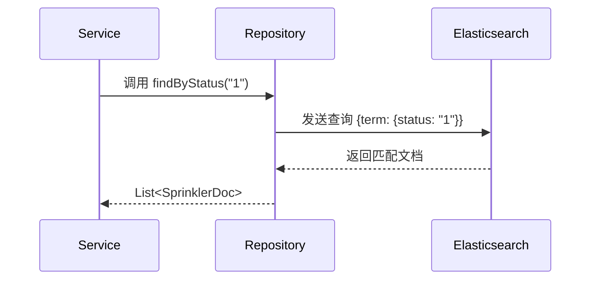
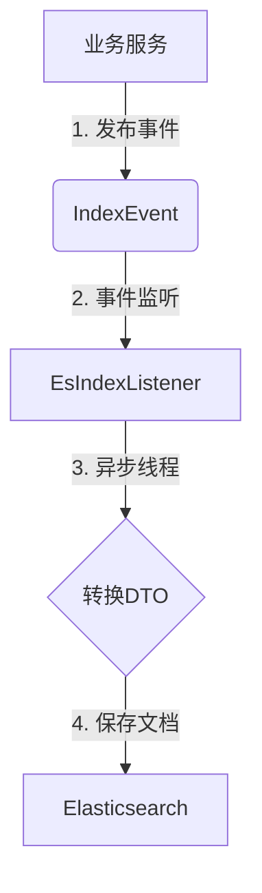
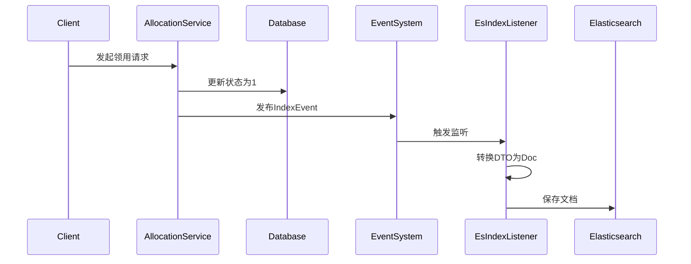

以下代码什么含义？

```java
@Repository
public interface SprinklerEsRepository extends ElasticsearchRepository<SprinklerDoc, String> {
    // 自定义ES查询
    @Query("{\"bool\": {\"must\": [{\"term\": {\"status\": \"?0\"}}]}}")
    List<SprinklerDoc> findByStatus(String status);
}

// 事件监听同步数据
@Component
public class EsIndexListener {
    @Async
    @EventListener
    public void handleIndexEvent(IndexEvent event) {
        SprinklerDoc doc = convertToEsDoc(event.getDto());
        esRepository.save(doc);
    }
}
```

--- R1
这段代码是用于实现 Elasticsearch 数据同步的核心组件，主要包含仓储层定义和事件监听机制。以下是逐层解析：

---

### 一、Elasticsearch 仓储接口解析

```java
@Repository
public interface SprinklerEsRepository
     extends ElasticsearchRepository<SprinklerDoc, String> {

    @Query("{\"bool\": {\"must\": [{\"term\": {\"status\": \"?0\"}}]}}")
    List<SprinklerDoc> findByStatus(String status);
}
```

#### 关键要素解析表

| 组件/注解                     | 作用说明                                                                                |
| ----------------------------- | --------------------------------------------------------------------------------------- |
| `@Repository`                 | 标记为 Spring 数据仓库组件                                                              |
| `ElasticsearchRepository`     | Spring Data Elasticsearch 的通用接口，提供 CRUD 基础操作                                |
| 泛型 `<SprinklerDoc, String>` | 定义文档对象类型和主键类型                                                              |
| `@Query`                      | 自定义 ES 查询 DSL，等价于 `{ "bool": { "must": [{ "term": { "status": "参数值" }}] }}` |

#### 执行流程



---

### 二、事件监听器解析

```java
@Component
public class EsIndexListener {
    @Async
    @EventListener
    public void handleIndexEvent(IndexEvent event) {
        SprinklerDoc doc = convertToEsDoc(event.getDto());
        esRepository.save(doc);
    }
}
```

#### 核心机制解析表

| 组件/注解             | 作用说明                                 |
| --------------------- | ---------------------------------------- |
| `@Component`          | 声明为 Spring 托管组件                   |
| `@EventListener`      | 监听应用事件，当 `IndexEvent` 发布时触发 |
| `@Async`              | 异步执行方法，避免阻塞主线程             |
| `convertToEsDoc`      | DTO 到 ES 文档的转换方法（需自定义实现） |
| `esRepository.save()` | 将文档写入 Elasticsearch                 |

#### 异步处理流程图



---

### 三、数据同步场景示例

当领用操作完成时，同步更新 ES 数据：

```java
@Service
public class AllocationService {

    @Autowired
    private ApplicationEventPublisher publisher;

    @Transactional
    public void allocate(SprinklerAllocateDTO dto) {
        // 1. 数据库操作
        sprinklerRepository.updateStatus(dto.getId(), 1);

        // 2. 发布索引事件
        publisher.publishEvent(new IndexEvent(dto));
    }
}
```

#### 时序图



---

### 四、潜在问题与解决方案

#### 问题 1：数据一致性

**现象**：数据库成功但 ES 写入失败  
**解决方案**：

```java
@Retryable(value = ElasticsearchException.class, maxAttempts = 3)
public void handleIndexEvent(IndexEvent event) {
    // 重试逻辑
}
```

#### 问题 2：异步顺序错乱

**现象**：先发事件后更新数据库  
**解决方案**：

```java
@TransactionalEventListener(phase = TransactionPhase.AFTER_COMMIT)
public void handleIndexEvent(IndexEvent event) {
    // 事务提交后执行
}
```

#### 性能优化建议

```properties
# application.properties
spring.elasticsearch.rest.uris=localhost:9200
spring.data.elasticsearch.client.reactive.endpoints=localhost:9200
spring.data.elasticsearch.client.reactive.socket-timeout=10s
```

---

通过这种设计，系统实现了：

1. **业务与搜索解耦**：通过事件机制分离核心业务与数据同步
2. **高性能写入**：异步处理避免阻塞主流程
3. **灵活查询**：自定义 DSL 支持复杂搜索需求
4. **弹性扩展**：可扩展监听器实现多数据源同步
