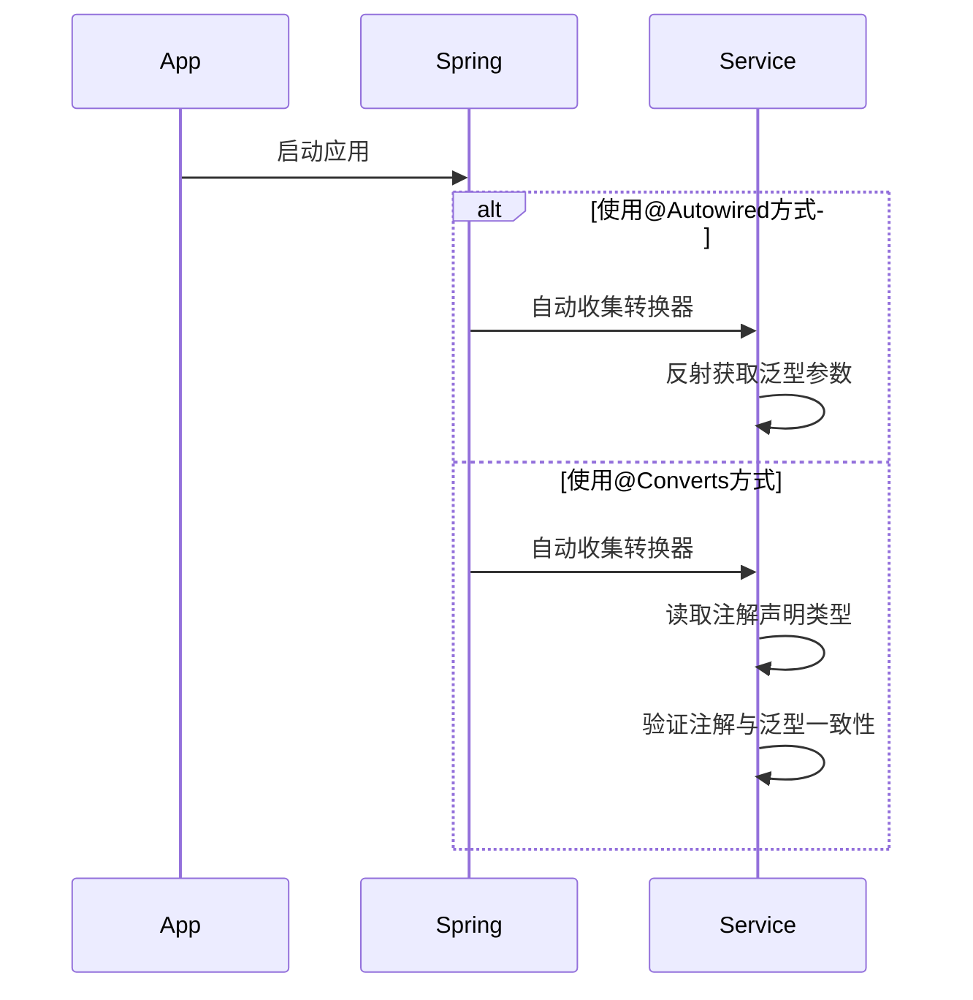

理论上来讲，这里@Autowired 已经实现了 TicketConverter 所有实现类的 converters 表生成吧。和注解驱动注册的效果是一样的吧。有区别吗？

#### 2. 工单转换接口

```java
public interface TicketConverter<T> {
    WorkOrder convert(T dto);
}

// 实现示例（自动注册）
@Component
public class MaintainTicketConverter implements TicketConverter<SprinklerMaintainDTO> {
    @Override
    public WorkOrder convert(SprinklerMaintainDTO dto) {
        return WorkOrder.builder()
            .type("MAINTAIN")
            .deviceId(dto.getSprinklerId())
            .description(dto.getReason())
            .build();
    }
}

// 统一转换服务
@Service
public class TicketConversionService {
    private final Map<Class<?>, TicketConverter<?>> converters = new ConcurrentHashMap<>();

    // 自动注册所有实现
    @Autowired
    public TicketConversionService(List<TicketConverter<?>> converterList) {
        converterList.forEach(c ->
            converters.put(getGenericType(c.getClass()), c)
        );
    }

    public <T> WorkOrder convert(T dto) {
        TicketConverter<T> converter = (TicketConverter<T>) converters.get(dto.getClass());
        return converter.convert(dto);
    }
}
```

```java

@Target(ElementType.TYPE)
@Retention(RetentionPolicy.RUNTIME)
public @interface Converts {
    Class<?>[] value();  // 允许指定多个DTO类型
}

@Component
@Converts({SprinklerMaintainDTO.class, EmergencyMaintainDTO.class})
public class MaintainTicketConverter
    implements TicketConverter<SprinklerMaintainDTO> {

    @Override
    public WorkOrder convert(SprinklerMaintainDTO dto) {
        // 转换逻辑
    }
}

@Service
public class TicketConversionService {
    private final Map<Class<?>, TicketConverter<?>> converters = new ConcurrentHashMap<>();

    @Autowired
    public TicketConversionService(List<TicketConverter<?>> converterList) {
        converterList.forEach(c -> {
            Converts ann = c.getClass().getAnnotation(Converts.class);
            if (ann == null) {
                throw new IllegalStateException("转换器缺少@Converts注解: " + c.getClass());
            }

            for (Class<?> dtoType : ann.value()) {
                validateTypeMatch(c, dtoType);
                converters.put(dtoType, c);
            }
        });
    }

    private void validateTypeMatch(TicketConverter<?> converter, Class<?> dtoType) {
        Type interfaceType = converter.getClass().getGenericInterfaces();
        Class<?> genericType = (Class<?>) ((ParameterizedType)interfaceType).getActualTypeArguments();

        if (!dtoType.isAssignableFrom(genericType)) {
            throw new IllegalArgumentException(
                "转换器 " + converter.getClass() + " 泛型类型 " + genericType +
                " 与注解类型 " + dtoType + " 不兼容"
            );
        }
    }

    public <T> WorkOrder convert(T dto) {
        TicketConverter<T> converter = (TicketConverter<T>) converters.get(dto.getClass());
        if (converter == null) {
            throw new NoConverterFoundException(dto.getClass());
        }
        return converter.convert(dto);
    }
}
```

--- R1

---

### 一、核心区别解析

#### **场景假设**：存在需要将 `EmergencyMaintainDTO` 和 `SprinklerMaintainDTO` 转换为同类型工单的需求

---

### 二、两种实现方式对比

#### **方案 1：仅用 `@Autowired` + 泛型**

```java
// 需编写两个转换器
@Component
public class EmergencyConverter implements TicketConverter<EmergencyMaintainDTO> {
    public WorkOrder convert(EmergencyMaintainDTO dto) {
        return WorkOrder.builder().type("MAINTAIN").build();
    }
}

@Component
public class SprinklerConverter implements TicketConverter<SprinklerMaintainDTO> {
    public WorkOrder convert(SprinklerMaintainDTO dto) {
        return WorkOrder.builder().type("MAINTAIN").build();
    }
}
```

#### **方案 2：`@Converts` 注解驱动**

```java
// 单个转换器处理两类DTO
@Component
@Converts({SprinklerMaintainDTO.class, EmergencyMaintainDTO.class})
public class UnifiedMaintainConverter
    implements TicketConverter<Object> {

    @Override
    public WorkOrder convert(Object dto) {
        if (dto instanceof SprinklerMaintainDTO) {
            return processStandard((SprinklerMaintainDTO)dto);
        } else if (dto instanceof EmergencyMaintainDTO) {
            return processEmergency((EmergencyMaintainDTO)dto);
        }
        throw new IllegalArgumentException();
    }
}
```

---

### 三、本质区别分析

#### 1. **注册依据不同**

| **方式**     | 注册依据           | 映射关系建立方式                |
| ------------ | ------------------ | ------------------------------- |
| `@Autowired` | 转换器泛型参数类型 | 自动推断（1 Converter → 1 DTO） |
| `@Converts`  | 显式注解声明       | 人工指定（1 Converter → N DTO） |

#### 2. **类型校验时机**



#### 3. **维护成本对比**

| **变更场景**        | @Autowired 方案  | @Converts 方案       |
| ------------------- | ---------------- | -------------------- |
| 新增支持的 DTO 类型 | 必须新建转换器类 | 修改注解值即可       |
| 删除某个 DTO 支持   | 删除转换器类     | 从注解数组中移除类型 |
| 修改关联关系        | 需修改泛型参数   | 仅修改注解值         |

---

### 四、关键差异总结表

| **维度**         | **@Autowired + 泛型**            | **@Converts 注解驱动**        |
| ---------------- | -------------------------------- | ----------------------------- |
| **多 DTO 支持**  | 每个转换器只能处理 1 个 DTO 类型 | 单个转换器可处理多个 DTO 类型 |
| **类型关联方式** | 隐式（通过泛型参数）             | 显式（通过注解声明）          |
| **代码冗余度**   | 同类转换逻辑需要多个转换器       | 可集中处理相似逻辑            |
| **运行时效率**   | 直接类型匹配（无类型判断）       | 需要类型检查（instanceof）    |
| **扩展灵活性**   | 低（受限于泛型参数）             | 高（动态调整注解值即可）      |
| **错误排查难度** | 类型不匹配时编译期报错           | 需运行时验证注解与泛型一致性  |

---

### 五、典型场景示例

#### **场景：设备维护工单统一处理**

- **输入类型**：
  - `SprinklerMaintainDTO`（喷淋设备常规维护）
  - `EmergencyMaintainDTO`（紧急维护）
- **输出要求**：
  - 生成统一的 `MAINTENANCE` 类型工单
  - 根据 DTO 类型添加不同优先级

##### **@Converts 方案实现优势**：

```java
@Component
@Converts({SprinklerMaintainDTO.class, EmergencyMaintainDTO.class})
public class MaintenanceConverter implements TicketConverter<Object> {

    @Override
    public WorkOrder convert(Object dto) {
        WorkOrder order = new WorkOrder();
        order.setType("MAINTENANCE");

        if (dto instanceof SprinklerMaintainDTO) {
            order.setPriority("NORMAL");
        } else if (dto instanceof EmergencyMaintainDTO) {
            order.setPriority("URGENT");
        }

        return order;
    }
}
```

##### **对比 @Autowired 方案缺陷**：

- 需要创建 `SprinklerMaintainConverter` 和 `EmergencyMaintainConverter` 两个类
- 重复定义工单类型设置逻辑
- 新增其他维护类型时需继续增加类

---

### 六、设计选择建议

#### **优先使用 @Converts 的情况**：

1. **多 DTO 统一处理**：多个 DTO 生成同类工单时
2. **业务逻辑相似**：不同 DTO 的处理流程存在共性
3. **高频变更需求**：常需要增减支持的 DTO 类型

#### **适合 @Autowired + 泛型的情况**：

1. **严格类型隔离**：每个 DTO 需要完全独立的处理逻辑
2. **编译期安全保障**：要求类型错误在编译阶段暴露
3. **性能敏感场景**：避免运行时类型检查开销

---

通过合理选择两种方式，可以实现 **灵活性与类型安全的最佳平衡**，满足不同业务场景的需求。
