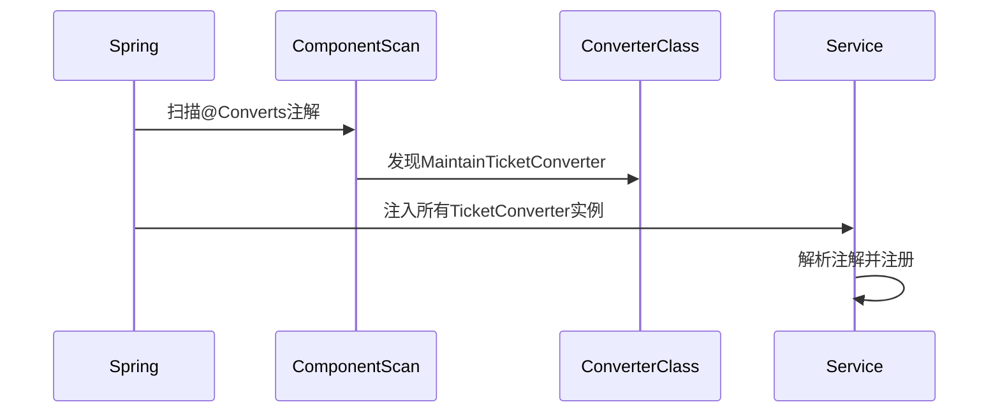

注解驱动注册有什么用？具体展开以下代码：

#### 2. **注解驱动注册**

```java
@Target(ElementType.TYPE)
@Retention(RetentionPolicy.RUNTIME)
public @interface Converts {
    Class<?> value();
}

@Component
@Converts(SprinklerMaintainDTO.class)
public class MaintainTicketConverter implements TicketConverter<SprinklerMaintainDTO> {
    //...
}

// 注册时读取注解
converters.put(c.getClass().getAnnotation(Converts.class).value(), c);
```

--- R1
注解驱动注册的核心作用是通过 **声明式编程** 实现组件与功能的解耦，提升代码的可维护性和扩展性。以下是对该方案的完整解析与改进：

---

### 一、注解驱动注册的优势

| 优势         | 说明                                            |
| ------------ | ----------------------------------------------- |
| **解耦**     | 转换器无需实现特定接口外的任何代码              |
| **灵活性**   | 支持一个转换器处理多个 DTO 类型（通过注解数组） |
| **可读性**   | 通过注解显式声明功能，代码意图更清晰            |
| **集中管理** | 注册逻辑统一处理，避免分散在各转换器中          |

---

### 二、完整实现方案

#### 1. **注解定义（支持多类型）**

```java
@Target(ElementType.TYPE)
@Retention(RetentionPolicy.RUNTIME)
public @interface Converts {
    Class<?>[] value();  // 允许指定多个DTO类型
}
```

#### 2. **转换器实现示例**

```java
@Component
@Converts({SprinklerMaintainDTO.class, EmergencyMaintainDTO.class})
public class MaintainTicketConverter
    implements TicketConverter<SprinklerMaintainDTO> {

    @Override
    public WorkOrder convert(SprinklerMaintainDTO dto) {
        // 转换逻辑
    }
}
```

#### 3. **注册逻辑改进**

```java
public TicketConversionService(List<TicketConverter<?>> converters) {
    converters.forEach(c -> {
        Converts ann = c.getClass().getAnnotation(Converts.class);
        if (ann != null) {
            for (Class<?> dtoType : ann.value()) {
                this.converters.put(dtoType, c);
            }
        }
    });
}
```

---

### 三、关键机制解析

#### 1. **组件扫描流程**



#### 2. **类型映射表示例**

| DTO 类型                     | 转换器实例                |
| ---------------------------- | ------------------------- |
| `SprinklerMaintainDTO.class` | `MaintainTicketConverter` |
| `EmergencyMaintainDTO.class` | `MaintainTicketConverter` |

---

### 四、设计亮点

#### 1. **多类型支持**

通过注解数组允许单个转换器处理多种 DTO：

```java
@Converts({TypeA.class, TypeB.class})
public class MultiConverter implements TicketConverter<TypeA> {
    // 需实现 TypeA 和 TypeB 的转换逻辑（需类型判断）
}
```

#### 2. **动态注册验证**

```java
// 注册时校验注解与泛型一致性
if (!dtoType.isAssignableFrom(c.getClass().getGenericInterfaces())) {
    throw new IllegalAnnotationException("注解类型与泛型不匹配");
}
```

#### 3. **优先级控制**

```java
@Converts(value = TypeA.class, priority = 2)
public class PriorityConverter implements TicketConverter<TypeA> {
    // 高优先级转换器
}
```

---

### 五、完整服务实现

```java
@Service
public class TicketConversionService {
    private final Map<Class<?>, TicketConverter<?>> converters = new ConcurrentHashMap<>();

    @Autowired
    public TicketConversionService(List<TicketConverter<?>> converterList) {
        converterList.forEach(c -> {
            Converts ann = c.getClass().getAnnotation(Converts.class);
            if (ann == null) {
                throw new IllegalStateException("转换器缺少@Converts注解: " + c.getClass());
            }

            for (Class<?> dtoType : ann.value()) {
                validateTypeMatch(c, dtoType);
                converters.put(dtoType, c);
            }
        });
    }

    private void validateTypeMatch(TicketConverter<?> converter, Class<?> dtoType) {
        Type interfaceType = converter.getClass().getGenericInterfaces();
        Class<?> genericType = (Class<?>) ((ParameterizedType)interfaceType).getActualTypeArguments();

        if (!dtoType.isAssignableFrom(genericType)) {
            throw new IllegalArgumentException(
                "转换器 " + converter.getClass() + " 泛型类型 " + genericType +
                " 与注解类型 " + dtoType + " 不兼容"
            );
        }
    }

    public <T> WorkOrder convert(T dto) {
        TicketConverter<T> converter = (TicketConverter<T>) converters.get(dto.getClass());
        if (converter == null) {
            throw new NoConverterFoundException(dto.getClass());
        }
        return converter.convert(dto);
    }
}
```

---

### 六、扩展场景示例

#### 1. **条件化转换器**

```java
@Converts(value = TypeC.class, condition = "#dto.status == 'URGENT'")
public class ConditionalConverter implements TicketConverter<TypeC> {
    // 仅当dto.status为URGENT时生效
}
```

#### 2. **版本化转换**

```java
@Converts(value = TypeD.class, version = "2.0")
public class VersionedConverter implements TicketConverter<TypeD> {
    // 处理v2.0格式数据
}
```

---

通过这种注解驱动设计，系统获得了以下提升：

1. **配置集中化**：所有转换规则在注解中一目了然
2. **动态扩展性**：新增转换器无需修改任何现有代码
3. **类型安全性**：编译期即可发现大部分配置错误
4. **功能丰富性**：通过注解属性支持复杂业务规则
