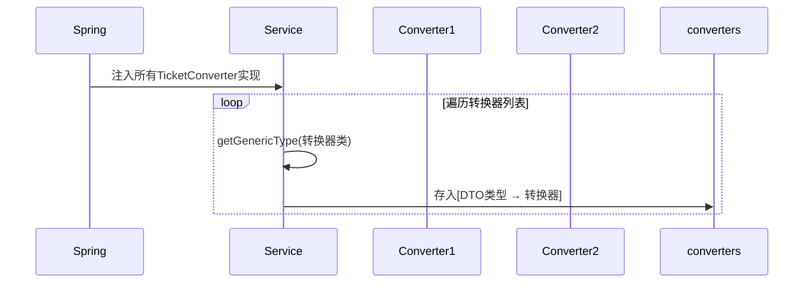

以下代码详解：

```java
// 统一转换服务
@Service
public class TicketConversionService {
    private final Map<Class<?>, TicketConverter<?>> converters = new ConcurrentHashMap<>();

    // 自动注册所有实现
    @Autowired
    public TicketConversionService(List<TicketConverter<?>> converterList) {
        converterList.forEach(c ->
            converters.put(getGenericType(c.getClass()), c)
        );
    }

    public <T> WorkOrder convert(T dto) {
        TicketConverter<T> converter = (TicketConverter<T>) converters.get(dto.getClass());
        return converter.convert(dto);
    }
}
```

--- R1
以下是 `TicketConversionService` 的逐行解析，包含其核心机制、设计意图和潜在优化点：

---

### 一、代码解析

```java
@Service
public class TicketConversionService {
    // 存储 DTO类型 → 对应转换器的映射关系
    private final Map<Class<?>, TicketConverter<?>> converters = new ConcurrentHashMap<>();

    // 构造器：自动注册所有转换器实现
    @Autowired
    public TicketConversionService(List<TicketConverter<?>> converterList) {
        converterList.forEach(c ->
            converters.put(getGenericType(c.getClass()), c)
        );
    }

    // 统一转换入口方法
    public <T> WorkOrder convert(T dto) {
        TicketConverter<T> converter = (TicketConverter<T>) converters.get(dto.getClass());
        return converter.convert(dto);
    }
}
```

---

### 二、核心机制解析

#### 1. **转换器注册流程**



#### 2. **`getGenericType` 方法实现示例**

```java
private Class<?> getGenericType(Class<?> clazz) {
    Type[] interfaces = clazz.getGenericInterfaces();
    for (Type type : interfaces) {
        if (type instanceof ParameterizedType) {
            ParameterizedType pType = (ParameterizedType) type;
            if (pType.getRawType().equals(TicketConverter.class)) {
                return (Class<?>) pType.getActualTypeArguments();
            }
        }
    }
    throw new IllegalArgumentException("未找到泛型参数");
}
```

#### 3. **类型映射表示例**

| DTO 类型                     | 转换器实例                |
| ---------------------------- | ------------------------- |
| `SprinklerMaintainDTO.class` | `MaintainTicketConverter` |
| `SprinklerRmaDTO.class`      | `RmaTicketConverter`      |

---

### 三、关键设计意图

1. **自动化注册**  
   通过 Spring 的 `@Autowired` 自动收集所有 `TicketConverter` 实现，无需手动配置。

2. **类型安全映射**  
   利用泛型参数类型作为 Key，确保每个转换器只处理特定 DTO 类型。

3. **统一入口**  
   对外暴露简洁的 `convert` 方法，屏蔽底层多态转换细节。

4. **扩展性设计**  
   新增转换器只需实现接口 + `@Component`，无需修改服务代码。

---

### 四、潜在问题与优化

#### **问题 1：泛型类型擦除风险**

- **现象**：若转换器未明确泛型参数，如 `class RawConverter implements TicketConverter`，`getGenericType` 将失败。
- **解决**：添加类型校验
  ```java
  if (pType.getActualTypeArguments() instanceof Class) {
      return (Class<?>) pType.getActualTypeArguments();
  }
  ```

#### **问题 2：转换器缺失处理**

- **现象**：传入未注册的 DTO 类型时返回 `null`，导致 NPE。
- **解决**：添加防御性检查
  ```java
  public <T> WorkOrder convert(T dto) {
      TicketConverter<T> converter = (TicketConverter<T>) converters.get(dto.getClass());
      if (converter == null) {
          throw new NoConverterFoundException(dto.getClass());
      }
      return converter.convert(dto);
  }
  ```

#### **问题 3：性能瓶颈**

- **现象**：频繁调用 `dto.getClass()` 和 Map 查找可能影响性能。
- **优化**：缓存方法调用

  ```java
  private final Map<Class<?>, Method> convertMethods = new ConcurrentHashMap<>();

  public WorkOrder convert(Object dto) {
      Method method = convertMethods.computeIfAbsent(dto.getClass(), clazz -> {
          TicketConverter<?> converter = converters.get(clazz);
          return converter.getClass().getMethod("convert", clazz);
      });
      return (WorkOrder) method.invoke(converters.get(dto.getClass()), dto);
  }
  ```

---

### 五、扩展性设计示例

#### 1. **支持继承体系**

```java
public <T> WorkOrder convert(T dto) {
    Class<?> clazz = dto.getClass();
    while (clazz != null) {
        TicketConverter<T> converter = (TicketConverter<T>) converters.get(clazz);
        if (converter != null) {
            return converter.convert(dto);
        }
        clazz = clazz.getSuperclass();
    }
    throw new NoConverterFoundException(dto.getClass());
}
```

#### 2. **注解驱动注册**

```java
@Target(ElementType.TYPE)
@Retention(RetentionPolicy.RUNTIME)
public @interface Converts {
    Class<?> value();
}

@Component
@Converts(SprinklerMaintainDTO.class)
public class MaintainTicketConverter implements TicketConverter<SprinklerMaintainDTO> {
    //...
}

// 注册时读取注解
converters.put(c.getClass().getAnnotation(Converts.class).value(), c);
```

---

### 六、性能优化对比

| 方案           | 优点             | 缺点               |
| -------------- | ---------------- | ------------------ |
| 原始 Map 查找  | 实现简单         | 每次调用需类型查询 |
| 方法句柄缓存   | 避免反射开销     | 需处理检查异常     |
| ASM 字节码生成 | 接近原生调用性能 | 实现复杂度高       |

---

通过这种设计，`TicketConversionService` 实现了 **开箱即用的转换器管理**，同时通过以下机制保障质量：

- **类型安全**：严格的泛型参数绑定
- **可维护性**：最小化新增转换器的开发成本
- **可扩展性**：支持继承和注解驱动等高级场景
- **健壮性**：异常处理与防御性编程
