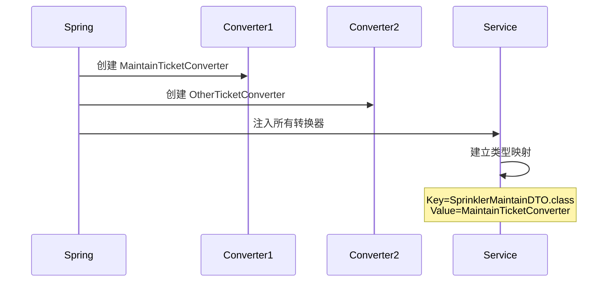
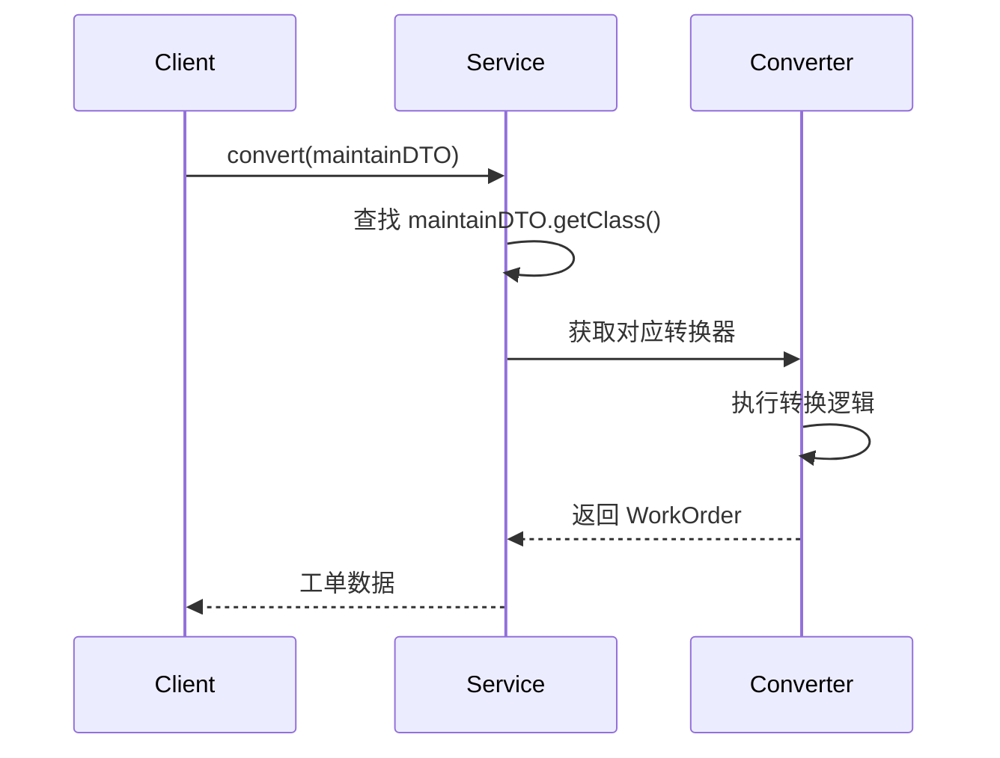

以下代码什么含义？

#### 2. 工单转换接口

```java
public interface TicketConverter<T> {
    WorkOrder convert(T dto);
}

// 实现示例（自动注册）
@Component
public class MaintainTicketConverter implements TicketConverter<SprinklerMaintainDTO> {
    @Override
    public WorkOrder convert(SprinklerMaintainDTO dto) {
        return WorkOrder.builder()
            .type("MAINTAIN")
            .deviceId(dto.getSprinklerId())
            .description(dto.getReason())
            .build();
    }
}

// 统一转换服务
@Service
public class TicketConversionService {
    private final Map<Class<?>, TicketConverter<?>> converters = new ConcurrentHashMap<>();

    // 自动注册所有实现
    @Autowired
    public TicketConversionService(List<TicketConverter<?>> converterList) {
        converterList.forEach(c ->
            converters.put(getGenericType(c.getClass()), c)
        );
    }

    public <T> WorkOrder convert(T dto) {
        TicketConverter<T> converter = (TicketConverter<T>) converters.get(dto.getClass());
        return converter.convert(dto);
    }
}
```

--- R1
java
private Class<?> getGenericType(Class<?> converterClass) {
Type[] interfaces = converterClass.getGenericInterfaces();
for (Type type : interfaces) {
if (type instanceof ParameterizedType) {
ParameterizedType pType = (ParameterizedType) type;
if (pType.getRawType().equals(TicketConverter.class)) {
Type[] typeArgs = pType.getActualTypeArguments();
if (typeArgs.length > 0) {
return (Class<?>) typeArgs;
}
}
}
}
throw new IllegalArgumentException("无法确定转换器的泛型类型");
}

```

这样就能正确获取每个转换器对应的 DTO 类型，作为映射的键。这样在服务中，当传入一个 DTO 实例时，通过其 Class 对象找到对应的转换器，进行类型安全的转换。

总结来说，这段代码实现了一个灵活的工单转换机制，通过接口和自动注册的方式，支持多种 DTO 类型到工单的转换，提高了代码的可扩展性和维护性。但在实现时需要注意类型安全和泛型参数的正确处理。

<end>已深度思考（用时35秒）</end>

```

这段代码实现了一个 **可扩展的工单转换系统**，用于将不同类型的 DTO（数据传输对象）转换为标准工单格式。以下是核心组件的详细解析：

---

### 一、组件结构解析

#### 1. **转换器接口定义**

```java
public interface TicketConverter<T> {
    WorkOrder convert(T dto);
}
```

- **作用**：定义统一转换契约，泛型 `<T>` 表示支持的 DTO 类型
- **关键设计**：
  - 泛型参数 `T` 限定输入数据类型
  - 返回标准工单对象 `WorkOrder`

#### 2. **具体转换器实现**

```java
@Component
public class MaintainTicketConverter
    implements TicketConverter<SprinklerMaintainDTO> {

    @Override
    public WorkOrder convert(SprinklerMaintainDTO dto) {
        return WorkOrder.builder()
            .type("MAINTAIN")
            .deviceId(dto.getSprinklerId())
            .description(dto.getReason())
            .build();
    }
}
```

- **功能**：将 `SprinklerMaintainDTO` 转换为维修工单
- **关键注解**：
  - `@Component`：Spring 自动扫描并注册为 Bean
- **实现细节**：
  - 明确指定泛型类型为具体 DTO 类
  - 使用建造者模式构造工单对象

#### 3. **统一转换服务**

```java
@Service
public class TicketConversionService {
    private final Map<Class<?>, TicketConverter<?>> converters = new ConcurrentHashMap<>();

    @Autowired
    public TicketConversionService(List<TicketConverter<?>> converterList) {
        converterList.forEach(c ->
            converters.put(getGenericType(c.getClass()), c)
        );
    }

    public <T> WorkOrder convert(T dto) {
        TicketConverter<T> converter = (TicketConverter<T>) converters.get(dto.getClass());
        return converter.convert(dto);
    }
}
```

- **核心机制**：
  - **自动注册**：通过构造函数注入所有实现类
  - **类型映射**：存储 DTO 类型与转换器的对应关系
  - **泛型处理**：`getGenericType()` 解析转换器的泛型参数类型

---

### 二、工作流程解析

#### 1. **启动时初始化**



#### 2. **运行时转换**



---

### 三、关键技术点

#### 1. **泛型类型解析**

```java
private Class<?> getGenericType(Class<?> converterClass) {
    Type[] interfaces = converterClass.getGenericInterfaces();
    // 解析 TicketConverter<T> 的 T 类型
    return (Class<?>) ((ParameterizedType)interfaces)
        .getActualTypeArguments();
}
```

- **作用**：获取转换器实现的泛型参数类型（即 DTO 类型）
- **示例**：
  - `MaintainTicketConverter` → `SprinklerMaintainDTO.class`

#### 2. **类型安全转换**

```java
// 强制类型转换的安全保障
TicketConverter<T> converter = (TicketConverter<T>) converters.get(dto.getClass());
```

- **安全保障**：
  - 启动时已确保映射关系正确
  - 转换器实现类明确定义了支持的 DTO 类型

#### 3. **扩展机制**

- **新增转换器**：
  1. 实现 `TicketConverter<NewDTO>`
  2. 添加 `@Component` 注解
  3. 系统自动注册，无需修改现有代码
- **示例**：
  ```java
  @Component
  public class RmaTicketConverter
      implements TicketConverter<SprinklerRmaDTO> {
      // 实现转换逻辑
  }
  ```

---

### 四、设计优势

| 优势           | 说明                                         |
| -------------- | -------------------------------------------- |
| **开闭原则**   | 新增转换器无需修改现有代码                   |
| **类型安全**   | 通过泛型确保转换器与 DTO 类型匹配            |
| **自动化注册** | Spring 依赖注入自动管理转换器实例            |
| **统一入口**   | `TicketConversionService` 提供标准化转换接口 |
| **易于维护**   | 转换逻辑集中管理，避免业务代码分散           |

---

### 五、潜在优化方向

#### 1. **类型解析增强**

```java
// 处理多层继承的情况
private Class<?> getGenericType(Class<?> clazz) {
    Type type = clazz;
    while (!(type instanceof ParameterizedType)) {
        if (type instanceof Class) {
            type = ((Class<?>) type).getGenericSuperclass();
        }
        // 处理更多边界情况...
    }
    // 解析逻辑...
}
```

#### 2. **异常处理改进**

```java
public <T> WorkOrder convert(T dto) {
    TicketConverter<T> converter = (TicketConverter<T>) converters.get(dto.getClass());
    if (converter == null) {
        throw new NoConverterFoundException(dto.getClass());
    }
    return converter.convert(dto);
}
```

#### 3. **性能优化**

```java
// 缓存方法调用
private static final MethodHandles.Lookup lookup = MethodHandles.lookup();
private static final Map<Class<?>, MethodHandle> methodCache = new ConcurrentHashMap<>();

public WorkOrder fastConvert(Object dto) {
    MethodHandle handle = methodCache.computeIfAbsent(dto.getClass(), clazz -> {
        MethodType type = MethodType.methodType(WorkOrder.class, clazz);
        return lookup.findVirtual(TicketConverter.class, "convert", type);
    });
    return handle.invokeExact(converter, dto);
}
```

---

通过这种设计，系统实现了 **高扩展性的工单转换机制**，能够灵活应对业务需求变化，同时保证类型安全和代码可维护性。
