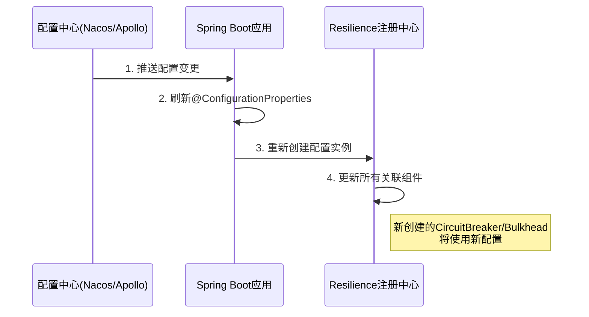

Spring 集成配置模块如何实现配置注册中心和结合@ConfigurationProperties 实现动态配置？

#### 2. **Spring 集成配置模块**

```java
// 模块2：Spring Bean配置
@Configuration
public class ResilienceConfig {
    @Bean
    public CircuitBreakerRegistry circuitBreakerRegistry() {
        return CircuitBreakerRegistry.ofDefaults(); // 默认配置注册中心
    }

    @Bean
    public BulkheadRegistry bulkheadRegistry() {
        return BulkheadRegistry.ofDefaults(); // 默认配置注册中心
    }
}
```

**特点**：

- 通过 Spring 管理注册中心生命周期
- 可结合@ConfigurationProperties 实现动态配置
- 适用于生产环境，便于统一管理

--- R1

---

### Spring 集成配置模块实现动态配置的完整方案

---

#### 一、核心实现步骤

##### 1. **定义配置属性映射类**

```java
@ConfigurationProperties(prefix = "resilience4j")
@Data // Lombok 自动生成 getter/setter
public class ResilienceProperties {
    // 熔断器配置
    private CircuitBreakerConfig circuitBreaker = new CircuitBreakerConfig();
    // 线程池隔离配置
    private BulkheadConfig bulkhead = new BulkheadConfig();

    // 嵌套配置类
    @Data
    public static class CircuitBreakerConfig {
        private float failureRateThreshold = 50;
        private int slidingWindowSize = 100;
        private Duration waitDuration = Duration.ofSeconds(10);
    }

    @Data
    public static class BulkheadConfig {
        private int maxConcurrentCalls = 20;
        private Duration maxWaitDuration = Duration.ofMillis(500);
    }
}
```

##### 2. **配置类与注册中心绑定**

```java
@Configuration
@EnableConfigurationProperties(ResilienceProperties.class)
public class ResilienceConfig {

    private final ResilienceProperties properties;

    // 构造函数注入配置
    public ResilienceConfig(ResilienceProperties properties) {
        this.properties = properties;
    }

    // 熔断器注册中心
    @Bean
    public CircuitBreakerRegistry circuitBreakerRegistry() {
        return CircuitBreakerRegistry.of(
            CircuitBreakerConfig.custom()
                .failureRateThreshold(properties.getCircuitBreaker().getFailureRateThreshold())
                .slidingWindowSize(properties.getCircuitBreaker().getSlidingWindowSize())
                .waitDurationInOpenState(properties.getCircuitBreaker().getWaitDuration())
                .build()
        );
    }

    // 线程池隔离注册中心
    @Bean
    public BulkheadRegistry bulkheadRegistry() {
        return BulkheadRegistry.of(
            BulkheadConfig.custom()
                .maxConcurrentCalls(properties.getBulkhead().getMaxConcurrentCalls())
                .maxWaitDuration(properties.getBulkhead().getMaxWaitDuration())
                .build()
        );
    }
}
```

---

#### 二、配置示例（application.yml）

```yaml
resilience4j:
  circuit-breaker:
    failure-rate-threshold: 60 # 熔断阈值调整为60%
    sliding-window-size: 50 # 统计窗口改为50次调用
    wait-duration: 5s # 熔断持续时间5秒
  bulkhead:
    max-concurrent-calls: 30 # 最大并发数提升到30
    max-wait-duration: 100ms # 等待时间缩短到100ms
```

---

#### 三、动态配置原理



---

#### 四、生产级增强特性

##### 1. **多服务独立配置**

```yaml
resilience4j:
  services:
    payment:
      circuit-breaker:
        failure-rate-threshold: 40
    order:
      circuit-breaker:
        failure-rate-threshold: 30
```

对应 Java 配置：

```java
@Bean("paymentCircuitBreaker")
public CircuitBreaker paymentCircuitBreaker() {
    return circuitBreakerRegistry.circuitBreaker("payment",
        getServiceConfig("payment").getCircuitBreaker());
}

@Bean("orderCircuitBreaker")
public CircuitBreaker orderCircuitBreaker() {
    return circuitBreakerRegistry.circuitBreaker("order",
        getServiceConfig("order").getCircuitBreaker());
}
```

##### 2. **配置热刷新（需配合 Spring Cloud Config）**

```java
@RefreshScope
@Configuration
public class RefreshableResilienceConfig {
    // 配置类添加@RefreshScope注解
    // 配合@EventListener监听RefreshEvent
}
```

---

#### 五、验证配置生效

##### 1. **启动时校验**

```java
@SpringBootTest
public class ResilienceConfigTest {

    @Autowired
    private CircuitBreakerRegistry registry;

    @Test
    void testCircuitConfig() {
        CircuitBreakerConfig config = registry.getDefaultConfig();
        assertThat(config.getFailureRateThreshold()).isEqualTo(60);
    }
}
```

##### 2. **运行时监控端点**

```java
@RestController
@Endpoint(id = "resilience")
public class ResilienceEndpoint {

    @Autowired
    private CircuitBreakerRegistry registry;

    @ReadOperation
    public Map<String, Object> getConfig() {
        return registry.getConfiguration("default")
            .getCircuitBreakerConfig().toMap();
    }
}
```

访问 `http://localhost:8080/actuator/resilience` 查看当前配置

---

#### 六、优势总结

1. **环境差异化配置**

   ```mermaid
   graph LR
       DEV[开发环境] -->|低阈值| Config1
       TEST[测试环境] -->|中阈值| Config2
       PROD[生产环境] -->|高阈值| Config3
   ```

2. **动态调优能力**

   - 无需重新部署即可调整熔断策略
   - 根据实时监控数据快速优化参数

3. **配置版本化管理**
   ```bash
   # 配置变更记录示例
   git commit -m "调整支付服务熔断阈值至60%"
   ```

---

通过这种集成方式，实现了配置管理的三大核心能力：

1. **集中化管理**：所有容错配置统一在 application.yml 中维护
2. **环境隔离**：通过 Profile 区分不同环境配置
3. **动态生效**：结合配置中心实现运行时配置热更新
