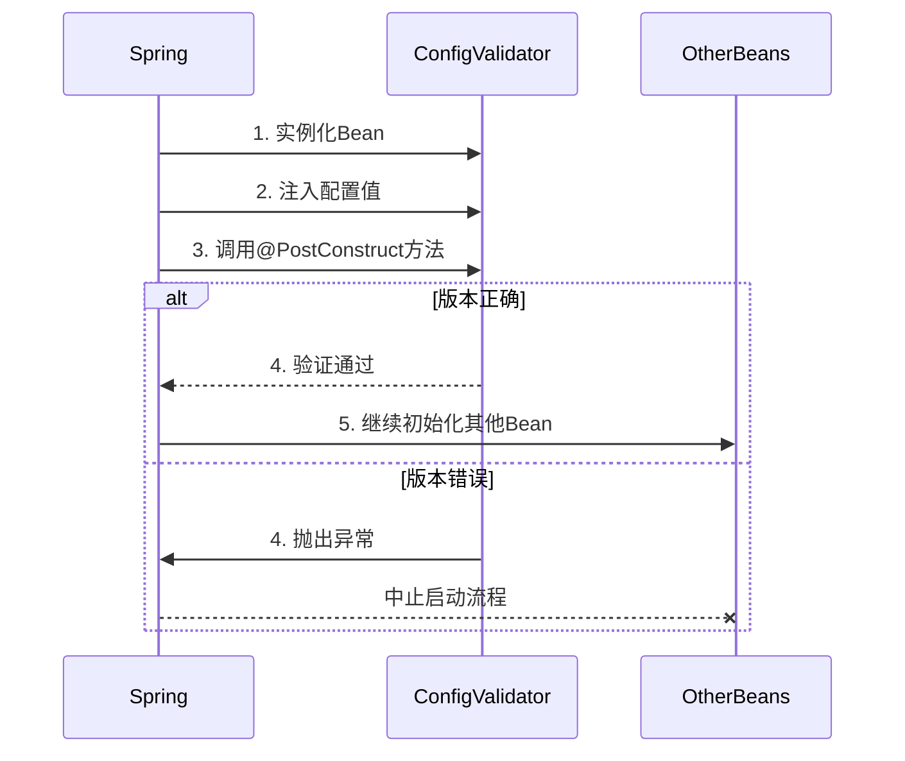

版本验证的代码应该放在哪里？

```java
@Value("${resilience.version}")
private String configVersion;

@PostConstruct
public void validateVersion() {
    if (!"v1.2".equals(configVersion)) {
        throw new IllegalStateException("配置版本不匹配");
    }
}
```

--- R1

```java
@Component
public class ConfigVersionValidator {

    @Value("${resilience.version}")
    private String configVersion;

    @PostConstruct
    public void validateVersion() {
        if (!"v1.2".equals(configVersion)) {
            throw new IllegalStateException("配置版本不匹配");
        }
    }

}

```

这里使用`@Component`注解让 Spring 管理该类的实例，并通过`@PostConstruct`确保验证方法在 Bean 初始化时执行。这样，验证逻辑集中在一个地方，便于管理和维护。同时，作为组件，它会被 Spring 容器自动检测和初始化，确保验证在应用启动时进行。

总结来说，版本验证的代码应该放在一个由 Spring 管理的 Bean 中，使用`@PostConstruct`确保在依赖注入完成后执行验证。选择的位置可以是专门的配置验证类，或者相关的配置类中，以保证逻辑的清晰和可维护性。

<end>已深度思考（用时 43 秒）</end>

---

### 版本验证代码的合理放置位置

---

#### 一、推荐方案

将版本验证逻辑放在 **独立的配置验证组件** 中，确保其作为 Spring Bean 被优先初始化。具体实现如下：

```java
@Component
public class ConfigValidator {
    @Value("${resilience.version}")
    private String configVersion;

    @PostConstruct
    public void validateConfiguration() {
        if (!"v1.2".equals(configVersion)) {
            throw new IllegalStateException("配置版本不匹配，当前版本: " + configVersion);
        }
    }
}
```

---

#### 二、关键设计说明

##### 1. **位置选择依据**

| **选项**                    | **优点**           | **缺点**                   | **适用场景**             |
| --------------------------- | ------------------ | -------------------------- | ------------------------ |
| 主启动类                    | 代码集中           | 破坏单一职责原则           | 小型项目快速验证         |
| 配置类 (`@Configuration`)   | 与配置管理逻辑集中 | 可能引入循环依赖           | 配置关联性强的验证       |
| **独立组件 (`@Component`)** | 职责单一，便于维护 | 需要额外类文件             | **推荐的中大型项目方案** |
| 具体业务类                  | 贴近使用场景       | 验证逻辑分散，难以统一管理 | 特殊业务场景             |

##### 2. **注解解析**

- **`@Component`**  
  将类声明为 Spring Bean，确保被容器管理。
- **`@PostConstruct`**  
  在依赖注入完成后执行验证，早于其他业务 Bean 的初始化。
- **`@Value("${resilience.version}")`**  
  注入配置文件中 `resilience.version` 的值。

---

#### 三、执行流程验证



---

#### 四、生产环境增强建议

##### 1. **多环境版本校验**

```java
@Profile("prod") // 仅在生产环境生效
@Component
public class ProdConfigValidator {
    @Value("${resilience.version}")
    private String configVersion;

    @PostConstruct
    public void validateProdVersion() {
        if (!configVersion.startsWith("prod-")) {
            throw new IllegalStateException("生产环境版本必须以prod-开头");
        }
    }
}
```

##### 2. **配置缺失防护**

```java
@PostConstruct
public void validateConfiguration() {
    Assert.notNull(configVersion, "配置项resilience.version必须存在");
    // 其他验证逻辑
}
```

##### 3. **监控集成**

```java
@Autowired
private MeterRegistry meterRegistry;

@PostConstruct
public void validateConfiguration() {
    try {
        // 验证逻辑...
        meterRegistry.counter("config_validation", "result", "success").increment();
    } catch (Exception e) {
        meterRegistry.counter("config_validation", "result", "fail").increment();
        throw e;
    }
}
```

---

### 五、错误排查指南

| **问题现象**                    | **可能原因**           | **解决方案**                           |
| ------------------------------- | ---------------------- | -------------------------------------- |
| 启动时报`IllegalStateException` | 配置版本与代码不匹配   | 检查`resilience.version`配置值         |
| 注入值为`null`                  | 配置项未定义或拼写错误 | 确认 yaml 文件包含`resilience.version` |
| 验证未生效                      | 类未被 Spring 扫描     | 检查包路径是否在`@ComponentScan`范围内 |

---

通过将版本验证逻辑封装在独立组件中，既保证了验证的**及时性**（早于业务逻辑初始化），又符合**单一职责原则**，是生产环境中推荐的最佳实践。
