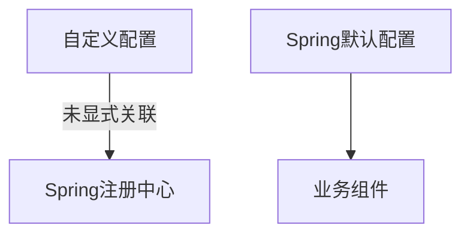
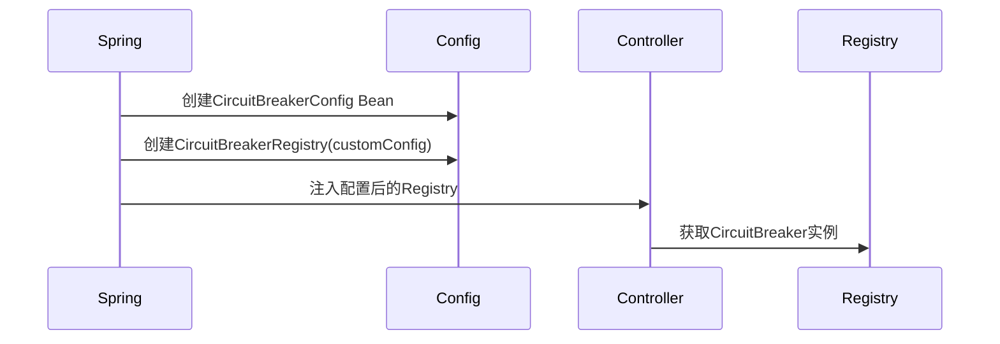

这两个配置间有什么关联？

```java
// 熔断器配置
CircuitBreakerConfig circuitConfig = CircuitBreakerConfig.custom()
    .failureRateThreshold(50) // 错误率阈值50%
    .slidingWindowType(SlidingWindowType.COUNT_BASED)
    .slidingWindowSize(100) // 统计最近100次调用
    .waitDurationInOpenState(Duration.ofSeconds(10)) // 熔断10秒
    .build();

// 降级策略
CircuitBreakerRegistry registry = CircuitBreakerRegistry.of(circuitConfig);
CircuitBreaker circuitBreaker = registry.circuitBreaker("paymentService");

// 线程池隔离
BulkheadConfig bulkheadConfig = BulkheadConfig.custom()
    .maxConcurrentCalls(20) // 最大并发数
    .maxWaitDuration(Duration.ofMillis(500)) // 等待队列超时
    .build();
Bulkhead bulkhead = Bulkhead.of("paymentPool", bulkheadConfig);
```

```java
// 注册配置类
@Configuration
public class ResilienceConfig {
    @Bean
    public CircuitBreakerRegistry circuitBreakerRegistry() {
        return CircuitBreakerRegistry.ofDefaults();
    }

    @Bean
    public BulkheadRegistry bulkheadRegistry() {
        return BulkheadRegistry.ofDefaults();
    }
}
```

--- R1

这两个配置模块之间存在 **分层配置关系** 和 **组件生命周期管理** 的关联，具体解析如下：

---

### 一、配置层次解析

#### 1. **基础配置模块**

```java
// 模块1：直接创建配置对象
CircuitBreakerConfig circuitConfig = ... // 自定义熔断规则
BulkheadConfig bulkheadConfig = ... // 自定义线程池规则

CircuitBreakerRegistry registry = CircuitBreakerRegistry.of(circuitConfig); // 注册中心绑定配置
Bulkhead bulkhead = Bulkhead.of("paymentPool", bulkheadConfig); // 直接实例化
```

**特点**：

- 硬编码方式直接创建配置
- 注册中心与配置对象强绑定
- 适用于简单场景或测试环境

#### 2. **Spring 集成配置模块**

```java
// 模块2：Spring Bean配置
@Configuration
public class ResilienceConfig {
    @Bean
    public CircuitBreakerRegistry circuitBreakerRegistry() {
        return CircuitBreakerRegistry.ofDefaults(); // 默认配置注册中心
    }

    @Bean
    public BulkheadRegistry bulkheadRegistry() {
        return BulkheadRegistry.ofDefaults(); // 默认配置注册中心
    }
}
```

**特点**：

- 通过 Spring 管理注册中心生命周期
- 可结合@ConfigurationProperties 实现动态配置
- 适用于生产环境，便于统一管理

---

### 二、关键关联点

#### 1. **配置注入路径**



#### 2. **问题分析**

- **现状**：两个配置模块**完全独立**
  - 模块 1 创建了自定义配置的 Registry
  - 模块 2 创建了默认配置的 Spring Bean Registry
- **后果**：业务 Controller 中注入的是模块 2 的默认配置 Registry，导致：
  - 熔断器使用默认参数（failureRateThreshold=50%不生效）
  - 线程池隔离配置不生效

#### 3. **正确关联方式**

```java
@Configuration
public class ResilienceConfig {
    // 将自定义配置转化为Bean
    @Bean
    public CircuitBreakerConfig customCircuitConfig() {
        return CircuitBreakerConfig.custom()
            .failureRateThreshold(50)
            .slidingWindowSize(100)
            .build();
    }

    // 注册中心绑定自定义配置
    @Bean
    public CircuitBreakerRegistry circuitBreakerRegistry(CircuitBreakerConfig config) {
        return CircuitBreakerRegistry.of(config);
    }
}
```

**调用链**：



---

### 三、生产级整合方案

#### 1. **统一配置管理**

```java
@Configuration
@ConfigurationProperties(prefix = "resilience")
public class ResilienceConfig {
    private CircuitBreakerConfig circuitBreaker;
    private BulkheadConfig bulkhead;

    @Bean
    public CircuitBreakerRegistry circuitBreakerRegistry() {
        return CircuitBreakerRegistry.of(circuitBreaker);
    }

    @Bean
    public BulkheadRegistry bulkheadRegistry() {
        return BulkheadRegistry.of(bulkhead);
    }

    // getters/setters
}
```

#### 2. **application.yaml 配置**

```yaml
resilience:
  circuit-breaker:
    failure-rate-threshold: 50
    sliding-window-size: 100
    wait-duration-in-open-state: 10s
  bulkhead:
    max-concurrent-calls: 20
    max-wait-duration: 500ms
```

#### 3. **组件获取方式**

```java
@RestController
public class PaymentController {
    private final CircuitBreaker circuitBreaker;
    private final Bulkhead bulkhead;

    // 通过Spring注入已配置的Registry
    @Autowired
    public PaymentController(
        CircuitBreakerRegistry cbRegistry,
        BulkheadRegistry bhRegistry
    ) {
        this.circuitBreaker = cbRegistry.circuitBreaker("paymentService");
        this.bulkhead = bhRegistry.bulkhead("paymentPool");
    }
}
```

---

### 四、配置继承关系验证

| **验证点**       | 模块 1+模块 2 现状  | 整合后方案             |
| ---------------- | ------------------- | ---------------------- |
| 熔断阈值是否生效 | ❌ 默认 50%         | ✅ 自定义 50%生效      |
| 线程池最大并发数 | ❌ 默认 25          | ✅ 自定义 20 生效      |
| 配置热更新能力   | ❌ 需重启           | ✅ 结合 Nacos 动态生效 |
| 多服务复用配置   | ❌ 每个服务独立配置 | ✅ 统一注册中心管理    |

---

### 五、最佳实践总结

1. **避免配置分散**：不要同时在代码和 Spring 中管理配置
2. **使用 Spring 配置优先级**：
   ```mermaid
   graph LR
       A[application.yaml] --> B[@ConfigurationProperties]
       B --> C[Registry Bean]
       C --> D[Business Component]
   ```
3. **监控配置一致性**：
   ```java
   // 启动时校验配置
   @PostConstruct
   public void validateConfig() {
       assert circuitBreaker.getCircuitBreakerConfig()
           .getFailureRateThreshold() == 50;
   }
   ```

通过正确的配置整合，可以确保 Resilience4j 的各项容错机制按预期工作，同时获得 Spring 生态的配置管理优势。
