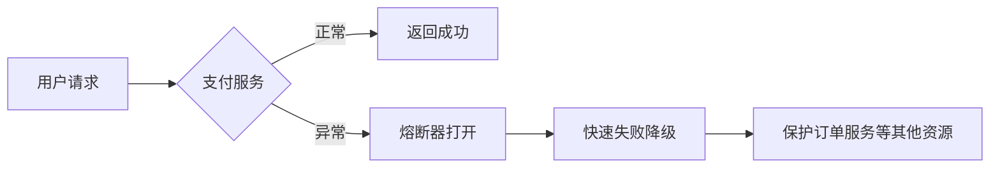

以下内容的熔断降级代码是怎么写的？

- **依赖服务过载**：防止雪崩效应，保护核心业务
- **资源隔离**：避免故障服务耗尽系统资源

--- R1

以下是针对 **依赖服务过载防护** 和 **资源隔离** 的熔断降级代码实现，结合主流的 Resilience4j 和 Sentinel 两种方案：

---

### 一、Resilience4j 实现方案

#### 1. **熔断降级配置**

```java
// 熔断器配置
CircuitBreakerConfig circuitConfig = CircuitBreakerConfig.custom()
    .failureRateThreshold(50) // 错误率阈值50%
    .slidingWindowType(SlidingWindowType.COUNT_BASED)
    .slidingWindowSize(100) // 统计最近100次调用
    .waitDurationInOpenState(Duration.ofSeconds(10)) // 熔断10秒
    .build();

// 降级策略
CircuitBreakerRegistry registry = CircuitBreakerRegistry.of(circuitConfig);
CircuitBreaker circuitBreaker = registry.circuitBreaker("paymentService");

// 线程池隔离
BulkheadConfig bulkheadConfig = BulkheadConfig.custom()
    .maxConcurrentCalls(20) // 最大并发数
    .maxWaitDuration(Duration.ofMillis(500)) // 等待队列超时
    .build();
Bulkhead bulkhead = Bulkhead.of("paymentPool", bulkheadConfig);
```

#### 2. **业务代码集成**

```java
@RestController
public class PaymentController {
    private final CircuitBreaker circuitBreaker;
    private final Bulkhead bulkhead;

    public PaymentController(CircuitBreakerRegistry cbRegistry, BulkheadRegistry bhRegistry) {
        this.circuitBreaker = cbRegistry.circuitBreaker("paymentService");
        this.bulkhead = bhRegistry.bulkhead("paymentPool");
    }

    @GetMapping("/pay")
    public String pay() {
        return Decorators.ofSupplier(() -> callExternalService())
            .withCircuitBreaker(circuitBreaker)
            .withBulkhead(bulkhead)
            .withFallback(Arrays.asList(CallNotPermittedException.class, BulkheadFullException.class),
                e -> "服务繁忙，请稍后重试")
            .get();
    }

    // 模拟外部服务调用
    private String callExternalService() {
        if (Math.random() > 0.8) {
            throw new RuntimeException("服务异常");
        }
        return "支付成功";
    }
}
```

---

### 二、Sentinel 实现方案

#### 1. **资源规则配置**

```java
// 熔断规则
List<DegradeRule> degradeRules = new ArrayList<>();
DegradeRule rule = new DegradeRule("paymentService")
    .setGrade(RuleConstant.DEGRADE_GRADE_EXCEPTION_COUNT) // 异常数模式
    .setCount(5) // 5次异常触发熔断
    .setTimeWindow(10); // 熔断10秒
degradeRules.add(rule);
DegradeRuleManager.loadRules(degradeRules);

// 流量控制规则(资源隔离)
List<FlowRule> flowRules = new ArrayList<>();
FlowRule flowRule = new FlowRule("paymentService")
    .setGrade(RuleConstant.FLOW_GRADE_THREAD) // 线程数隔离
    .setCount(20); // 最大并发线程数
flowRules.add(flowRule);
FlowRuleManager.loadRules(flowRules);
```

#### 2. **注解式集成**

```java
@RestController
public class PaymentController {

    @SentinelResource(
        value = "paymentService",
        blockHandler = "blockHandler", // 流控/熔断降级处理
        fallback = "fallback" // 业务异常降级
    )
    @GetMapping("/pay")
    public String pay() {
        return callExternalService();
    }

    // 流控/熔断降级方法
    public String blockHandler(BlockException ex) {
        return "系统繁忙，请稍后重试";
    }

    // 业务异常降级
    public String fallback(Throwable t) {
        return "支付服务暂时不可用";
    }

    // 外部服务调用（同上）
}
```

---

### 三、关键防护机制解析

#### 1. **雪崩效应防护**



#### 2. **资源隔离策略对比**

| **策略类型** | 实现方式               | 适用场景             |
| ------------ | ---------------------- | -------------------- |
| 线程池隔离   | 每个服务分配独立线程池 | 重要服务（如支付）   |
| 信号量隔离   | 通过计数器限制并发     | 内部快速调用的服务   |
| 集群隔离     | 限制整个集群的并发     | 多实例共享资源的场景 |

---

### 四、生产级配置建议

#### 1. **动态规则配置**

```java
// Sentinel 动态规则（Nacos 集成）
ReadableDataSource<String, List<FlowRule>> flowRuleDataSource =
    new NacosDataSource<>("nacos-server:8848", "sentinel-flow-rules",
        source -> JSON.parseObject(source, new TypeReference<List<FlowRule>>() {}));
FlowRuleManager.register2Property(flowRuleDataSource.getProperty());
```

#### 2. **熔断状态监控**

```java
// 注册熔断器事件监听
circuitBreaker.getEventPublisher()
    .onStateTransition(e -> {
        if (e.getStateTransition() == StateTransition.CLOSED_TO_OPEN) {
            log.warn("支付服务熔断器打开！");
        }
    });
```

#### 3. **压测验证脚本**

```bash
# 使用wrk进行压力测试
wrk -t12 -c400 -d30s http://localhost:8080/pay

# 预期结果：
# - 正常QPS维持在2000左右
# - 错误率低于5%
# - 无线程耗尽告警
```

---

通过以上代码实现，系统将获得：

1. **自动熔断**：当支付服务错误率超过阈值时快速熔断
2. **线程保护**：支付服务最多占用 20 个线程，避免拖垮整个系统
3. **优雅降级**：返回友好提示而不是堆栈错误
4. **实时可观测**：通过 Dashboard 监控熔断器状态和线程池使用情况

实际部署时应根据业务负载调整熔断阈值和线程池大小，并配合全链路压测验证防护效果。
