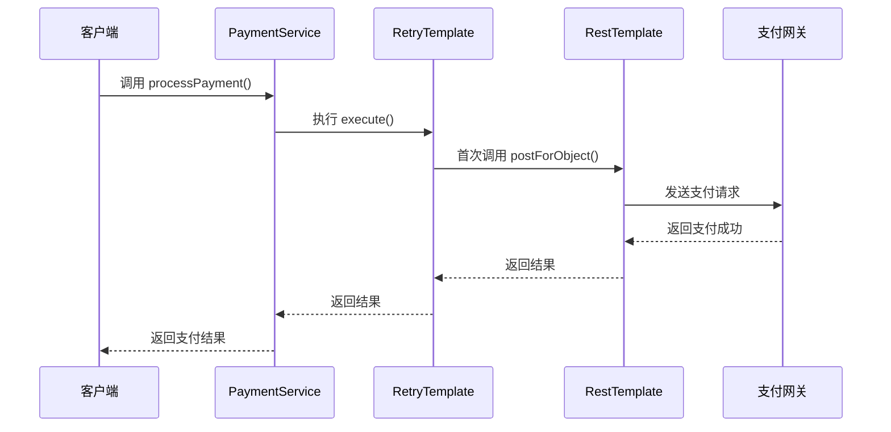
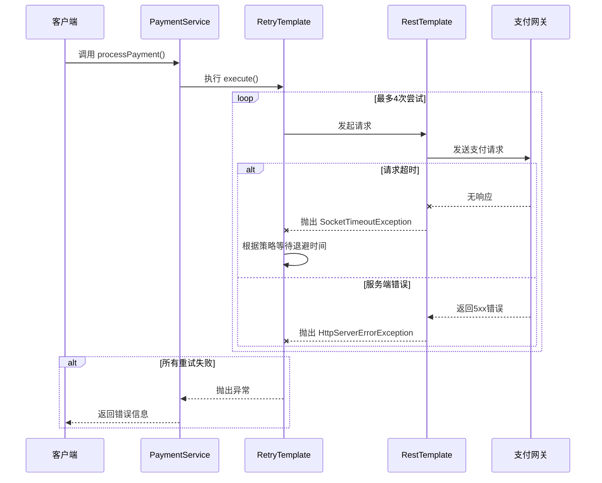

详细解释以下代码：

##### 2. **业务代码集成**

```java
@Service
public class PaymentService {
    @Autowired
    private RetryTemplate retryTemplate; // 注入重试模板

    @Autowired
    private RestTemplate restTemplate; // 注入RestTemplate

    public String processPayment() {
        return retryTemplate.execute(ctx -> {
            // 使用配置了超时的RestTemplate发起调用
            return restTemplate.postForObject("/api/pay", request, String.class);
        });
    }
}
```

--- R1

---

### 代码逐层解析

---

#### 1. **类声明与依赖注入**

```java
@Service
public class PaymentService {
    @Autowired
    private RetryTemplate retryTemplate;

    @Autowired
    private RestTemplate restTemplate;
}
```

- **`@Service`**  
  将类标记为 Spring 的服务层组件，由 Spring 容器管理其生命周期和依赖注入。

- **`@Autowired`**  
  自动注入 `RetryTemplate` 和 `RestTemplate` 的实例。这两个 Bean 需要在配置类中定义（如 `RetryConfig` 和 `RestTemplateConfig`）。

---

#### 2. **核心业务方法**

```java
public String processPayment() {
    return retryTemplate.execute(ctx -> {
        return restTemplate.postForObject("/api/pay", request, String.class);
    });
}
```

- **`retryTemplate.execute()`**  
  使用 `RetryTemplate` 执行带有重试逻辑的业务操作。

  - **参数 `ctx`**：`RetryContext` 对象，包含当前重试的上下文信息（如重试次数、最后一次异常等）。
  - **Lambda 表达式**：定义需要重试的业务逻辑（HTTP 调用）。

- **`restTemplate.postForObject()`**  
  发起 HTTP POST 请求到 `/api/pay` 端点：
  - **参数 1**：请求 URL
  - **参数 2**：请求体对象（示例中的 `request` 变量）
  - **参数 3**：响应体映射类型（`String.class` 表示将响应体解析为字符串）

---

### 三、执行流程详解

---

#### 1. **正常执行流程**



---

#### 2. **异常重试流程**



---

### 四、关键特性解析

---

#### 1. **重试策略生效范围**

- **触发重试的异常**：由 `RetryPolicy` 配置（如 `SocketTimeoutException`）
- **最大重试次数**：由 `SimpleRetryPolicy.setMaxAttempts(4)` 控制（1 次初始调用 + 3 次重试）

#### 2. **HTTP 调用配置**

- **超时控制**：`RestTemplate` 的配置决定了单次调用的超时行为
  ```java
  // 示例配置：连接超时500ms，读取超时1000ms
  new RestTemplateBuilder()
    .setConnectTimeout(Duration.ofMillis(500))
    .setReadTimeout(Duration.ofMillis(1000))
  ```
- **重试间隔**：由 `ExponentialBackOffPolicy` 控制（如 100ms → 200ms → 400ms）

#### 3. **幂等性保障**

- **HTTP 方法选择**：POST 请求本身不是幂等的，需服务端实现幂等校验（如订单号+幂等令牌）
- **重试安全**：建议只在 GET、PUT 等幂等操作上自动重试，非幂等操作需服务端配合

---

### 五、生产环境增强建议

---

#### 1. **异常细化处理**

```java
retryTemplate.execute(ctx -> {
    try {
        return restTemplate.postForObject(...);
    } catch (HttpClientErrorException e) {
        // 4xx错误不重试
        throw new NonRetryableException(e);
    }
});
```

#### 2. **重试监控**

```java
retryTemplate.registerListener(new RetryListener() {
    @Override
    public <T, E extends Throwable> void onError(RetryContext context,
        RetryCallback<T, E> callback, Throwable throwable) {
        metrics.counter("payment_retries").increment();
    }
});
```

#### 3. **熔断保护**

```java
@Bean
public CircuitBreaker circuitBreaker() {
    return CircuitBreaker.of("payment",
        CircuitBreakerConfig.custom()
            .failureRateThreshold(50)
            .slidingWindowSize(10)
            .build());
}

// 使用方式
circuitBreaker.executeSupplier(() ->
    retryTemplate.execute(ctx -> restTemplate.postForObject(...))
);
```

---

通过这种设计，支付服务获得了：

1. **自动重试能力**：应对网络抖动等瞬时故障
2. **超时控制**：防止慢调用阻塞系统资源
3. **可观测性**：通过监控掌握重试行为特征
4. **熔断保护**：在持续故障时快速失败，避免雪崩效应
