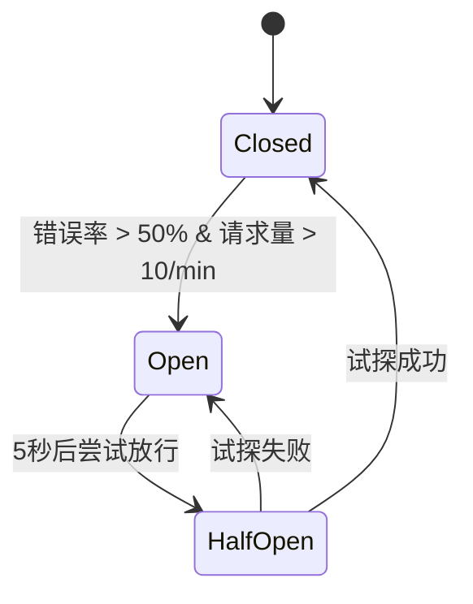

熔断降级是什么情况？
| 第三方服务调用异常 | 熔断降级 + AOP 日志 | Hystrix/Sentinel |
--- R1

### 熔断降级详解

#### 1. 熔断降级的核心作用

熔断降级是一种 **服务容错保护机制**，主要用于解决以下问题：

- **第三方服务不稳定**：接口超时、高错误率
- **依赖服务过载**：防止雪崩效应，保护核心业务
- **资源隔离**：避免故障服务耗尽系统资源

#### 2. 触发场景示例

```java
// 调用第三方支付接口
@SentinelResource(value = "payApi", fallback = "localPayFallback")
public PaymentResult callPayment(PaymentRequest req) {
    return paymentClient.execute(req); // 可能抛出超时或异常
}

// 降级方法
public PaymentResult localPayFallback(PaymentRequest req) {
    return PaymentResult.error("系统繁忙，请稍后重试");
}
```

#### 3. 熔断器工作流程



#### 4. Hystrix vs Sentinel 对比

| **特性** | Hystrix              | Sentinel                          |
| -------- | -------------------- | --------------------------------- |
| 熔断策略 | 基于错误百分比       | 支持异常数、异常比例、响应时间    |
| 规则配置 | 代码/配置文件        | 动态规则（支持 Nacos 等配置中心） |
| 流量控制 | 有限支持             | 精细化 QPS/线程数控制             |
| 实时监控 | Hystrix Dashboard    | Sentinel Dashboard + Prometheus   |
| 生态适配 | Spring Cloud Netflix | Spring Cloud Alibaba              |

#### 5. AOP 集成方案

```java
@Aspect
@Component
public class CircuitBreakerAspect {
    // 记录熔断事件
    @AfterThrowing(pointcut = "@annotation(sentinelResource)", throwing = "ex")
    public void logCircuitBreak(JoinPoint jp, SentinelResource sentinelResource, Exception ex) {
        String resource = sentinelResource.value();
        log.warn("资源 {} 触发熔断，异常类型：{}", resource, ex.getClass());
        Metrics.counter("circuit_breaker", "resource", resource).increment();
    }

    // 记录降级事件
    @AfterReturning(pointcut = "@annotation(sentinelResource)", returning = "result")
    public void logFallback(JoinPoint jp, SentinelResource sentinelResource, Object result) {
        if (result instanceof FallbackResult) {
            log.info("资源 {} 触发降级，返回兜底结果", sentinelResource.value());
        }
    }
}
```

#### 6. 生产配置建议（以 Sentinel 为例）

```yaml
sentinel:
  datasource:
    ds1:
      nacos:
        server-addr: localhost:8848
        dataId: sentinel-rules
        rule-type: degrade # 熔断降级规则
---
# Nacos 配置内容
[
  {
    "resource": "payApi",
    "grade": 1, # 异常数模式
    "count": 5, # 触发阈值
    "timeWindow": 10, # 熔断时长(秒)
    "minRequestAmount": 10, # 最小请求数
    "statIntervalMs": 1000, # 统计窗口
  },
]
```

#### 7. 分级容错策略

| **故障级别** | 处理方式     | 技术实现                     |
| ------------ | ------------ | ---------------------------- |
| 短暂抖动     | 超时重试     | RetryTemplate + 退避策略     |
| 部分失败     | 熔断+降级    | Sentinel 熔断规则 + Fallback |
| 完全不可用   | 切换备用服务 | 服务路由权重调整             |
| 灾难性故障   | 全局限流     | Sentinel 集群流控            |

#### 8. 效果验证方法

1. **混沌测试**：使用 Chaos Monkey 模拟第三方服务延迟/异常
2. **压力测试**：观察熔断触发后系统负载变化
   ```bash
   wrk -t12 -c400 -d30s http://api/pay
   ```
3. **监控指标**：
   - 熔断状态变化（Sentinel Dashboard）
   - 系统吞吐量（QPS/TPS）
   - 错误率（5xx 比例）

通过熔断降级机制，系统可在第三方服务异常时 **自动切换运行模式**，在保障核心业务可用的前提下，通过 AOP 日志实现故障的实时追踪与分析，最终形成从故障防御到问题定位的完整闭环。
