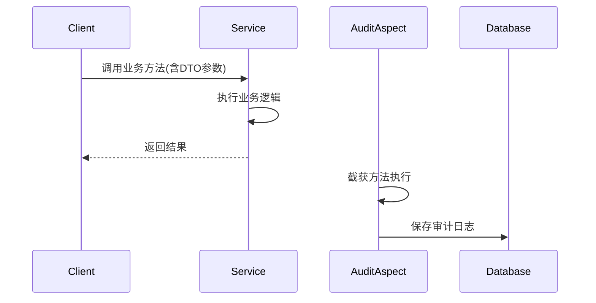

这是审计方法中的数据库审计日志表还是什么，似乎是使用了 aop，但事实上还是创建是数据库审计日志表？

#### 3. 审计日志接口

```java
@Aspect
@Component
public class AuditAspect {
    @AfterReturning(
        pointcut = "execution(* com.example.service.*Processor.*(..)) && args(dto)",
        returning = "result"
    )
    public void logAudit(JoinPoint joinPoint, Object dto, Object result) {
        AuditLog log = AuditLog.builder()
            .operation(joinPoint.getSignature().getName())
            .targetId(getSprinklerId(dto))
            .status(result instanceof SuccessResult ? "SUCCESS" : "FAILED")
            .build();
        auditLogRepository.save(log);
    }
}
```

--- R1

### 一、代码核心功能解析

这段代码实现了 **基于 AOP 的数据库审计日志记录**，主要功能是在业务操作完成后自动记录操作日志到数据库。以下是关键要素解析：

---

#### 1. **核心组件说明**

| 组件/注解         | 作用                                                             |
| ----------------- | ---------------------------------------------------------------- |
| `@Aspect`         | 声明该类为切面组件                                               |
| `@Component`      | 纳入 Spring 容器管理                                             |
| `@AfterReturning` | 后置通知，在目标方法**成功执行后**触发                           |
| `pointcut`        | 定义切入点：拦截 `service` 包下所有 `Processor` 后缀类的任意方法 |
| `args(dto)`       | 匹配方法参数包含名为 `dto` 的参数                                |
| `JoinPoint`       | 提供被拦截方法的元数据（如方法名、参数等）                       |

---

### 二、审计日志记录流程

#### 1. **执行流程图**



#### 2. **日志记录关键步骤**

1. **方法拦截**：匹配 `*Processor` 类的所有方法
2. **参数提取**：获取方法中的 `dto` 参数
3. **日志构建**：
   - 操作名称：通过 `joinPoint.getSignature().getName()` 获取
   - 目标 ID：从 DTO 中提取设备 ID
   - 状态：根据返回结果判断成功/失败
4. **持久化存储**：调用 `auditLogRepository.save(log)`

---

### 三、技术实现细节

#### 1. **审计日志表结构示例**

```sql
CREATE TABLE audit_log (
    id BIGINT PRIMARY KEY AUTO_INCREMENT,
    operation VARCHAR(50) NOT NULL,  -- 操作方法名
    target_id VARCHAR(36) NOT NULL,  -- 设备ID
    status VARCHAR(10) NOT NULL,     -- 执行状态
    created_time DATETIME DEFAULT CURRENT_TIMESTAMP
);
```

#### 2. **切入点表达式详解**

```java
execution(* com.example.service.*Processor.*(..)) && args(dto)
```

- `*Processor`：匹配所有以 Processor 结尾的类
- `*(..)`：匹配任意方法（任何参数）
- `args(dto)`：要求方法包含名为 dto 的参数

#### 3. **状态判断逻辑**

```java
status = result instanceof SuccessResult ? "SUCCESS" : "FAILED"
```

- 假设业务方法统一返回 `SuccessResult` 或 `FailureResult`
- 实际项目中建议使用自定义注解标注成功状态

---

### 四、设计优缺点分析

#### **优势**

1. **解耦性**：业务代码无需包含日志记录逻辑
2. **统一管理**：所有 Processor 类的方法自动记录日志
3. **可扩展性**：易于添加新的日志字段或处理逻辑

#### **潜在问题**

1. **性能影响**：频繁的数据库写入可能成为瓶颈
   - **优化方案**：采用异步批量写入
     ```java
     @Async
     public void logAudit(...) {
         // 异步处理
     }
     ```
2. **异常未覆盖**：仅记录成功情况，需补充异常捕获
   - 增加 `@AfterThrowing` 通知处理失败情况
     ```java
     @AfterThrowing(pointcut = "execution(* com.example.service.*Processor.*(..))", throwing = "ex")
     public void logException(JoinPoint joinPoint, Exception ex) {
         // 记录异常日志
     }
     ```

---

### 五、生产环境建议

#### 1. **日志分级存储**

```java
public void logAudit(...) {
    if (isCriticalOperation(joinPoint)) { // 关键操作同步写入
        auditLogRepository.save(log);
    } else {                             // 普通操作进入队列
        mqTemplate.send("audit_queue", log);
    }
}
```

#### 2. **敏感数据脱敏**

```java
private String getSprinklerId(Object dto) {
    String rawId = dto.getSprinklerId();
    return maskSensitiveData(rawId); // 对ID进行脱敏处理
}
```

#### 3. **上下文增强**

```java
log.setOperator(SecurityContextHolder.getContext().getUsername()); // 记录操作人
log.setIpAddress(RequestContextHolder.getRequest().getRemoteAddr()); // 记录IP
```

---

### 六、与传统数据库审计对比

| **维度**     | **AOP 审计方案**             | **数据库自带审计**               |
| ------------ | ---------------------------- | -------------------------------- |
| **实现层级** | 应用层                       | 数据库层                         |
| **记录内容** | 业务操作语义（如"allocate"） | SQL 执行日志（如 INSERT/UPDATE） |
| **性能影响** | 可控（通过异步优化）         | 可能较大（依赖数据库实现）       |
| **可读性**   | 业务友好（包含领域术语）     | 技术导向（显示 SQL 语句）        |
| **存储方式** | 自定义表结构                 | 数据库系统表                     |
| **改造成本** | 需开发代码                   | 只需配置数据库参数               |

---

通过这种设计，系统实现了 **业务操作可追溯性**，同时平衡了功能需求与技术实现。实际应用中可根据审计等级要求，组合使用应用层和数据库层的审计机制。
