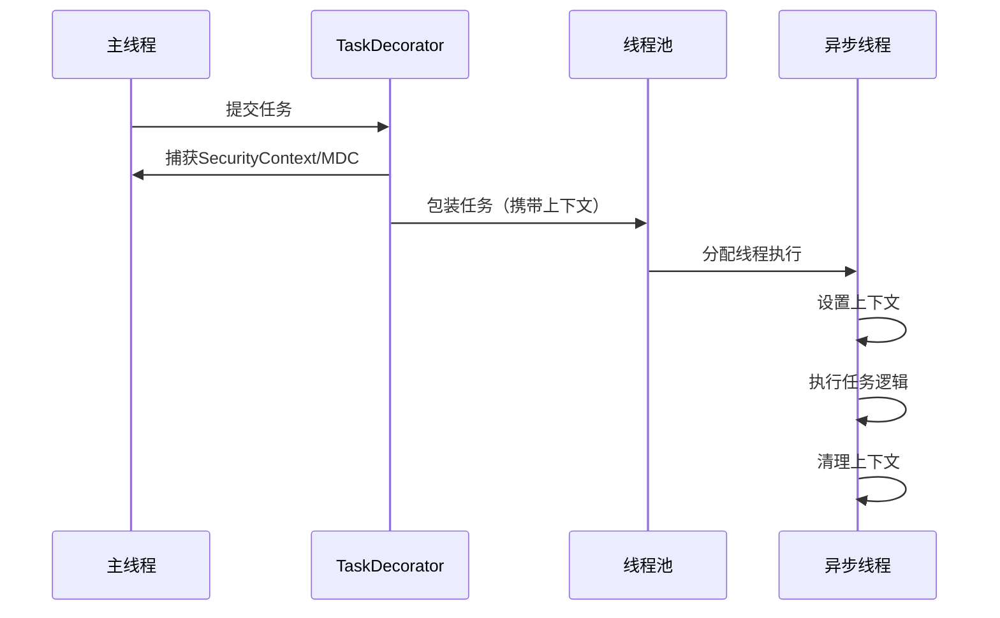

在 auditExecutor 中添加上下文传递配置的目的是什么？

#### 2. **上下文传递配置**

```java
@Bean("auditExecutor")
public Executor auditExecutor() {
    ThreadPoolTaskExecutor executor = new ThreadPoolTaskExecutor();
    // 添加上下文传递装饰器
    executor.setTaskDecorator(new ContextCopyingDecorator());
    return executor;
}

public class ContextCopyingDecorator implements TaskDecorator {
    @Override
    public Runnable decorate(Runnable runnable) {
        // 捕获当前线程上下文
        SecurityContext context = SecurityContextHolder.getContext();
        Map<String, String> mdc = MDC.getCopyOfContextMap();

        return () -> {
            try {
                SecurityContextHolder.setContext(context);
                if (mdc != null) MDC.setContextMap(mdc);
                runnable.run();
            } finally {
                SecurityContextHolder.clearContext();
                MDC.clear();
            }
        };
    }
}
```

--- R1

### 在 `auditExecutor` 中添加上下文传递配置的核心目的是：**确保异步任务能正确继承并隔离调用线程的上下文信息**，主要解决以下关键问题：

---

#### 一、解决的关键问题

| **上下文类型**       | **未传递时的表现**                   | **传递后的效果**                 |
| -------------------- | ------------------------------------ | -------------------------------- |
| **SecurityContext**  | 异步线程无法获取用户认证信息         | 保持用户身份信息，权限校验正常   |
| **MDC 日志追踪**     | 日志丢失请求 ID 等关键追踪信息       | 日志链路完整，支持请求全链路追踪 |
| **事务上下文**       | 异步操作无法参与原事务（需单独配置） | 明确异步任务的事务边界           |
| **ThreadLocal 变量** | 业务自定义的线程局部变量丢失         | 按需传递业务相关上下文           |

---

#### 二、实现机制解析



---

#### 三、关键代码段解析

```java
public class ContextCopyingDecorator implements TaskDecorator {
    @Override
    public Runnable decorate(Runnable runnable) {
        // 1. 捕获提交线程的上下文快照
        SecurityContext context = SecurityContextHolder.getContext(); // Spring Security
        Map<String, String> mdc = MDC.getCopyOfContextMap(); // SLF4J MDC

        return () -> {
            try {
                // 2. 异步线程执行前注入上下文
                SecurityContextHolder.setContext(context);
                if (mdc != null) MDC.setContextMap(mdc);

                // 3. 执行业务逻辑
                runnable.run();
            } finally {
                // 4. 清理避免上下文污染
                SecurityContextHolder.clearContext();
                MDC.clear();
            }
        };
    }
}
```

---

#### 四、生产环境必要性

1. **安全审计合规性**

   - 异步操作（如订单处理）必须记录操作用户身份
   - 未传递安全上下文会导致审计日志中用户信息缺失

2. **分布式追踪完整性**

   - 假设使用 `TraceID` 串联全链路日志：
     ```bash
     # 无上下文传递
     [Async-1] INFO ... - Processing payment
     # 有上下文传递
     [Async-1] [TraceID=abc123] INFO ... - Processing payment
     ```

3. **资源泄漏防护**
   - 线程池复用线程时，残留的上下文可能导致：
     - 用户 A 的操作使用用户 B 的权限
     - 日志中混杂不同请求的信息

---

#### 五、配置注意事项

1. **性能权衡**

   - 上下文拷贝会增加单次任务提交开销（约 0.2~1ms）
   - 建议：对安全/追踪敏感的场景开启，普通日志任务可选

2. **自定义扩展**

   ```java
   // 扩展传递业务上下文
   public class BizContextDecorator extends ContextCopyingDecorator {
       @Override
       public Runnable decorate(Runnable runnable) {
           Runnable wrapped = super.decorate(runnable);
           BizContext bizContext = BizContextHolder.get();
           return () -> {
               try {
                   BizContextHolder.set(bizContext);
                   wrapped.run();
               } finally {
                   BizContextHolder.clear();
               }
           };
       }
   }
   ```

3. **与 @Async 的兼容性**
   - 本方案适用于所有线程池提交场景
   - 若使用 `@Async` 注解，需配合 `AsyncConfigurer` 配置

---

通过这种设计，系统实现了 **安全无痛的上下文传递**，为异步操作提供了与同步调用一致的上下文环境，是构建可靠企业级应用的重要基础设施。
