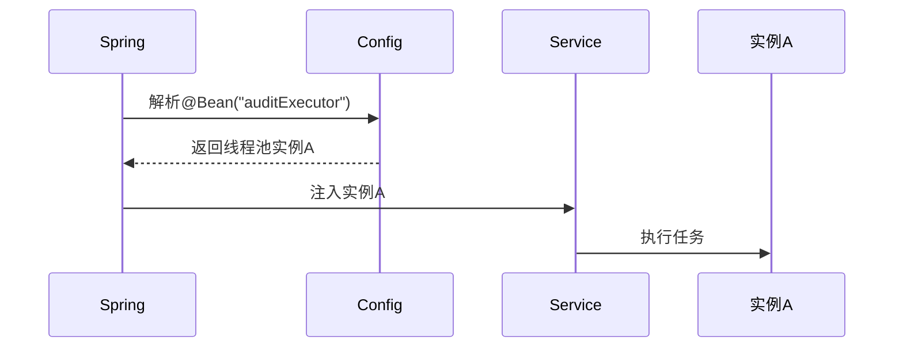

下面代码能复用线程池的原因是什么？

```java
@Configuration
@EnableAsync
public class AsyncConfig {

    @Bean("auditExecutor")
    public Executor auditTaskExecutor() {
        ThreadPoolTaskExecutor executor = new ThreadPoolTaskExecutor();
        executor.setCorePoolSize(5);
        executor.setMaxPoolSize(10);
        executor.setQueueCapacity(100);
        executor.setThreadNamePrefix("audit-");
        executor.setRejectedExecutionHandler(new ThreadPoolExecutor.CallerRunsPolicy());
        executor.initialize();
        return executor;
    }
}
```

```java
    @Bean
    @Qualifier("auditExecutor")
    public Executor auditExecutor() {
        // 复用配置类中的线程池
        return new ThreadPoolTaskExecutor(); // 实际从配置类获取
    }
```

--- R1
这两个代码段实际上存在 **配置冲突**，并不能正确复用线程池。以下是对问题的详细分析和正确实现方式：

---

### 一、原代码问题解析

#### 1. **错误复现过程**

```java
// 代码段1：正确声明线程池
@Bean("auditExecutor")  // 定义名为 auditExecutor 的Bean
public Executor auditTaskExecutor() {
    return new ThreadPoolTaskExecutor();
}

// 代码段2：错误覆盖定义
@Bean
@Qualifier("auditExecutor") // 试图复用同名Bean
public Executor auditExecutor() {
    return new ThreadPoolTaskExecutor(); // 实际上创建了新实例
}
```

#### 2. **导致的问题**

- **Bean 名称冲突**：两个方法都声明了名为 `auditExecutor` 的 Bean
- **实际效果**：后定义的 Bean 会覆盖前者，最终容器中只有第二个线程池实例
- **结果**：线程池并未复用，反而创建了冗余实例

---

### 二、正确复用线程池方案

#### 1. **单一定义线程池**

```java
@Configuration
@EnableAsync
public class AsyncConfig {
    // 唯一线程池定义
    @Bean("auditExecutor")
    public Executor auditTaskExecutor() {
        ThreadPoolTaskExecutor executor = new ThreadPoolTaskExecutor();
        // 具体配置参数
        return executor;
    }
}
```

#### 2. **在需要处注入使用**

```java
@Service
public class AuditService {

    // 通过名称注入
    @Autowired
    @Qualifier("auditExecutor")
    private Executor auditExecutor;

    public void asyncProcess() {
        CompletableFuture.runAsync(() -> {
            // 异步任务逻辑
        }, auditExecutor);
    }
}
```

#### 3. **AOP 切面中的正确引用**

```java
@Aspect
@Component
public class AuditAspect {
    // 直接引用Bean名称
    @Async("auditExecutor")
    public void logAudit(...) {
        // 异步处理逻辑
    }
}
```

---

### 三、线程池复用原理

#### 1. **Spring IoC 容器机制**

- **Bean 单例性**：默认情况下，Spring 管理的 Bean 是单例的
- **名称唯一性**：同一上下文中相同名称的 Bean 只会存在一个实例
- **依赖查找**：通过 `@Qualifier` 或 Bean 名称精确获取已存在的实例

#### 2. **复用过程示例**



---

### 四、配置优化建议

#### 1. **参数化配置（最佳实践）**

```java
@Bean("auditExecutor")
public Executor auditExecutor(
    @Value("${async.audit.core-pool:5}") int corePoolSize,
    @Value("${async.audit.max-pool:10}") int maxPoolSize
) {
    ThreadPoolTaskExecutor executor = new ThreadPoolTaskExecutor();
    executor.setCorePoolSize(corePoolSize);
    executor.setMaxPoolSize(maxPoolSize);
    return executor;
}
```

#### 2. **监控集成**

```java
@Bean
public ExecutorExecutorServiceAdapter auditExecutorAdapter(
    @Qualifier("auditExecutor") ThreadPoolTaskExecutor executor) {
    return new ExecutorServiceAdapter(executor.getThreadPoolExecutor());
}

// 接入Micrometer监控
@Bean
public MeterBinder auditThreadPoolMetrics(
    @Qualifier("auditExecutorAdapter") ExecutorService executor) {
    return new ThreadPoolMetrics(executor, "audit");
}
```

---

### 五、常见错误场景

#### 1. **错误：重复定义 Bean**

```java
// ❌ 错误示例：两个方法产生同名Bean
@Bean("auditExecutor")
public Executor method1() { return new ThreadPoolTaskExecutor(); }

@Bean("auditExecutor")
public Executor method2() { return new ThreadPoolTaskExecutor(); }
```

#### 2. **错误：错误使用@Primary**

```java
@Bean
@Primary // 导致线程池被意外覆盖
public Executor defaultExecutor() {
    return new SimpleAsyncTaskExecutor();
}
```

---

通过遵循 **单一定义、多处复用** 的原则，可以确保线程池实例在 Spring 上下文中真正实现复用。这种设计既能保证系统资源的合理利用，又能通过统一配置提升可维护性。
