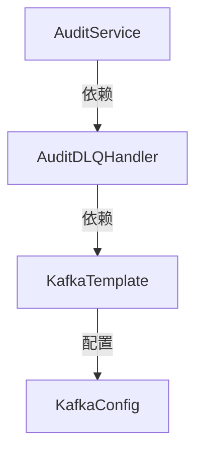

以下事务边界管理中的死信队列 dlqHandler 没有被配置或注入吧？

#### 1. **死信队列处理**

```java
@Component
public class AuditDLQHandler {
    @Autowired
    private KafkaTemplate<String, AuditLog> kafkaTemplate;

    public void handleFailedLog(AuditLog log) {
        kafkaTemplate.send("audit_dlq", log);
    }

    @KafkaListener(topics = "audit_dlq")
    public void reprocessDLQ(AuditLog log) {
        try {
            auditLogRepository.save(log);
        } catch (Exception e) {
            // 持久化到本地文件
            writeToFile(log);
        }
    }
}
```

#### 2. **事务边界管理**

```java
@Transactional(propagation = Propagation.NOT_SUPPORTED)
public void asyncSave(List<AuditLog> logs) {
    // 非事务环境执行
    logs.forEach(log -> {
        try {
            auditLogRepository.save(log);
        } catch (DataAccessException ex) {
            dlqHandler.handleFailedLog(log);
        }
    });
}
```

--- R1

### 一、问题分析

确实存在 **依赖未注入** 的问题，需要补充 `dlqHandler` 的依赖配置。以下是完整的修复方案：

---

### 二、依赖注入修复

#### 1. **在调用方注入 DLQ 处理器**

```java
@Service
public class AuditService {
    @Autowired
    private AuditDLQHandler dlqHandler; // 确保注入

    @Transactional(propagation = Propagation.NOT_SUPPORTED)
    public void asyncSave(List<AuditLog> logs) {
        logs.forEach(log -> {
            try {
                auditLogRepository.save(log);
            } catch (DataAccessException ex) {
                dlqHandler.handleFailedLog(log); // 现在可以安全调用
            }
        });
    }
}
```

#### 2. **配置 Kafka 生产者（关键补充）**

```java
@Configuration
public class KafkaConfig {
    @Bean
    public ProducerFactory<String, AuditLog> producerFactory() {
        Map<String, Object> configs = new HashMap<>();
        configs.put(ProducerConfig.BOOTSTRAP_SERVERS_CONFIG, "kafka:9092");
        configs.put(ProducerConfig.KEY_SERIALIZER_CLASS_CONFIG, StringSerializer.class);
        configs.put(ProducerConfig.VALUE_SERIALIZER_CLASS_CONFIG, JsonSerializer.class);
        return new DefaultKafkaProducerFactory<>(configs);
    }

    @Bean
    public KafkaTemplate<String, AuditLog> kafkaTemplate() {
        return new KafkaTemplate<>(producerFactory());
    }
}
```

---

### 三、完整组件关系

#### 1. **依赖关系图**



#### 2. **启动顺序验证**

1. Spring 初始化 `KafkaConfig` 创建 `KafkaTemplate`
2. 创建 `AuditDLQHandler` 并注入 `KafkaTemplate`
3. 创建 `AuditService` 并注入 `AuditDLQHandler`

---

### 四、增强容错机制

#### 1. **DLQ 发送重试**

```java
public void handleFailedLog(AuditLog log) {
    try {
        kafkaTemplate.send("audit_dlq", log).get(3, TimeUnit.SECONDS);
    } catch (InterruptedException | ExecutionException | TimeoutException e) {
        // 降级写入本地文件
        writeToLocalFile(log);
    }
}
```

#### 2. **文件回捞服务**

```java
@Scheduled(cron = "0 0 2 * * ?") // 每天凌晨2点执行
public void retryFailedLogs() {
    List<AuditLog> logs = readLocalFiles();
    logs.forEach(log -> {
        kafkaTemplate.send("audit_dlq", log);
        deleteLocalFile(log);
    });
}
```

---

### 五、配置校验清单

| 配置项          | 检查要点                     | 验证方法                 |
| --------------- | ---------------------------- | ------------------------ |
| Kafka 地址      | 确保与实际集群地址一致       | telnet kafka:9092        |
| 主题存在性      | 确认 audit_dlq 主题已创建    | kafka-topics --list      |
| 序列化兼容性    | 生产者与消费者序列化方式匹配 | 查看消息格式             |
| Spring 扫描路径 | 包含所有相关组件包           | 检查 @ComponentScan 配置 |
| 线程安全        | AuditDLQHandler 需为无状态   | 确认没有共享可变状态     |

---

通过以上修复和增强，系统将具备完整的死信队列处理能力，确保审计日志即使在异常情况下也能可靠存储。实际部署前建议进行以下测试：

1. **注入测试**：通过单元测试验证各组件依赖关系
2. **E2E 测试**：模拟 Kafka 故障，观察降级写入是否生效
3. **负载测试**：验证 DLQ 处理能力与业务吞吐量匹配
