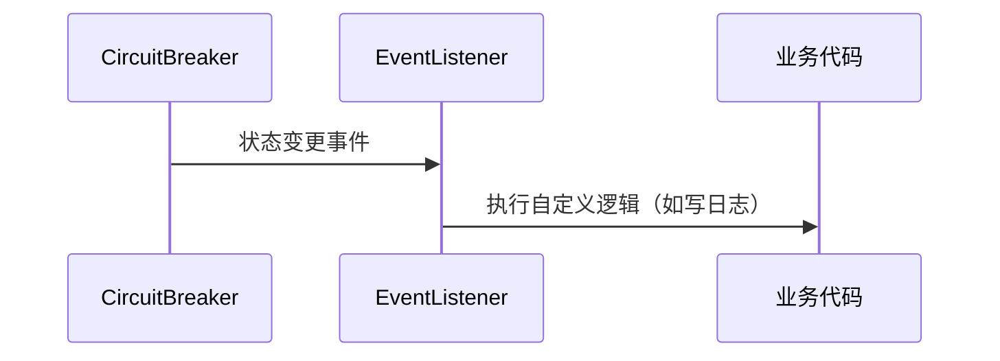
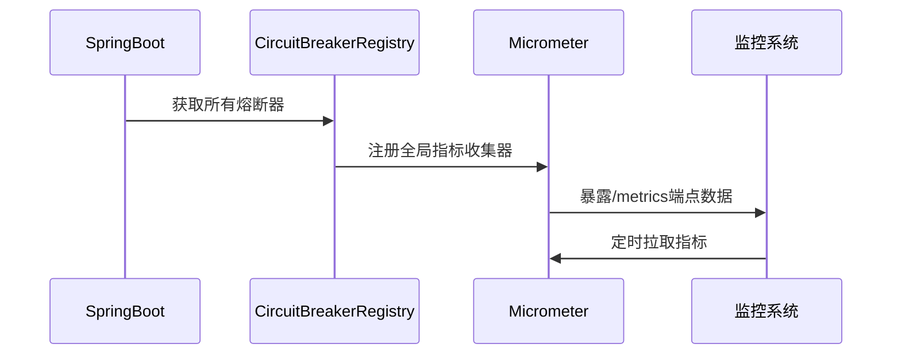

这两种监控方法有什么区别吗？层级上的,比如实际对应不同的处理流程？我只知道 circuitBreaker 只监听状态变化并在日志中监控。MeterRegistryCustomizer<MeterRegistry>对象监控所有 CircuitBreakerRegistry 注册中心的熔断器实例的状态变化，由 springboot 完成管理？

#### 2. **熔断状态监控**

```java
// 注册熔断器事件监听
circuitBreaker.getEventPublisher()
    .onStateTransition(e -> {
        if (e.getStateTransition() == StateTransition.CLOSED_TO_OPEN) {
            log.warn("支付服务熔断器打开！");
        }
    });
```

2. **配置变更监控**

   ```java
   @Bean
   public MeterRegistryCustomizer<MeterRegistry> resilienceMetrics(CircuitBreakerRegistry registry) {
       return r -> registry.getAllCircuitBreakers()
           .forEach(cb -> cb.getEventPublisher()
               .onStateTransition(e ->
                   metricsCounter.increment("circuit_breaker_state_change")));
   }
   ```

--- R1

---

### 两种监控方法的层级与流程差异分析

---

#### 一、核心差异概览

| **维度**         | **熔断器事件监听**                   | **MeterRegistryCustomizer 指标监控**       |
| ---------------- | ------------------------------------ | ------------------------------------------ |
| **监控层级**     | 单个 `CircuitBreaker` 实例级别       | 全局 `CircuitBreakerRegistry` 注册中心级别 |
| **触发机制**     | 直接订阅熔断器的事件流               | 通过 Spring Boot Actuator 集成指标系统     |
| **数据处理方式** | 自定义业务逻辑（如日志、告警）       | 标准化指标采集（如 Prometheus 格式）       |
| **代码侵入性**   | 需显式注册到每个熔断器               | 自动应用于所有熔断器                       |
| **生命周期管理** | 由开发者手动管理                     | 由 Spring 容器统一管理                     |
| **典型应用场景** | 需要立即响应的业务操作（如发送告警） | 长期趋势分析、监控大盘                     |

---

#### 二、执行流程对比

##### 1. **熔断器事件监听流程**



- **特点**：
  - 事件驱动模型，实时性高
  - 需为每个熔断器单独注册监听器
  - 示例代码：
    ```java
    circuitBreaker.getEventPublisher()
        .onStateTransition(e -> log.info("状态变更: {}", e));
    ```

##### 2. **MeterRegistryCustomizer 监控流程**



- **特点**：
  - 基于 Spring Boot Actuator 的指标系统
  - 自动聚合所有熔断器的状态数据
  - 示例指标输出：
    ```
    circuit_breaker_state_change_total{name="paymentService",state="OPEN"} 3
    ```

---

#### 三、生产环境配合使用建议

##### 1. **组合方案**

```java
// 业务级监听（快速响应）
circuitBreaker.getEventPublisher().onStateTransition(e -> {
    if (e.getStateTransition() == StateTransition.CLOSED_TO_OPEN) {
        alertService.send("熔断器已打开！");
    }
});

// 系统级监控（长期观测）
@Bean
public MeterRegistryCustomizer<MeterRegistry> metrics(CircuitBreakerRegistry registry) {
    return r -> registry.getAllCircuitBreakers()
        .forEach(cb -> cb.getEventPublisher()
            .onStateTransition(e ->
                r.counter("circuit_breaker_transitions",
                    "name", cb.getName(),
                    "state", e.getStateTransition().name())
                .increment()));
}
```

##### 2. **职责划分**

| **监控类型** | 实现方式                | 技术栈             | 运维关注点         |
| ------------ | ----------------------- | ------------------ | ------------------ |
| 业务事件监控 | 事件监听 + 自定义逻辑   | Logback/Kafka      | 日志告警、实时响应 |
| 系统指标监控 | MeterRegistryCustomizer | Prometheus/Grafana | 历史趋势、容量规划 |

---

#### 四、常见误区解答

##### 1. **是否重复监控？**

- **否**：两者关注点不同，事件监听用于 **即时动作**，指标监控用于 **长期分析**
- **示例**：
  - 事件监听：熔断器打开时立即触发服务降级
  - 指标监控：统计一天内熔断次数，用于优化阈值设置

##### 2. **性能影响对比**

| **操作**         | 事件监听开销 | 指标监控开销  |
| ---------------- | ------------ | ------------- |
| 单次事件处理时间 | 低（μs 级）  | 极低（ns 级） |
| 高并发场景影响   | 可能成为瓶颈 | 几乎无影响    |

##### 3. **如何选择？**

- **需同时使用**：
  ```mermaid
  graph LR
      A[熔断事件发生] --> B{需立即处理?}
      B -->|是| C[事件监听]
      B -->|否| D[指标监控]
  ```
- **决策树**：
  - 需要实时告警 → 事件监听
  - 需要历史数据分析 → 指标监控
  - 两者都需要 → 组合使用

---

通过理解这两种监控机制的不同层级和适用场景，可以更科学地设计系统的可观测性方案，实现从实时响应到长期分析的全方位监控覆盖。
