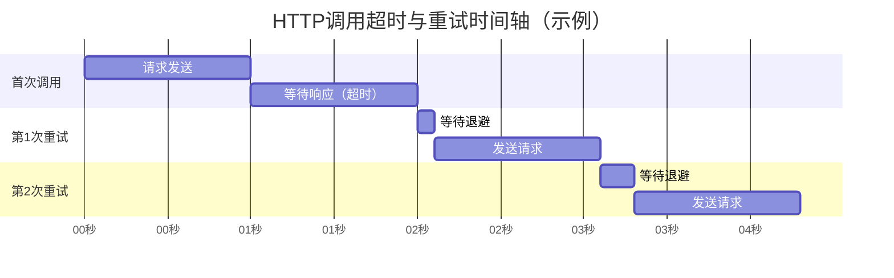
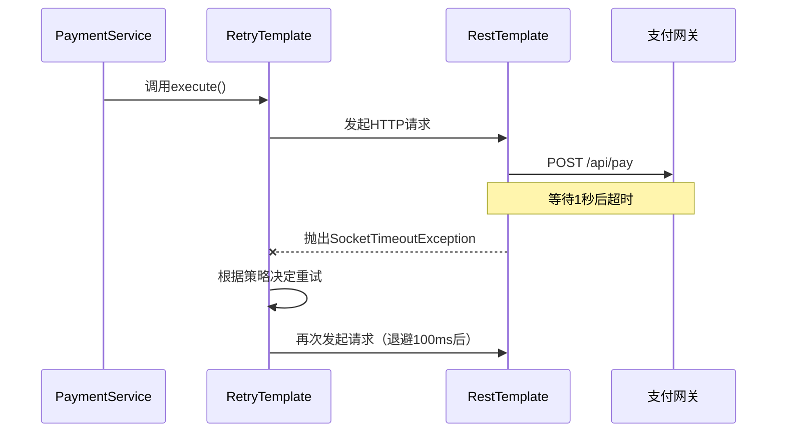

配置的 RestTemplate 是如何生效的？

```java
@Configuration
public class RetryConfig {

    @Bean
    public RetryTemplate retryTemplate() {
        RetryTemplate template = new RetryTemplate();

        // 重试策略：最大重试3次（初次调用+3次重试=最多4次尝试）
        SimpleRetryPolicy retryPolicy = new SimpleRetryPolicy();
        retryPolicy.setMaxAttempts(4);

        // 退避策略：指数退避（初始间隔100ms，倍数2，最大间隔1s）
        ExponentialBackOffPolicy backOffPolicy = new ExponentialBackOffPolicy();
        backOffPolicy.setInitialInterval(100);
        backOffPolicy.setMultiplier(2);
        backOffPolicy.setMaxInterval(1000);

        template.setRetryPolicy(retryPolicy);
        template.setBackOffPolicy(backOffPolicy);

        return template;
    }
}
```

##### 1. **超时参数配置**

结合 `RestTemplate` 设置连接/读取超时：

```java
@Bean
public RestTemplate restTemplate() {
    return new RestTemplateBuilder()
        .setConnectTimeout(Duration.ofMillis(500))
        .setReadTimeout(Duration.ofMillis(1000))
        .build();
}
```

--- R1

---

### RestTemplate 配置生效机制详解

---

#### 一、配置生效流程

##### 1. **Spring Bean 注册**

```java
@Configuration
public class RetryConfig {
    // RetryTemplate 的配置独立于RestTemplate
    @Bean
    public RetryTemplate retryTemplate() { ... }
}

// 另一配置类（可能位于其他@Configuration类中）
@Bean
public RestTemplate restTemplate() {
    return new RestTemplateBuilder()
        .setConnectTimeout(500)
        .setReadTimeout(1000)
        .build();
}
```

- **关键点**：
  - `RetryTemplate` 和 `RestTemplate` 是 **两个独立** 的 Spring Bean
  - 它们的配置通过不同的 `@Bean` 方法分别注册到 Spring 容器

##### 2. **业务代码集成**

```java
@Service
public class PaymentService {
    @Autowired
    private RetryTemplate retryTemplate; // 注入重试模板

    @Autowired
    private RestTemplate restTemplate; // 注入RestTemplate

    public String processPayment() {
        return retryTemplate.execute(ctx -> {
            // 使用配置了超时的RestTemplate发起调用
            return restTemplate.postForObject("/api/pay", request, String.class);
        });
    }
}
```

- **协作机制**：
  1. `RestTemplate` 的 **超时设置** 控制单次 HTTP 调用的最大等待时间
  2. 当调用超时（抛出 `SocketTimeoutException`）时，触发 `RetryTemplate` 的重试逻辑
  3. 重试间隔由 `ExponentialBackOffPolicy` 控制

---

#### 二、超时与重试的配合关系

##### 1. **单次调用时间轴**



- **参数对应**：
  - **`connectTimeout=500ms`**：建立 TCP 连接的最长等待时间
  - **`readTimeout=1000ms`**：从服务器读取响应的最长等待时间
  - **`initialInterval=100ms`**：首次重试前的等待时间

##### 2. **异常传播流程**



---

#### 三、配置验证方法

##### 1. **超时配置验证**

```java
@Test
public void testRestTemplateTimeout() {
    // 模拟慢速服务
    String slowUrl = "http://httpbin.org/delay/5";
    assertThatThrownBy(() ->
        restTemplate.getForObject(slowUrl, String.class)
    ).isInstanceOf(ResourceAccessException.class)
     .hasCauseInstanceOf(SocketTimeoutException.class);
}
```

##### 2. **重试次数验证**

```java
@Test
public void testRetryAttempts() {
    // 模拟总是超时的服务
    when(restTemplate.postForObject(any(), any(), any()))
        .thenThrow(new SocketTimeoutException("Timeout"));

    assertThatThrownBy(() -> paymentService.processPayment())
        .isInstanceOf(ExhaustedRetryException.class)
        .hasMessageContaining("重试耗尽");

    verify(restTemplate, times(4)).postForObject(...); // 验证4次调用
}
```

---

#### 四、生产环境调优建议

##### 1. **超时参数计算**

- **连接超时** = 平均 TCP 握手时间 × 2  
  （例如公网服务建议 1-3 秒）
- **读取超时** = 预估服务最大处理时间 + 缓冲时间  
  （例如普通 API 设置 3-5 秒，批量处理适当延长）

##### 2. **重试公式推导**

推荐的最大总耗时计算：

```
总耗时 = Σ(重试间隔) + (重试次数+1) × 单次超时时间
```

示例配置（3 次重试）：

```
总耗时 = (100ms + 200ms + 400ms) + 4 × 1000ms = 700ms + 4000ms = 4700ms
```

##### 3. **熔断保护配置**

在重试模板外包裹熔断器，防止持续重试导致系统过载：

```java
@Bean
public CircuitBreaker circuitBreaker() {
    return CircuitBreaker.of("payment",
        CircuitBreakerConfig.custom()
            .failureRateThreshold(50)
            .slidingWindowSize(20)
            .build());
}

// 使用组合策略
retryTemplate.execute(
    circuitBreaker.decorateSupplier(() -> restTemplate.postForObject(...))
);
```

---

通过以上机制，`RestTemplate` 的超时配置与 `RetryTemplate` 的重试策略形成完整容错链路，共同保障服务调用的可靠性。两者通过异常传播和 Spring 的依赖注入协同工作，开发者无需显式编码它们的交互逻辑。
