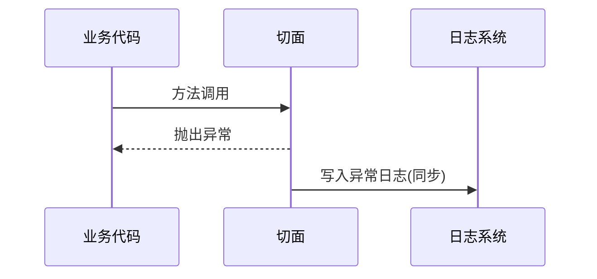
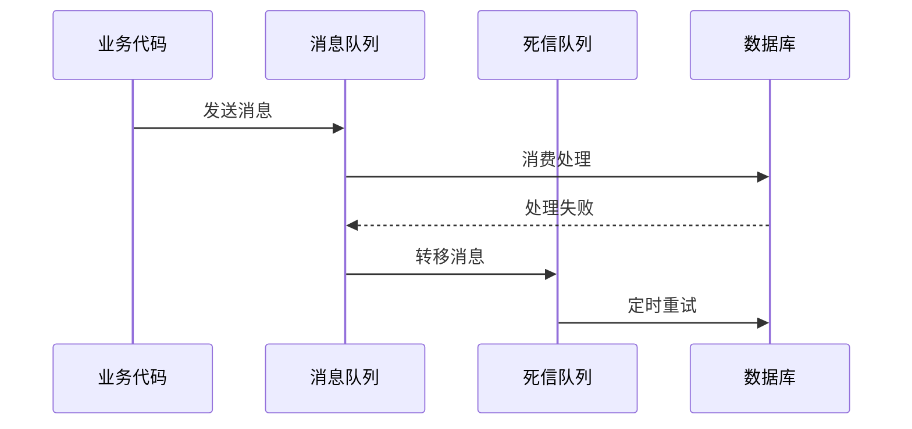

aop 记录异常日志和死信队列记录异常日志有什么区别？有什么优劣？

2. **异常未覆盖**：仅记录成功情况，需补充异常捕获

- 增加 `@AfterThrowing` 通知处理失败情况
  ```java
  @AfterThrowing(pointcut = "execution(* com.example.service.*Processor.*(..))", throwing = "ex")
  public void logException(JoinPoint joinPoint, Exception ex) {
      // 记录异常日志
  }
  ```

#### 1. **死信队列处理**

```java
@Component
public class AuditDLQHandler {
    @Autowired
    private KafkaTemplate<String, AuditLog> kafkaTemplate;

    public void handleFailedLog(AuditLog log) {
        kafkaTemplate.send("audit_dlq", log);
    }

    @KafkaListener(topics = "audit_dlq")
    public void reprocessDLQ(AuditLog log) {
        try {
            auditLogRepository.save(log);
        } catch (Exception e) {
            // 持久化到本地文件
            writeToFile(log);
        }
    }
}
```

--- R1

### 一、核心概念对比

#### 1. **AOP 异常日志记录**

```java
@AfterThrowing(pointcut = "execution(* com..*.*(..))", throwing = "ex")
public void logException(JoinPoint jp, Exception ex) {
    // 记录方法签名、参数、异常堆栈等上下文
    log.error("方法 {} 执行异常, 参数: {}",
        jp.getSignature(), jp.getArgs(), ex);
}
```

**本质**：在代码执行流程中同步捕获异常

#### 2. **死信队列异常处理**

```java
try {
    auditRepo.save(log);
} catch (Exception e) {
    dlqHandler.handleFailedLog(log); // 发送到DLQ
}
```

**本质**：异步处理持久化失败的数据

---

### 二、核心差异分析

| **维度**     | AOP 异常日志         | 死信队列处理                   |
| ------------ | -------------------- | ------------------------------ |
| **作用阶段** | 业务逻辑执行阶段     | 数据持久化阶段                 |
| **捕获目标** | 代码执行中的任何异常 | 特定操作（如数据库写入）的失败 |
| **处理方式** | 同步记录日志         | 异步重试/人工干预              |
| 数据完整性   | 仅记录异常信息       | 保留原始数据对象               |
| 典型使用场景 | 监控方法级异常率     | 保障关键数据不丢失             |

---

### 三、技术实现对比

#### 1. **AOP 异常记录流程**



#### 2. **死信队列处理流程**



---

### 四、优缺点分析

#### 1. **AOP 异常日志**

**优点**：

- 精准定位异常发生位置（类+方法+行号）
- 保留完整的调用栈信息
- 与业务代码解耦，无需修改原有逻辑

**缺点**：

- 日志系统故障会导致日志丢失
- 无法恢复业务数据状态
- 高频异常可能引发性能问题

#### 2. **死信队列处理**

**优点**：

- 保证数据最终持久化
- 支持自动重试机制
- 避免业务逻辑被持久化失败阻塞

**缺点**：

- 需要额外中间件支持（如 Kafka）
- 处理延迟较高（秒级到分钟级）
- 需配套死信处理逻辑

---

### 五、生产环境建议方案

#### 1. **组合使用最佳实践**

```java
public class OrderService {
    @Transactional
    public void createOrder(OrderDTO dto) {
        try {
            // 业务逻辑...
            auditLogRepo.save(log);
        } catch (Exception e) {
            // AOP层已记录异常
            dlqHandler.handleRetry(log); // 关键数据进入重试队列
            throw e; // 触发事务回滚
        }
    }
}
```

#### 2. **分级处理策略**

| **异常类型**       | 处理方式            | 工具选择           |
| ------------------ | ------------------- | ------------------ |
| 非关键业务异常     | AOP 记录日志        | ELK 收集           |
| 数据库写入失败     | DLQ + 定时重试      | Kafka/RocketMQ DLQ |
| 第三方服务调用异常 | 熔断降级 + AOP 日志 | Hystrix/Sentinel   |

#### 3. **监控指标设计**

```java
// AOP 异常监控
Counter.builder("business.exceptions")
       .tag("service", "order")
       .register(registry);

// DLQ 积压监控
Gauge.builder("dlq.backlog", dlq::size)
     .register(registry);
```

---

通过合理结合两种机制，既能实现异常的可观测性，又能保障关键数据可靠性。建议将 AOP 日志用于 **问题诊断**，DLQ 用于 **数据恢复**，两者形成完整的异常处理体系。
