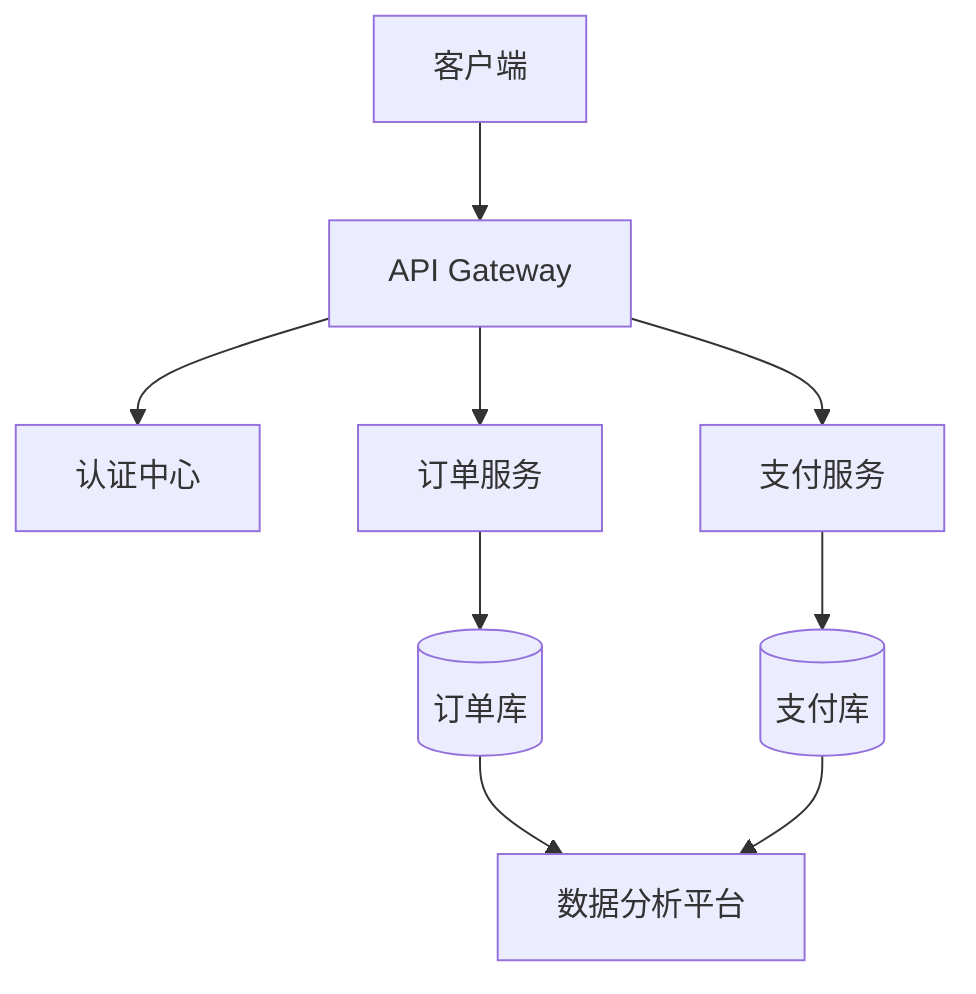

对于一个架构设计文档，该编写哪些内容？
--- R1
架构设计文档是系统建设的蓝图，需要清晰传达系统的核心设计思想、技术决策和实现路径。以下是一个完整的架构设计文档应包含的核心内容及结构模板，结合不同架构风格（如微服务、事件驱动等）的侧重点：

---

### 一、文档核心结构（示例模板）

#### 1. **文档基本信息**

- 版本历史（含修订日期、版本号、修改人）
- 文档受众（开发/测试/运维/管理层）
- 术语表（领域专有名词解释）

#### 2. **业务背景与目标**

```markdown
- **业务痛点**：现有系统无法支持日均 100 万订单的峰值
- **核心需求**：<kbd>高并发</kbd> <kbd>水平扩展</kbd> <kbd>99.99%可用性</kbd>
- **成功指标**：TPS ≥ 5000，平均响应时间 < 200ms
```

#### 3. **架构全景图**



#### 4. **架构视图分解**

- **逻辑架构**
  ```markdown
  - 分层设计：表现层/业务层/数据层
  - 模块划分：用户中心、商品服务、交易引擎
  ```
- **物理架构**
  ```markdown
  - 部署拓扑：Region > AZ > Cluster
  - 资源规划：K8s Pod 数量、DB 分片策略
  ```
- **数据架构**
  ```markdown
  - 存储选型：MySQL（OLTP）+ ClickHouse（OLAP）
  - 数据流：CDC → Kafka → Flink → Data Lake
  ```

#### 5. **关键技术决策**

```markdown
| 技术领域 | 选型          | 替代方案  | 决策依据        |
| -------- | ------------- | --------- | --------------- |
| 服务框架 | Spring Cloud  | Dubbo     | 生态完整性      |
| 消息队列 | Apache Kafka  | RocketMQ  | 吞吐量&生态集成 |
| 缓存     | Redis Cluster | Memcached | 数据结构丰富性  |
```

#### 6. **质量属性设计**

- **可用性**
  ```markdown
  - 多 AZ 部署：RTO < 2 分钟，RPO ≈ 0
  - 熔断策略：10 秒内错误率>50%触发熔断
  ```
- **性能**
  ```markdown
  - 读写分离：写主库，读从库+缓存
  - 分库分表：用户 ID hash 分 128 库
  ```
- **安全性**
  ```markdown
  - 零信任架构：SPIFFE/SPIRE 身份认证
  - 数据加密：AES-256 + TLS 1.3
  ```

#### 7. **关键设计细节**

- **订单状态机**

  ```plantuml
  [*] --> PENDING : 创建订单
  PENDING --> PAID : 支付成功
  PENDING --> CANCELED : 用户取消
  PAID --> SHIPPED : 发货
  SHIPPED --> COMPLETED : 确认收货
  ```

- **分布式事务方案**
  ```markdown
  1. 支付回调采用**本地消息表**
  2. 库存扣减使用**Saga 模式**
  3. 最终一致性窗口：≤30 秒
  ```

#### 8. **风险与应对**

```markdown
| 风险点               | 影响等级 | 应对措施                    |
| -------------------- | -------- | --------------------------- |
| Redis 集群脑裂       | 高       | 部署 Raft 协议改进版        |
| 分库分表后查询受限   | 中       | 建立 ES 二级索引            |
| 第三方支付接口不稳定 | 高       | 多通道自动切换+异步重试队列 |
```

#### 9. **演进路线图**

```gantt
title 架构演进里程碑
dateFormat  YYYY-MM-DD
section 核心能力
订单系统重构       :a1, 2023-06-01, 90d
支付链路改造       :a2, after a1, 60d
section 质量提升
全链路压测        :2023-09-01, 30d
多活能力建设      :2023-10-01, 90d
```

---

### 二、不同架构风格侧重点

#### 1. **微服务架构**

```markdown
- **服务治理**：熔断阈值、限流算法选择
- **API 设计**：RESTful 规范、gRPC 接口定义
- **数据一致性**：CQRS 模式实现案例
```

#### 2. **事件驱动架构**

```markdown
- **事件溯源**：订单状态变更事件流
- **消息协议**：Avro Schema 版本管理
- **流处理**：Flink 窗口函数配置
```

#### 3. **Serverless 架构**

```markdown
- **冷启动优化**：预热策略配置
- **资源规划**：Lambda 内存/超时设置
- **监控体系**：X-Ray 跟踪集成
```

---

### 三、文档维护实践建议

1. **版本控制**

   ```markdown
   - 与代码库同仓库管理（如/docs/architecture）
   - 重大变更需发起 RFC 评审流程
   ```

2. **可视化工具链**

   ```markdown
   - 架构图：Draw.io/C4 Model
   - 文档编写：Markdown + Mermaid
   - 版本管理：Git + Conventional Commits
   ```

3. **生命周期管理**
   ```markdown
   - 每季度架构健康度评估
   - 与 ADRs（Architecture Decision Records）联动
   ```

---

通过以上结构化设计和持续演进机制，可确保架构文档既具备技术指导性，又能适应业务快速发展需求。实际编写时应根据团队成熟度调整详略程度，核心原则是**服务于系统构建和沟通**，而非形式主义的文档工程。
