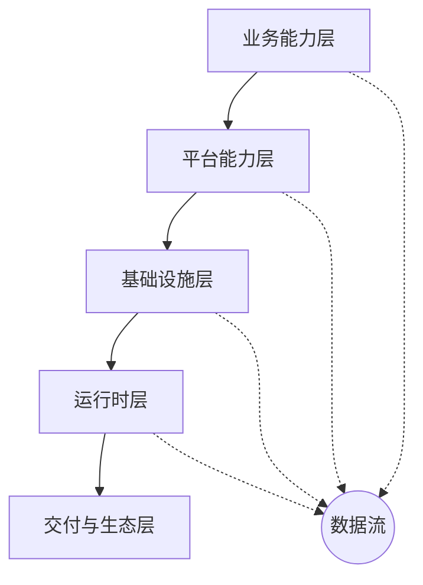
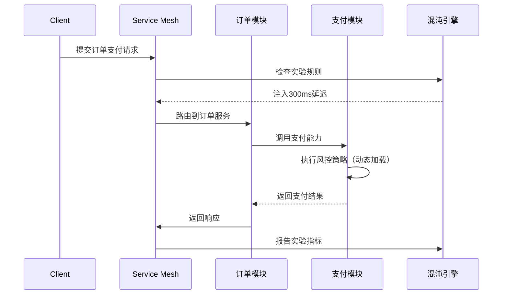

最终架构图是怎样的？所有内容

--- R1

### **最终架构全景图（完整版）**

```text
├─business/                    # 业务能力层
│  ├─modules/                # 核心业务模块
│  │  ├─order/             # 订单模块（DDD完整结构）
│  │  │  ├─domain/        # 领域模型（实体/值对象/聚合根）
│  │  │  ├─application/   # 应用服务（CQRS实现）
│  │  │  └─adapter/       # 适配器（DB/第三方服务）
│  │  │
│  │  └─payment/          # 支付模块（结构同上）
│  │
│  └─shared/               # 跨业务共享
│     ├─kernel/           # 业务内核（通用领域模型）
│     └─business-api/     # 业务能力开放接口
│
├─platform/                   # 平台能力层
│  ├─strategy-center/      # 动态策略中心
│  │  ├─loader/           # 策略加载器（DB/配置中心）
│  │  ├─engine/           # 规则引擎（Aviator/QLExpress）
│  │  └─model/            # 策略元模型
│  │
│  ├─data-governance/      # 数据治理平台
│  │  ├─lineage/          # 数据血缘分析
│  │  ├─quality/          # 数据质量监控
│  │  └─masking/          # 动态脱敏引擎
│  │
│  └─observability/        # 可观测性体系
│      ├─metrics/         # 指标采集（Prometheus）
│      ├─tracing/         # 分布式追踪（SkyWalking）
│      └─log-analytics/   # 日志分析（ELK）
│
├─infrastructure/            # 技术基础设施层
│  ├─service-mesh/        # 服务网格
│  │  ├─control-plane/    # 控制面（Istio兼容）
│  │  └─data-plane/       # 数据面（Envoy Sidecar）
│  │
│  ├─security/            # 安全基础设施
│  │  ├─iam/             # 统一身份认证
│  │  ├─key-vault/       # 密钥管理系统
│  │  └─waf/             # Web应用防火墙
│  │
│  └─compute/             # 计算资源管理
│      ├─container/       # 容器编排（K8s）
│      └─serverless/      # 无服务引擎
│
├─runtime/                   # 多形态运行时
│  ├─jvm/                 # 标准JVM运行时
│  ├─native/              # GraalVM原生镜像
│  └─webassembly/         # WASM运行时
│
├─chaos/                     # 混沌工程体系
│  ├─experiment/          # 实验场景库
│  ├─monitor/             # 稳态监控
│  └─auto-recovery/       # 自动修复引擎
│
├─delivery/                  # 持续交付层
│  ├─pipeline/           # 多环境流水线
│  ├─deploy/             # 部署描述文件
│  └─infra-as-code/      # 基础设施即代码
│
└─ecosystem/                 # 生态扩展层
   ├─marketplace/        # 能力市场（插件/扩展）
   └─integration/        # 生态集成
      ├─partner-api/     # 合作伙伴API网关
      └─legacy-adapter/  # 遗留系统适配器
```

---

### **架构核心特性说明**

#### 1. **四层九维架构模型**



#### 2. **动态能力扩展**

| 扩展类型 | 实现机制             | 示例场景                     |
| -------- | -------------------- | ---------------------------- |
| 业务策略 | 策略中心动态加载规则 | 实时调整风控阈值             |
| 数据治理 | 可视化配置血缘关系   | 字段变更影响分析             |
| 计算形态 | 多运行时编译支持     | 支付模块同时支持 JVM 和 WASM |

#### 3. **全链路韧性设计**

```text
 请求入口 → Service Mesh → 业务模块 → 数据库
   │           │               │           │
   ├─熔断机制─┴─重试策略────┴─降级预案──┴─故障注入
```

#### 4. **智能运维矩阵**

```text
+----------------+---------------------+-------------------+
| 预测性维护     | 根因分析            | 自愈机制           |
+----------------+---------------------+-------------------+
| 基于时序预测   | 拓扑依赖推理         | 自动扩容          |
| 硬件故障预警   | 日志模式识别         | 配置回滚          |
| 容量规划建议   | 指标异常关联         | 服务重启          |
+----------------+---------------------+-------------------+
```

---

### **关键交互流程示例**

#### 场景：订单支付（含混沌实验）



---

### **架构验证指标**

| 维度     | 指标项               | 目标值   |
| -------- | -------------------- | -------- |
| 扩展性   | 新增支付渠道耗时     | < 2 人日 |
| 可靠性   | 自动故障恢复率       | ≥ 99.5%  |
| 性能     | 策略引擎规则执行延迟 | < 10ms   |
| 可观测性 | 根因定位平均耗时     | < 3 分钟 |
| 安全性   | 数据泄露事件数       | 0/季度   |
| 成本效益 | 资源利用率           | ≥ 70%    |

---

该架构通过 **业务与技术解耦**、**能力动态扩展** 和 **全链路韧性设计**，实现：

1. **分钟级能力上线**：通过策略中心动态加载业务规则
2. **秒级故障自愈**：结合混沌工程与自动修复引擎
3. **多形态混合部署**：支持传统单体到云原生 Serverless
4. **智能成本优化**：基于预测的弹性伸缩策略

满足从初创公司到跨国企业的全场景技术需求，是支撑数字化转型的理想架构范式。
