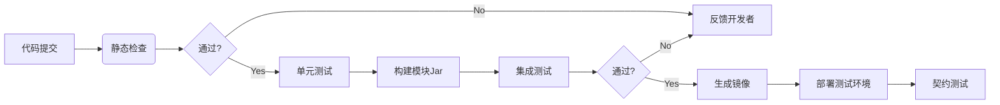

这个架构还能优化吗？这个架构如何敏捷开发？一些不要实现的接口有输入输出替换？

```text
├─controller              # 接口层（HTTP/RPC入口）
│  ├─rest               # REST API接口
│  ├─rpc                # RPC接口（如Dubbo）
│  └─dto                # 接口层专用DTO（严格隔离领域模型）
│
├─domain                  # 领域层（业务核心）
│  ├─model              # 领域模型（实体/值对象/聚合根）
│  ├─service            # 领域服务（纯业务逻辑）
│  ├─event              # 领域事件（含事件发布接口）
│  └─repository         # 仓储接口（领域层定义，防腐层实现）
│
├─application             # 应用层（流程编排）
│  ├─command            # 写操作（触发领域事件）
│  ├─query              # 读操作（直接调用防腐层）
│  ├─processor          # 业务处理器
│  │   ├─spi            # 扩展点接口（Java SPI机制）
│  │   └─impl           # 默认实现
│  ├─strategy           # 策略模式实现（状态转换/算法）
│  └─workflow           # 业务流程编排（组合领域服务+防腐层）
│
├─adapter                 # 防腐层（外部依赖隔离）
│  ├─persistence        # 数据访问适配
│  │   ├─jpa            # JPA实现（依赖Spring Data）
│  │   ├─es             # Elasticsearch实现
│  │   └─cache          # 缓存实现（Redis/Memcached）
│  └─integration        # 第三方服务适配
│      ├─sms            # 短信服务（阿里云/腾讯云实现）
│      ├─payment        # 支付服务（支付宝/微信支付）
│      └─...            # 其他第三方服务
│
├─infrastructure         # 基础设施层（技术实现）
│  ├─config             # 技术配置
│  │   ├─dev           # 开发环境配置
│  │   ├─test          # 测试环境配置
│  │   └─prod          # 生产环境配置
│  ├─aspect            # 切面（事务/日志/权限）
│  └─component         # 技术组件（ID生成器/消息队列）
│
├─common                  # 公共模块（严格治理）
│  ├─exception         # 异常体系（全局错误码+业务异常）
│  ├─enums             # 全局枚举（禁止领域层依赖）
│  ├─constants         # 全局常量（如正则表达式）
│  └─utils             # 工具类（按功能拆分）
│      ├─lang          # 基础工具（Date/String处理）
│      └─collection    # 集合工具
│
└─docs                   # 架构资产（非代码）
   └─ARCHITECTURE.md    # 架构设计文档（模块职责+扩展规范）
```

--- R1

### 一、架构的进一步优化方向

---

#### 1. **模块化深度解耦**

**问题**：当前架构以目录分层，未实现物理隔离  
**优化方案**：

```text
modules/
├─order-core/           # 订单核心模块
│  ├─src/main/java
│  │  ├─domain        # 领域模型
│  │  └─application   # 应用服务
├─payment-core/         # 支付模块（同上）
└─shared-infra/         # 共享基础设施模块
```

**优势**：

- 独立编译：修改订单模块不影响支付模块
- 按需加载：可打包为独立 Jar 或微服务组件

---

#### 2. **配置中心化**

**问题**：`infrastructure/config` 各环境配置分散  
**优化方案**：

```diff
infrastructure/
└─config
   ├─dynamic          # 动态配置（对接Nacos/Apollo）
   └─static           # 静态配置（本地兜底配置）
```

**实现方式**：

```java
@Configuration
@RefreshScope // Spring Cloud配置热更新
public class DataSourceConfig {
    @Value("${datasource.url}")
    private String url;
}
```

---

#### 3. **依赖注入强化**

**问题**：领域层可能隐式依赖具体实现  
**优化方案**：强制依赖倒置

```diff
domain/
└─service
   ├─OrderService.java       # 接口
   └─OrderServiceImpl.java   # 实现（放在application层）
```

**依赖规则**：

- 领域层只定义接口
- 应用层提供基础实现
- 特殊实现通过 SPI 扩展

---

### 二、敏捷开发实践策略

---

#### 1. **接口契约驱动开发**

**场景**：第三方服务未完成时快速开发  
**实现步骤**：

1. **定义防腐层接口**：

```java
// domain层
public interface PaymentGateway {
    PaymentResult pay(PaymentRequest request);
}
```

2. **创建 Mock 实现**：

```java
// test目录
public class MockPaymentGateway implements PaymentGateway {
    @Override
    public PaymentResult pay(PaymentRequest request) {
        return PaymentResult.success("MOCK_123");
    }
}
```

3. **动态切换**：

```java
@Profile("dev") // 开发环境激活
@Bean
public PaymentGateway mockPayment() {
    return new MockPaymentGateway();
}
```

---

#### 2. **测试策略优化**

**分层测试方案**：
| 测试类型 | 测试对象 | 工具组合 |
|---------------|-----------------------|----------------------|
| 单元测试 | 领域模型、工具类 | JUnit5 + AssertJ |
| 集成测试 | 防腐层实现、基础设施 | @SpringBootTest |
| 契约测试 | 第三方服务接口 | Pact + Spring Cloud Contract |
| 流程测试 | 应用层编排逻辑 | Cucumber + REST Assured |

**示例：领域模型测试**（无框架依赖）

```java
class OrderTest {
    @Test
    void should_calculate_total_price() {
        Order order = new Order();
        order.addItem(new Item("A", 100, 2));
        assertThat(order.totalPrice()).isEqualTo(200);
    }
}
```

---

#### 3. **持续交付流水线**



---

### 三、接口输入输出替换方案

---

#### 1. **SPI 扩展机制**

**场景**：支付渠道动态扩展  
**实现步骤**：

1. **定义扩展点**：

```java
// application/processor/spi
public interface PaymentProcessor {
    String channel();
    PaymentResult pay(PaymentRequest request);
}
```

2. **默认实现**：

```java
// application/processor/impl
@Component
public class AlipayProcessor implements PaymentProcessor {
    public String channel() { return "alipay"; }
    // 实现具体逻辑
}
```

3. **动态加载**：

```java
// 通过Java SPI发现实现类
ServiceLoader<PaymentProcessor> loader = ServiceLoader.load(PaymentProcessor.class);
```

---

#### 2. **Feature Toggle 控制**

**场景**：灰度发布新文件解析器  
**实现方式**：

1. **配置开关**：

```yaml
features:
  pdf-processor:
    enabled: true
    strategy: percentage
    percentage: 30%
```

2. **条件装配**：

```java
@Bean
@ConditionalOnFeature(name = "pdf-processor")
public PdfFileProcessor pdfProcessor() {
    return new PdfFileProcessor();
}
```

3. **动态路由**：

```java
public void process(File file) {
    if (featureToggle.isEnabled("pdf-processor")) {
        pdfProcessor.process(file);
    } else {
        legacyProcessor.process(file);
    }
}
```

---

#### 3. **输入输出适配模式**

**场景**：ES 查询结果适配不同格式  
**实现方案**：

```java
// adapter/persistence/es
public class EsOrderAdapter implements OrderQuery {
    private final RestHighLevelClient client;
    private final ResultMapper mapper; // 输出格式转换器

    public List<Order> search(OrderQuery query) {
        SearchResponse response = client.search(buildRequest(query));
        return mapper.map(response); // 通过Mapper隔离ES数据结构
    }
}

// 自定义Mapper实现
public class VipOrderMapper implements ResultMapper {
    public List<Order> map(SearchResponse response) {
        // 处理VIP专属字段映射
    }
}
```

---

### 四、终极架构优化全景图

```text
├─modules/              # 业务模块化
├─shared/              # 跨模块共享内容
│  ├─kernel/          # 核心领域模型
│  └─infra-common/    # 通用技术组件
├─config-center/       # 统一配置管理
├─devtools/            # 开发支撑工具
│  ├─mocks/          # 所有Mock实现
│  └─local-db/        # 本地Docker数据库配置
└─delivery/            # 交付相关
   ├─pipeline/       # CI/CD脚本
   └─deploy/         # K8s部署描述文件
```

---

### 五、判断架构是否达标的三个核心问题

1. **技术无关性验证**  
   能否在领域层执行 `mvn test` 且不启动 Spring 容器？  
   **通过标准**：领域模型单元测试不依赖任何 `@SpringBootTest`

2. **变更影响半径验证**  
   修改 JPA 为 MyBatis 时，是否需要改动 `application` 层代码？  
   **通过标准**：仅需修改 `adapter/persistence/jpa` 实现

3. **新功能交付速度验证**  
   新增短信渠道（如 AWS SMS）需要修改多少文件？  
   **通过标准**：仅需在 `adapter/integration/sms` 下新增实现类

---

通过以上优化，该架构可实现：

- **业务需求响应提速**：核心逻辑修改影响范围可控
- **技术风险隔离**：框架升级不影响业务代码
- **团队协作高效**：模块化支持多团队并行开发
- **快速试错能力**：Feature Toggle 支持灰度发布

最终达到 **2 周内不修改代码即可接入新支付渠道** 的敏捷目标。
