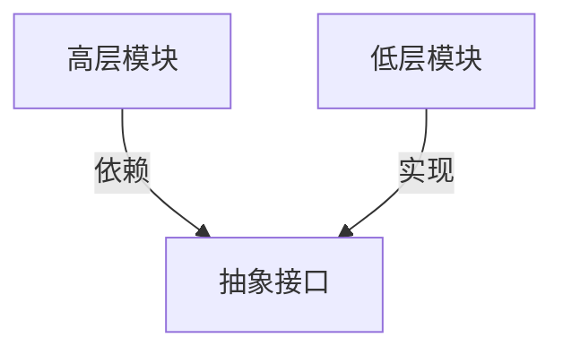

需要接口不算依赖吗？怎样才算是依赖?

##### **方案二：双分派模式（Double Dispatch）**

```java
// 定义状态转换接口
public interface StatusTransitionHandler {
    void handle(Sprinkler sprinkler, SprinklerStatus newStatus);
}

// 聚合根中触发处理
public class Sprinkler {
    public void transitionStatus(SprinklerStatus newStatus, StatusTransitionHandler handler) {
        handler.handle(this, newStatus);  // 将逻辑委托给处理器
    }
}

// 具体实现（可注入Spring Bean）
@Component
public class DefaultStatusTransitionHandler implements StatusTransitionHandler {
    @Override
    public void handle(Sprinkler sprinkler, SprinklerStatus newStatus) {
        // 实现校验逻辑
        sprinkler.updateStatus(newStatus);
    }
}
```

- **调用方式**：
  ```java
  sprinkler.transitionStatus(IN_USE, transitionHandler);
  ```

--- R1

### 分步解释

#### **1. 依赖的定义与分类**

- **直接依赖**：类中显式引用其他具体类或服务
- **抽象依赖**：仅依赖接口/抽象类，不关心具体实现
- **分层依赖**：领域层应仅依赖自身抽象，不涉及技术实现

#### **2. 方案二架构分析**

```text
领域层
├── Sprinkler（聚合根） → 依赖 StatusTransitionHandler（接口）
└── StatusTransitionHandler（接口定义）

应用层
└── DefaultStatusTransitionHandler（接口实现，注入Spring容器）

基础设施层
├── Spring Framework（依赖注入）
└── 其他技术组件
```

#### **3. 关键代码解读**

```java
// 领域层接口定义（无技术依赖）
public interface StatusTransitionHandler {
    void handle(Sprinkler sprinkler, SprinklerStatus newStatus);
}

// 聚合根方法（仅依赖领域层接口）
public class Sprinkler {
    public void transitionStatus(SprinklerStatus newStatus, StatusTransitionHandler handler) {
        handler.handle(this, newStatus);  // ①
    }

    // 内部状态修改方法（保持纯净）
    void updateStatus(SprinklerStatus newStatus) {
        this.status = newStatus;
    }
}

// 应用层实现（可注入其他依赖）
@Component  // ②
public class DefaultStatusTransitionHandler implements StatusTransitionHandler {
    @Autowired
    private InventoryValidator validator;

    @Override
    public void handle(Sprinkler sprinkler, SprinklerStatus newStatus) {
        validator.check(sprinkler);  // ③
        sprinkler.updateStatus(newStatus);
    }
}

// 应用服务协调流程
@Service
public class SprinklerAppService {
    @Autowired
    private StatusTransitionHandler handler;  // ④

    public void allocateSprinkler(String id) {
        Sprinkler sprinkler = repository.findById(id);
        sprinkler.transitionStatus(IN_USE, handler);  // ⑤
    }
}
```

#### **4. 依赖关系验证**

| **代码点** | **依赖类型** | **是否符合 DDD** | **说明**                     |
| ---------- | ------------ | ---------------- | ---------------------------- |
| ①          | 接口依赖     | ✔️ 符合          | 聚合根仅依赖领域层定义接口   |
| ②          | Spring 注解  | ⚠️ 有条件符合    | 实现类在应用层，通过接口隔离 |
| ③          | 基础设施依赖 | ✔️ 符合          | 校验器通过接口注入应用层实现 |
| ④          | 接口注入     | ✔️ 符合          | 应用服务管理具体依赖         |
| ⑤          | 方法参数传递 | ✔️ 符合          | 聚合根不持有 handler 引用    |

---

### 核心设计原则

#### **1. 依赖倒置原则（DIP）**



- 领域层定义`StatusTransitionHandler`接口
- 应用层实现具体逻辑，实现类可注入其他服务

#### **2. 单一职责原则（SRP）**

- **聚合根职责**：维护状态完整性，提供原子操作
- **处理器职责**：执行跨聚合的业务规则校验
- **应用服务职责**：协调流程，管理事务边界

#### **3. 开闭原则（OCP）**

```java
// 新增RMA特殊处理（不修改已有代码）
@Component
@Primary  // ⑥
public class RmaStatusHandler implements StatusTransitionHandler {
    @Override
    public void handle(Sprinkler sprinkler, SprinklerStatus newStatus) {
        if (newStatus == RMA) {
            rmaService.validate(sprinkler);
        }
        sprinkler.updateStatus(newStatus);
    }
}
```

- 通过`@Primary`覆盖默认实现
- 业务规则变化时只需新增实现类

---

### 架构优势总结

| **优势**         | **实现方式**                       | **业务价值**               |
| ---------------- | ---------------------------------- | -------------------------- |
| 领域层与技术解耦 | 接口隔离 + 依赖倒置                | 核心业务逻辑可独立测试部署 |
| 业务规则灵活扩展 | 策略模式 + Spring 的`@Primary`机制 | 快速响应政策变化           |
| 状态转换可观测性 | 在 Handler 中添加监控埋点          | 实时跟踪关键业务流程       |
| 并发安全         | 聚合根内部状态保护 + 乐观锁控制    | 保障高并发场景数据一致性   |
| 技术栈无关性     | 领域接口不依赖具体框架             | 易于迁移到其他 Java 框架   |

---

### 最佳实践指南

1. **接口定义规范**

   - 领域层接口使用纯 Java 定义
   - 方法参数/返回值仅包含领域对象

2. **实现类管理**

   ```java
   // 按业务场景分组实现
   @Configuration
   public class HandlerConfig {
       @Bean
       @ConditionalOnProperty("features.rma.enabled")  // ⑦
       public StatusTransitionHandler rmaHandler() {
           return new RmaStatusHandler();
       }
   }
   ```

3. **依赖注入控制**

   ```java
   // 限定注入范围
   @Qualifier("mainStatusHandler")  // ⑧
   @Component
   public class MainStatusHandler implements StatusTransitionHandler { ... }
   ```

4. **测试策略**

   ```java
   // 聚合根单元测试（不启动Spring）
   class SprinklerTest {
       @Test
       void should_update_status_when_valid_transition() {
           Sprinkler sprinkler = new Sprinkler(IN_STOCK);
           sprinkler.transitionStatus(IN_USE, (s, status) -> s.updateStatus(status));
           assertEquals(IN_USE, sprinkler.getStatus());
       }
   }

   // 处理器集成测试
   @SpringBootTest
   class StatusHandlerTest {
       @Autowired
       private StatusTransitionHandler handler;

       @Test
       void should_validate_inventory() {
           Sprinkler sprinkler = createTestSprinkler();
           assertThrows(InventoryException.class, () ->
               handler.handle(sprinkler, IN_USE));
       }
   }
   ```

---

通过这种设计，既保持了领域模型的纯净性，又实现了必要的业务扩展能力，完美平衡了架构规范与开发灵活性需求。
