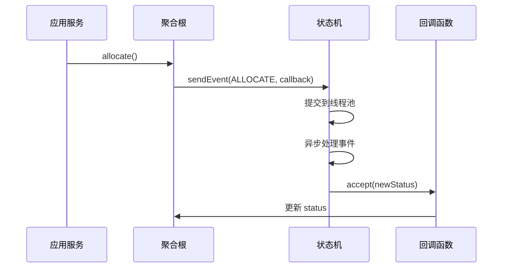

以下方法的回调函数在哪里注册的？

#### **方案 2：异步回调监听**

```java
public interface SprinklerStateMachine {
    void sendEvent(SprinklerEvent event, Consumer<SprinklerStatus> callback);
}

// 聚合根中
public void allocate() {
    stateMachine.sendEvent(SprinklerEvent.ALLOCATE, newStatus -> {
        this.status = newStatus; // ✅ 回调中更新状态
    });
}
```

--- R1

### 回调注册机制详解

#### **1. 回调触发流程**

```text
调用 sendEvent()
→ 状态机异步处理事件
→ 处理完成
→ 执行回调函数
```

#### **2. 具体实现示例**

```java
// 基础设施层实现（异步状态机）
@Component
public class AsyncStateMachineImpl implements SprinklerStateMachine {
    private final ExecutorService executor = Executors.newCachedThreadPool();
    private SprinklerStatus currentStatus = IN_STOCK;

    @Override
    public void sendEvent(SprinklerEvent event, Consumer<SprinklerStatus> callback) {
        executor.submit(() -> {
            // 模拟异步处理耗时
            try {
                Thread.sleep(100);
            } catch (InterruptedException e) {
                Thread.currentThread().interrupt();
            }

            // 实际状态转换逻辑
            SprinklerStatus newStatus = calculateNewStatus(event);
            currentStatus = newStatus;

            // 触发回调（关键点）
            callback.accept(newStatus); // ①
        });
    }
}
```

#### **3. 关键代码解释**

- **① `callback.accept(newStatus)`**：  
  异步任务线程在状态转换完成后，**主动调用传入的回调函数**，将新状态传递给聚合根。

#### **4. 回调注册位置**

```java
// 注册发生在聚合根的 allocate() 方法中
public void allocate() {
    stateMachine.sendEvent(ALLOCATE, newStatus -> {  // ②
        this.status = newStatus;  // 回调在此处注册
    });
}
```

- **② Lambda 表达式**：  
  直接作为参数传递给 `sendEvent()` 方法，相当于创建了一个匿名 `Consumer` 实例。

#### **5. 线程安全性分析**

| **操作阶段** | **线程归属**   | **风险**                     | **解决方案**              |
| ------------ | -------------- | ---------------------------- | ------------------------- |
| 状态转换处理 | 线程池工作线程 | 多线程并发修改 currentStatus | 使用 AtomicReference 或锁 |
| 回调执行     | 线程池工作线程 | 聚合根状态被多线程修改       | 同步锁或 volatile 变量    |

#### **6. 完整执行时序**



---

### 总结

**回调函数通过方法参数显式注册**，由状态机在异步操作完成后触发。这种设计实现了：

1. **解耦性**：聚合根不依赖状态机实现细节
2. **实时性**：状态变更后立即同步
3. **灵活性**：可自由扩展不同的回调逻辑

实际开发中需注意**线程安全**和**异步超时处理**（建议增加超时中断机制）。
