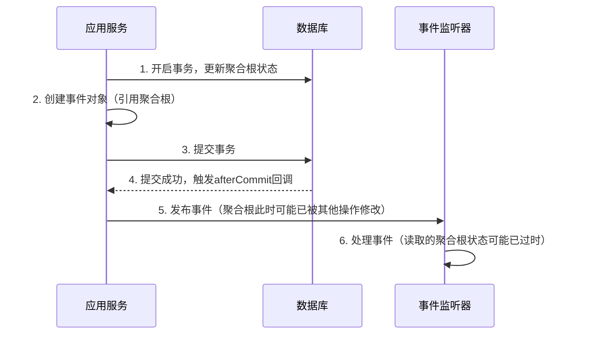

什么情况下会发生被修改的错误？

- **事件对象的不可变性**：确保事件数据在发布后不被修改。
  ```java
  // 推荐：在事务内提前构建事件对象（避免聚合根状态后续变化）
  SprinklerStatusChangedEvent event = new SprinklerStatusChangedEvent(sprinkler);
  TransactionSynchronizationManager.registerSynchronization(...);
  ```

--- R1

### 事件数据被错误修改的场景与原理

---

#### **1. 问题发生的典型场景**

假设事件对象 **直接引用聚合根**，且在事务提交后，**聚合根状态被其他操作修改**。此时已发布的事件数据可能与实际事务提交时的状态不一致。

##### **示例代码（危险写法）**

```java
public class SprinklerStatusChangedEvent {
    // 直接持有聚合根引用
    private final Sprinkler sprinkler;

    public SprinklerStatusChangedEvent(Sprinkler sprinkler) {
        this.sprinkler = sprinkler;
    }
}

// 应用服务中发布事件
public void changeStatus() {
    Sprinkler sprinkler = repository.findById(...);
    sprinkler.transitionStatus(NEW_STATUS);
    repository.save(sprinkler);

    // 直接传递聚合根到事件对象
    SprinklerStatusChangedEvent event = new SprinklerStatusChangedEvent(sprinkler);
    TransactionSynchronizationManager.registerSynchronization(...);
}
```

---

#### **2. 错误发生流程**



---

#### **3. 具体风险场景**

##### **场景 1：同一事务内后续修改**

```java
public void changeStatus() {
    Sprinkler sprinkler = repository.findById(...);
    sprinkler.transitionStatus(NEW_STATUS);
    repository.save(sprinkler);

    // 创建事件对象（此时状态为 NEW_STATUS）
    SprinklerStatusChangedEvent event = new SprinklerStatusChangedEvent(sprinkler);

    // 事务提交前，再次修改聚合根状态
    sprinkler.setStatus(OTHER_STATUS); // ⚠️ 错误操作

    // 注册同步器
    TransactionSynchronizationManager.registerSynchronization(...);
}
```

- **结果**：事件监听器收到的状态为 `OTHER_STATUS`，但数据库实际提交的是 `NEW_STATUS`。

##### **场景 2：其他线程并发修改**

```text
时间线：
1. 事务提交 → 数据状态为 NEW_STATUS
2. 事件发布前，其他线程修改聚合根状态为 OTHER_STATUS
3. 事件监听器读取到 OTHER_STATUS（与事务提交结果不一致）
```

---

### **解决方案：事件对象不可变性**

#### **1. 推荐实现方式**

```java
// 事件对象仅包含不可变数据
public class SprinklerStatusChangedEvent {
    private final String sprinklerId;
    private final SprinklerStatus oldStatus;
    private final SprinklerStatus newStatus;

    // 构造时直接复制值
    public SprinklerStatusChangedEvent(Sprinkler sprinkler) {
        this.sprinklerId = sprinkler.getId();
        this.oldStatus = sprinkler.getPreviousStatus(); // 假设聚合根记录旧状态
        this.newStatus = sprinkler.getStatus();
    }
}
```

#### **2. 提前构建事件对象**

在事务提交**前**捕获确定的状态，避免后续修改影响事件数据：

```java
public void changeStatus() {
    Sprinkler sprinkler = repository.findById(...);
    SprinklerStatus oldStatus = sprinkler.getStatus(); // 记录旧状态

    sprinkler.transitionStatus(NEW_STATUS);
    repository.save(sprinkler);

    // 提前构建事件（捕获提交前状态）
    SprinklerStatusChangedEvent event = new SprinklerStatusChangedEvent(oldStatus, NEW_STATUS);

    // 注册同步器
    TransactionSynchronizationManager.registerSynchronization(...);
}
```

---

### **最佳实践总结**

| **实践**                     | **作用**                                   |
| ---------------------------- | ------------------------------------------ |
| **事件对象不可变**           | 防止事件数据在发布后被意外修改             |
| **构造时复制数据（非引用）** | 确保事件数据与事务提交时的状态一致         |
| **提前构建事件**             | 避免事务提交前代码中的后续操作影响事件数据 |
| **避免暴露聚合根引用**       | 通过 DTO 或值对象传递必要数据，降低耦合    |

通过以上措施，可彻底避免事件数据与事务实际提交结果不一致的问题。
