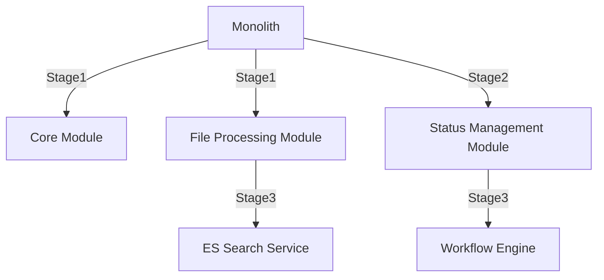

如何对以下内容建立 **可观测的架构约束** 和 **渐进式拆分机制**

---

针对该场景的演进式架构设计，建议采用模块化+扩展点设计模式，结合领域驱动设计思想进行优化。以下是分步骤实施方案：

### 一、架构分层优化（演进基础）

1. **分层结构**：

```java
- Application Layer（控制器层）
  ├── FileController
  └── StatusController
- Domain Layer（领域层）
  ├── FileProcessor
  ├── StatusManager
  └── Validator
- Infrastructure Layer（基础设施层）
  ├── FileParser
  ├── DataPersister
  ├── AuditLogger
  └── MessageSerializer
```

2. **核心接口定义**（扩展点预留）：

```java
// 文件解析扩展接口
public interface FileParser {
    List<BaseDTO> parse(MultipartFile file) throws IOException;
}

// 状态转换规则接口
public interface StatusTransitionRule {
    boolean validate(Status current, Status target);
}

// 数据持久化扩展接口
public interface DataPersister<T extends BaseDTO> {
    PersistResult persist(T dto);
}

// 审计日志接口
public interface AuditLogger {
    void logAction(ActionType type, String entityId, String operator);
}
```

### 二、流程优化方案

1. **统一文件处理管道**：

```java
public class FileProcessingPipeline {
    // 扩展点：可注入不同解析器
    private final Map<String, FileParser> parsers = new ConcurrentHashMap<>();

    @Autowired
    private StatusTransitionRuleEngine ruleEngine;

    public ProcessingResult process(MultipartFile file) {
        // 1. 文件类型路由
        FileParser parser = parsers.get(getFileType(file));

        // 2. 领域校验（扩展点）
        ValidationResult vr = validator.validate(file);

        // 3. 状态转换执行
        StatusTransition transition = ruleEngine.applyRules(currentStatus);

        // 4. 审计日志（切面实现）
        auditLogger.log(ActionType.FILE_PROCESS);

        // 5. 异常统一处理
        try {
            return processorTemplate.process(file);
        } catch (BusinessException e) {
            return MessageSerializer.serialize(e);
        }
    }
}
```

2. **状态机设计**（支持未来扩展）：

```java
// 状态配置示例（可存储到数据库）
public enum SprinklerStatus {
    IN_STOCK(0),
    IN_USE(1),
    UNDER_MAINTENANCE(2),
    DAMAGED(3),
    RMA(4);

    // 状态转换矩阵
    private static final Map<Status, Set<Status>> transitions = Map.of(
        IN_STOCK, Set.of(IN_USE),
        IN_USE, Set.of(UNDER_MAINTENANCE, DAMAGED),
        UNDER_MAINTENANCE, Set.of(IN_STOCK, RMA)
    );

    // 验证方法（可扩展）
    public boolean canTransitionTo(Status newStatus) {
        return transitions.get(this).contains(newStatus);
    }
}
```

### 三、Elasticsearch 集成准备

1. **双重写入策略**：

```java
@Repository
public class SprinklerRepositoryImpl implements SprinklerRepository {

    @Autowired
    private JdbcTemplate jdbcTemplate;

    // ES扩展点（通过配置开关控制）
    @Value("${search.enabled:false}")
    private boolean searchEnabled;

    @Override
    @Transactional
    public void save(BaseDTO dto) {
        // 主数据库操作
        jdbcTemplate.update(...);

        if(searchEnabled) {
            // 异步写入ES
            CompletableFuture.runAsync(() -> esClient.index(dto));
        }
    }
}
```

### 四、审计日志实现

1. **切面日志记录**：

```java
@Aspect
@Component
public class AuditAspect {

    @Pointcut("@annotation(com.example.Auditable)")
    public void auditableMethod() {}

    @Around("auditableMethod()")
    public Object auditMethod(ProceedingJoinPoint joinPoint) throws Throwable {
        // 记录请求参数
        AuditLog log = new AuditLog()
           .setAction(getActionType(joinPoint))
           .setParameters(serializeParams(joinPoint.getArgs()));

        try {
            Object result = joinPoint.proceed();
            log.setSuccess(true);
            return result;
        } catch (Exception e) {
            log.setSuccess(false)
               .setErrorMsg(e.getMessage());
            throw e;
        } finally {
            auditLogRepository.save(log);
            // 实时日志推送（WebSocket或Server-Sent Events）
            realtimeLogService.push(log);
        }
    }
}
```

### 五、异常处理策略

```java
@ControllerAdvice
public class GlobalExceptionHandler {

    @ExceptionHandler(BusinessException.class)
    public ResponseEntity<ErrorResponse> handleBusinessException(BusinessException ex) {
        ErrorResponse response = new ErrorResponse()
            .setCode(ex.getCode())
            .setMessage(ex.getMessage())
            .setDetails(serializeValidationErrors(ex));

        return ResponseEntity.status(HttpStatus.BAD_REQUEST)
                             .body(response);
    }

    // 统一序列化处理
    private Object serializeValidationErrors(BusinessException ex) {
        return ex.getValidationErrors().stream()
            .map(error -> new ErrorDetail()
                .setField(error.getField())
                .setRejectedValue(error.getValue())
                .setMessage(error.getMessage()))
            .collect(Collectors.toList());
    }
}
```

### 六、演进路线图

1. **第一阶段（基础架构）**：

   - 实现核心状态机
   - 完成文件处理管道
   - 基础审计日志

2. **第二阶段（扩展能力）**：

   - 实现 ES 双重写入
   - 增加工单转换模块
   - 完善实时日志推送

3. **第三阶段（优化提升）**：
   - 引入规则引擎（Drools）
   - 实现分布式任务调度
   - 增加监控指标（Prometheus）

### 七、关键配置示例

```yaml
# application.yml
features:
  elasticsearch:
    enabled: false
    cluster-nodes: localhost:9300
  realtime-log:
    enabled: true
    transport: websocket
  file-processing:
    parallel-threads: 4
    chunk-size: 100
```

该设计通过模块化解耦、接口抽象、切面编程等方式预留了充分的扩展能力，同时保持核心流程的稳定性。未来扩展时可通过实现预定义的接口、修改配置、增加切面逻辑等方式进行渐进式演进，无需重构核心业务逻辑。

--- R1

以下是针对该架构设计建立可观测约束和渐进式拆分的具体实施方案，包含可落地的技术手段和验证方法：

---

### 一、可观测架构约束建设

#### 1. 分层架构监控矩阵

```yaml
# 监控指标定义（Micrometer实现）
monitoring:
  application_layer:
    - metric: http.server.requests
      tags: [controller, method, outcome]
  domain_layer:
    - metric: custom.domain.process.time
      tags: [processor_type, status]
    - event: state_transition
      fields: [from_state, to_state, entity_id]
  infrastructure_layer:
    - metric: jdbc.connections.active
    - metric: es.bulk.operations
```

**实施方式**：

- 使用`@Timed("custom.domain.process.time")`注解领域服务方法
- 在`StatusManager`中埋点状态转换事件
- 通过 AOP 自动捕获基础设施层指标

#### 2. 架构约束验证规则

```java
// 架构约束检查（ArchUnit测试）
@ArchTest
static final ArchRule layer_dependencies = layeredArchitecture()
    .layer("Application").definedBy("..application..")
    .layer("Domain").definedBy("..domain..")
    .layer("Infrastructure").definedBy("..infrastructure..")
    .whereLayer("Application").mayNotBeAccessedByAnyLayer()
    .whereLayer("Domain").mayOnlyBeAccessedByLayers("Application")
    .as("分层架构约束");

// 接口实现检查
@ArchTest
static final ArchRule interface_implementations = classes()
    .that().implement(FileParser.class)
    .should().resideInAPackage("..infrastructure.fileparser")
    .as("解析器实现位置约束");
```

#### 3. 实时架构拓扑监控

```bash
# Spring Boot Actuator配置
management:
  endpoints:
    web:
      exposure:
        include: health,metrics,archComponents
  arch:
    enabled: true
    components:
      include:
        - "com.example.application.*"
        - "com.example.domain.*"
```

---

### 二、渐进式拆分机制

#### 1. 模块拆分路线



#### 2. 动态模块加载

```java
// 模块加载器接口
public interface ModuleLoader {
    void loadModule(ModuleDescriptor descriptor);
    void unloadModule(String moduleId);
}

// 基于OSGi的实现
@Component
public class OsgiModuleLoader implements ModuleLoader {
    private final BundleContext bundleContext;

    public void loadModule(ModuleDescriptor desc) {
        Bundle bundle = bundleContext.installBundle(desc.getLocation());
        bundle.start();
    }
}
```

#### 3. 服务拆分示例（文件处理模块）

```java
// 1. 定义gRPC服务接口
service FileProcessingService {
    rpc ProcessFile(FileRequest) returns (ProcessingResult);
}

// 2. 保留原Controller作为适配层
@RestController
public class FileControllerProxy {
    @Autowired
    private FileProcessingClient client;

    @PostMapping("/files")
    public Result upload(MultipartFile file) {
        return client.processFile(file);
    }
}

// 3. 配置特性开关
features:
  file-processing:
    deployment-mode: local # 可选local/remote
```

#### 4. 数据库拆分策略

```sql
-- 阶段1：Schema分离
CREATE SCHEMA file_processing AUTHORIZATION service_user;

-- 阶段2：数据库路由
@Configuration
public class RoutingDataSource extends AbstractRoutingDataSource {
    @Override
    protected Object determineCurrentLookupKey() {
        return TransactionContext.getCurrentSchema();
    }
}

-- 阶段3：物理分离
spring:
  datasource:
    fileprocessing:
      url: jdbc:postgresql://file-db:5432/file
    core:
      url: jdbc:postgresql://core-db:5432/core
```

---

### 三、验证机制

#### 1. 约束违反检测流水线

```groovy
// Jenkins Pipeline步骤
stage('Arch Check') {
    steps {
        sh './gradlew archTest'
        junit 'build/reports/archTest/**/*.xml'
    }
}

// 静态分析配置
spotbugs {
    excludeFilter = file('config/arch-rules.xml')
    effort = 'max'
    reportLevel = 'low'
}
```

#### 2. 实时架构健康度看板

```json
// Grafana仪表板配置
{
  "panels": [
    {
      "type": "heatmap",
      "title": "层级调用关系",
      "targets": [
        {
          "expr": "sum(rate(http_server_requests_seconds_count[5m])) by (layer)"
        }
      ]
    },
    {
      "type": "stat",
      "title": "架构约束违反",
      "thresholds": "0,0",
      "targets": [
        {
          "expr": "arch_violations_total"
        }
      ]
    }
  ]
}
```

#### 3. 拆分影响度评估模型

```python
# 模块耦合度评估算法
def calculate_coupling(module):
    fan_in = len(get_inbound_dependencies(module))
    fan_out = len(get_outbound_dependencies(module))
    instability = fan_out / (fan_in + fan_out)
    return {
        'instability': instability,
        'abstractness': get_abstractness(module)
    }
```

---

### 四、关键实施步骤

1. **约束基线建立**

   - 在 CI 流水线中集成 ArchUnit 测试
   - 为每个模块定义`module-info.java`约束
   - 初始化 Micrometer 监控埋点

2. **渐进拆分启动**

   - 将文件处理模块重构成独立 Gradle 子项目
   - 使用 Testcontainers 维护模块集成测试
   - 部署轻量级服务网格（如 Linkerd）进行流量观测

3. **动态能力注入**

   - 开发配置中心管理模块开关
   - 实现基于 Nginx 的流量镜像机制
   - 建立模块健康度 KPI 指标体系

4. **完成度验证**
   - 执行混沌工程测试（如模拟模块故障）
   - 通过服务依赖矩阵验证架构隔离性
   - 评估各模块的抽象/稳定平衡指数

---

该方案通过将架构约束转化为可执行的验证规则，结合细粒度的渐进式拆分策略，在保证系统稳定性的前提下实现可控演进。实施过程中需重点关注模块接口的版本兼容性和跨模块事务的一致性保障。
