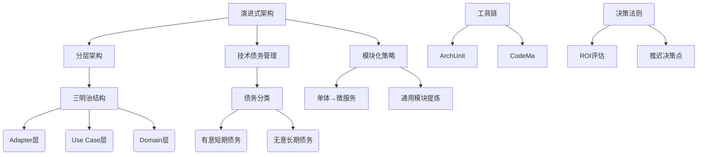

如果我对以下内容完全不熟悉，帮我构思我该怎么学习以下内容效率最高？提出哪些问题，对哪些概念进行深入理解，之后的学习规划是怎样的？

---

在敏捷开发中平衡快速交付与架构可持续性，需要遵循 **"演进式架构"（Evolutionary Architecture）** 理念。以下是经过验证的实践方案，既能保证初期快速交付 MVP（Minimum Viable Product），又能控制长期重构代价：

---

### 一、分层架构策略（降低核心业务耦合度）

#### 1. 核心三明治结构

```text
┌───────────────────────┐
│        Adapter        │  # 易变层：对接外部系统（API/数据库）
├───────────────────────┤
│       Use Case        │  # 业务逻辑层（保持纯净领域模型）
├───────────────────────┤
│        Domain         │  # 核心层：实体/值对象/领域服务（零依赖）
└───────────────────────┘
```

- **实践要点**：
  - 将第三方库依赖限制在 Adapter 层（如 Spring 注解仅出现在 Controller/Repository）
  - 领域层使用原生 Java/Kotlin 代码，避免技术框架污染
  - 用例层通过依赖倒置（DIP）调用 Adapter 接口

_示例：支付模块初期实现_

```java
// Domain层（稳定）
public record PaymentRequest(OrderId orderId, Money amount) {}

// Use Case层（业务逻辑）
public class ProcessPaymentUseCase {
    private final PaymentGateway gateway; // 接口依赖

    public PaymentResult execute(PaymentRequest request) {
        if (request.amount().greaterThan(MAX_LIMIT)) {
            return PaymentResult.failed("金额超限");
        }
        return gateway.charge(request); // 调用抽象接口
    }
}

// Adapter层（易变）
@RestController
public class PaymentController {
    @PostMapping("/pay")
    public PaymentResult pay(@RequestBody PaymentRequest request) {
        return useCase.execute(request);
    }
}
```

#### 2. 模块化演进路线

```text
Phase 1: 单体模块（快速启动）
   └── src/main/java
       ├── order
       ├── payment
       └── inventory

Phase 2: 垂直模块拆分（业务增长后）
   ├── order-service
   ├── payment-service
   └── inventory-service

Phase 3: 核心通用模块提炼（规模扩大）
   ├── common-domain
   ├── common-utils
   └── service-*/
```

---

### 二、技术债务控制策略

#### 1. 债务分类管理矩阵

| 债务类型         | 处理策略                   | 示例场景                 |
| ---------------- | -------------------------- | ------------------------ |
| **有意短期债务** | 创建 TechDebt 标签跟踪     | 快速上线时的临时补丁代码 |
| **无意长期债务** | 立即重构 + 补充测试        | 发现核心层耦合外部框架   |
| **架构债务**     | 制定季度重构计划           | 模块边界模糊导致循环依赖 |
| **测试债务**     | 在 CI 中设置覆盖率阈值拦截 | 关键路径缺少集成测试     |

#### 2. 债务登记示例（GitLab Issue）

```markdown
**TechDebt: 支付结果通知耦合微信 SDK**

影响范围：

- `PaymentNotificationService` 直接使用 WxPayConfig

重构方案：

1. 提取 `NotificationGateway` 接口
2. 创建 `WxNotificationAdapter` 实现
3. 通过 DI 注入适配器

截止期限：2023-Q3
关联测试：PaymentNotificationIT
```

---

### 三、高效演进实践工具链

#### 1. 架构守护工具

```yaml
# ArchUnit 测试示例
@AnalyzeClasses(packages = "com.example")
public class ArchitectureTest {
    @Test
    void domain_layer_should_not_depend_on_spring() {
        noClasses().that().resideInAPackage("..domain..")
                   .should().dependOnClassesThat().resideInAPackage("org.springframework..")
                   .check(importedClasses);
    }

    @Test
    void use_case_should_be_spring_free() {
        classes().that().haveNameMatching(".*UseCase")
                 .should().beAnnotatedWith(SpringUnfreeze.class) // 自定义注解
                 .check(importedClasses);
    }
}
```

#### 2. 可视化依赖分析

使用 [CodeMa](https://www.codema.ai/) 或 [Lattix](https://www.lattix.com/) 生成模块依赖图，识别违规耦合：  


---

### 四、快速启动 checklist

1. **架构决策记录（ADR）**  
   在 `/docs/adr` 目录保存关键决策：

   ```markdown
   # ADR 001: 选择单体架构启动

   ## 状态：已接受

   ## 背景

   初期团队规模 3 人，需在 2 周内上线 MVP

   ## 决策

   - 使用单体模块结构
   - 但强制遵守分层规范

   ## 后果

   - 快速交付能力+20%
   - 技术债务风险+30%
   ```

2. **自动化脚手架生成**  
   使用 [Maven Archetype](https://maven.apache.org/guides/mini/guide-creating-archetypes.html) 创建项目模板：

   ```bash
   mvn archetype:generate -Dfilter=com.example:base-archetype
   ```

3. **持续集成质量门禁**  
   GitHub Actions 配置示例：

   ```yaml
   jobs:
     quality-gate:
       steps:
         - name: Architecture Tests
           run: mvn test -Dtest=*ArchTest*

         - name: Coverage Check
           run: |
             COVERAGE=$(awk '/Total/ {print $4}' target/site/jacoco/index.html)
             if (( $(echo "$COVERAGE < 80" | bc -l) )); then
               echo "覆盖率低于80%: $COVERAGE"
               exit 1
             fi
   ```

---

### 五、平衡法则

1. **ROI 优先原则**  
   对每个架构决策进行价值评估：

   ```
   预期收益（可维护性/扩展性） ÷ 实施成本（人天） > 当前迭代优先级阈值
   ```

2. **推迟决策点**  
   使用抽象保留可能性：

   ```java
   // 初期：本地缓存实现
   @Component
   public class LocalCache implements DataCache {
       private final Map<String, Object> store = new ConcurrentHashMap<>();
   }

   // 演进为Redis时：
   @Profile("prod")
   @Component
   public class RedisCache implements DataCache {
       private final RedisTemplate template;
   }
   ```

通过以上方法，可在保持 70%架构灵活性的前提下，实现初期开发速度不减。关键在于建立 **可观测的架构约束** 和 **渐进式拆分机制**，让系统像生物体一样自然生长。

--- R1

为了高效掌握敏捷开发中的演进式架构及相关技术，以下是为你量身定制的学习路线。该路线采用「概念解构-实践验证-系统整合」三步法，结合刻意练习原则，预计可在 6-8 周内建立完整认知体系。

---

### 一、关键问题导航（学习方向锚定）

#### 基础认知层

1. **演进式架构的本质**

   - 为什么说"架构是演进而非设计出来的"？
   - 如何量化评估架构的演进能力？有哪些可观测指标？

2. **分层架构的价值**

   - Adapter 层与 Domain 层的依赖方向为何必须是单向的？
   - 若 Use Case 层直接调用 MySQL 驱动会引发什么技术债务？

3. **技术债务管理**
   - 如何区分"良性债务"与"恶性债务"？
   - 为什么说测试覆盖率是债务管理的基础设施？

#### 实践应用层

4. **模块化演进**

   - 单体拆分为微服务的临界点判断依据是什么？
   - common-domain 模块提炼需要哪些防腐措施？

5. **工具链应用**
   - ArchUnit 如何通过单元测试实现架构守护？
   - 可视化依赖分析能发现哪些隐性架构问题？

#### 决策判断层

6. **ROI 平衡法则**
   - 如何计算"推迟接口抽象化"的收益成本比？
   - 当业务需求与架构规范冲突时，决策框架是什么？

---

### 二、核心概念图谱（掌握优先级排序）



**掌握顺序建议**：

1. 三明治结构 → 技术债务分类 → ArchUnit 基础
2. 模块化策略 → 可视化分析 → ROI 评估
3. 决策框架 → 完整案例推演

---

### 三、阶段性学习规划

#### 阶段 1：基础构建（2 周）

**目标**：建立分层架构的肌肉记忆  
**实操任务**：

1. 在现有项目中实施三明治结构：

   - 创建`domain`包（仅含 POJO）
   - 将 Spring 注解限制在`adapter`包
   - 使用 maven-enforcer-plugin 禁止错误依赖

2. 编写 ArchUnit 测试用例：
   ```java
   @Test
   void domain_layer_should_not_see_spring() {
       noClasses().that().resideInAPackage("..domain..")
                  .should().dependOnClassesThat().belongToAnyPackage("org.springframework..")
                  .check(importedClasses);
   }
   ```

**学习材料**：

- 《演进式架构》第 3 章（重点阅读架构适应度函数）
- Martin Fowler 的[模块化定义指南](https://martinfowler.com/articles/break-monolith-into-microservices.html)

---

#### 阶段 2：债务管理（1.5 周）

**目标**：形成技术债务处置直觉  
**实操任务**：

1. 在 GitLab 创建技术债务看板，分类登记 5 个现存问题
2. 对`PaymentService`进行债务重构：
   - 使用策略模式解耦支付渠道
   - 补充集成测试覆盖支付失败场景

**关键验证**：

```bash
# 重构后运行测试
mvn test -Dtest=PaymentServiceIT
# 查看Jacoco报告是否覆盖新分支
open target/site/jacoco/index.html
```

**学习材料**：

- 《重构：改善既有代码的设计》第 2 章
- 技术债务量化论文《Managing Technical Debt in Software Engineering》

---

#### 阶段 3：工具精通（1 周）

**目标**：掌握架构分析工具链  
**实操任务**：

1. 使用 CodeMa 生成模块依赖图：

   ```python
   # 示例分析脚本
   from codema import ProjectAnalyzer

   analyzer = ProjectAnalyzer("/path/to/project")
   analyzer.visualize_dependencies()
   analyzer.export_heatmap("dependencies.html")
   ```

2. 配置持续集成门禁：
   ```yaml
   # GitHub Actions片段
   - name: Architecture Gate
     run: |
       if ! mvn test -Dtest=ArchitectureTest; then
           echo "架构违规！查看ArchUnit报告"
           exit 1
       fi
   ```

**学习材料**：

- ArchUnit 官方文档中的[架构规则示例](https://www.archunit.org/userguide/html/000_Index.html)
- Lattix 白皮书《Managing Software Architecture》

---

#### 阶段 4：综合实践（2 周）

**目标**：完成完整项目生命周期演练  
**项目场景**：电商订单系统演进

```text
迭代1：单体架构（支持创建订单）
迭代2：拆分支付模块（含技术债务登记）
迭代3：引入Redis缓存（通过抽象接口）
迭代4：通用模块提炼（order-domain）
```

**交付产出**：

1. 4 份 ADR 文档
2. 模块依赖演进图谱
3. 技术债务追踪看板

---

### 四、刻意练习方案

#### 概念卡制作模板

````markdown
**概念**：依赖倒置原则  
**反模式案例**：

```java
// Service直接依赖MySQL实现
public class OrderService {
    private MySQLOrderRepository repository;
}
```
````

**正确实践**：

```java
// 通过接口解耦
public interface OrderRepository {
    void save(Order order);
}

public class OrderService {
    private final OrderRepository repository;
}
```

**检测方法**：  
`ArchUnit验证领域层不依赖具体实现`

```

#### 错题本记录要点
1. 错误现象：领域对象包含@Table注解
2. 根本原因：违反分层架构的依赖方向
3. 修正方案：将JPA注解限制在adapter层
4. 验证方式：运行ArchUnit测试套件

---

### 五、效果评估体系
**Level 1：基础认知**
✅ 能准确绘制三明治架构图
✅ 说出技术债务的4种分类

**Level 2：实践能力**
✅ 在30分钟内完成模块化拆分
✅ 编写有效的ArchUnit规则

**Level 3：决策判断**
✅ 对模拟案例做出ROI合理评估
✅ 设计出可演进的缓存接口

**Level 4：体系构建**
✅ 主导完成完整项目演进周期
✅ 输出架构演进评估报告

---

通过该学习路线，你将在8周后具备：
1. 在敏捷环境下设计可演进架构的能力
2. 技术债务的量化管理手段
3. 架构决策的ROI评估框架
4. 完整的工具链使用经验

建议每周投入10-12小时，重点突破阶段1和阶段4的实操任务。遇到卡点时，可通过「概念卡回溯+错题本分析」进行针对性突破。
```
