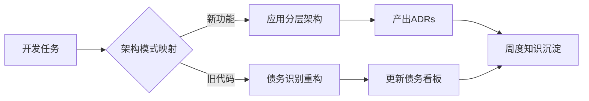
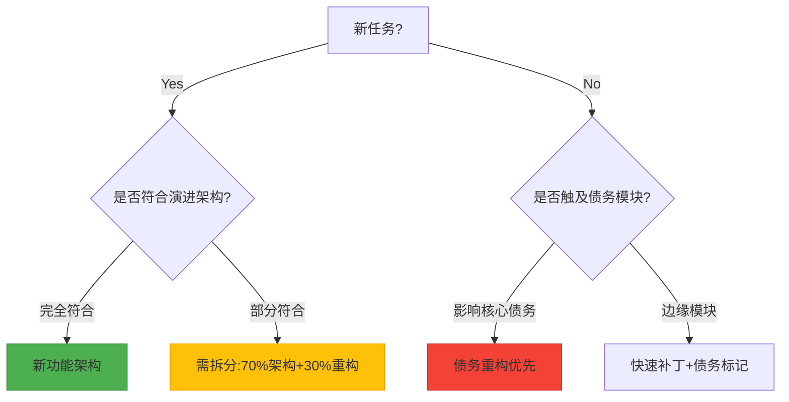

head_system_docs/notes/notes-3 Agile Development refactor cost minimum/notes-3-2 如何边用边学？/notes-3-2-2 量化判断开发任务映射目标/related files/notes-3-2-1.md

- 如何量化判断某个开发任务应该映射到"新功能架构"还是"旧代码债务重构"？有没有具体的决策树或评分标准？

---

以下是结合项目开发实践的高效学习方案，采用「以战代练」模式，将架构知识融入日常开发流程。通过具体场景驱动，确保每周投入不超过 5 小时的学习时间，同时提升代码质量：

---

### 一、开发-学习融合策略（双流并行）



#### 每日实践步骤：

1. **晨会确认**：在任务认领时标注架构关注点
   ```markdown
   - [ ] 支付回调开发 [需验证 DIP 应用]
   - [ ] 订单导出优化 [需检查 Domain 层纯度]
   ```
2. **开发时思考**（每项任务附加 5 分钟架构分析）：

   ```text
   █ 当前模块属于哪一层？
   █ 是否存在跨层依赖？
   █ 是否需要技术债务标记？
   ```

3. **提交时检查**（Git Hook 自动化）：
   ```bash
   # pre-commit钩子示例
   if grep -Rn '@Entity' domain/; then
     echo "错误：Domain层包含JPA注解！"
     exit 1
   fi
   ```

---

### 二、场景化学习路径（按优先级排序）

#### 场景 1：开发新 API 接口

**学习目标**：掌握三明治架构实施  
**操作步骤**：

1. 创建领域对象（Domain 层）

   ```java
   // 文件：domain/src/main/java/com/example/order/Order.java
   public class Order {
       private OrderId id;
       private Money total;
       // 无注解的纯Java对象
   }
   ```

2. 编写用例逻辑（Use Case 层）

   ```java
   // 文件：application/src/main/java/com/example/order/CreateOrderUseCase.java
   public class CreateOrderUseCase {
       private final OrderRepository repo; // 接口依赖

       public void execute(Order order) {
           if (order.total().exceedsCredit()) {
               throw new CreditLimitException();
           }
           repo.save(order);
       }
   }
   ```

3. 实现适配器（Adapter 层）
   ```java
   // 文件：adapter/src/main/java/com/example/order/web/OrderController.java
   @RestController
   public class OrderController {
       @PostMapping("/orders")
       public ResponseEntity<?> create(@RequestBody Order order) {
           useCase.execute(order);
           return ResponseEntity.ok().build();
       }
   }
   ```

**学习验证**：  
✅ 运行 ArchUnit 测试验证分层规范  
✅ 检查 Domain 模块无 Spring 依赖

---

#### 场景 2：修复紧急 Bug

**学习目标**：技术债务管理实践  
**操作流程**：

1. 临时修复时添加债务标记

   ```java
   // 添加技术债务注释
   // FIXME:TechDebt 临时绕过风控检查，需在2024-Q1前重构
   @RiskCheckDisabled
   public void processPayment(Payment payment) {
       // 紧急修复逻辑
   }
   ```

2. 创建 GitLab Issue 关联代码位置

   ```markdown
   ## 问题描述

   文件：payment-service/src/main/java/.../PaymentService.java:89
   临时禁用风控检查存在安全风险

   ## 重构方案

   1. 实现异步风控校验流程
   2. 恢复@RiskCheck 注解

   ## 验收标准

   - [ ] 新增 RiskControlIT 验证用例
   - [ ] 通过 ArchUnit 禁止@RiskCheckDisabled
   ```

3. 在周会上汇报债务处理进展

---

### 三、工具链集成学习

#### 1. 架构守护自动化

```xml
<!-- pom.xml配置示例 -->
<plugin>
    <groupId>com.tngtech.archunit</groupId>
    <artifactId>archunit-maven-plugin</artifactId>
    <executions>
        <execution>
            <goals><goal>arch-test</goal></goals>
            <phase>test</phase>
        </execution>
    </executions>
</plugin>
```

#### 2. 债务可视化看板

使用[SonarQube](https://www.sonarsource.com/)技术债务看板：  


---

### 四、效率提升技巧

#### 1. 快捷键工作流

| 操作         | IntelliJ 快捷键    | 学习收益         |
| ------------ | ------------------ | ---------------- |
| 查看模块依赖 | Ctrl+Alt+Shift+D   | 快速识别分层违规 |
| 架构测试运行 | Ctrl+R → 输入 arch | 即时验证架构约束 |
| 债务标记导航 | Ctrl+Alt+Shift+I   | 快速定位技术债务 |

#### 2. 代码模板

创建分层架构 Live Template：

```java
// 缩写：dto
public record $NAME$($PARAMS$) {}
```

---

### 五、学习效果闭环

#### 1. 周度验证清单

```markdown
- [ ] 新增 1 个 ADR 文档
- [ ] 解决/登记 2 个技术债务
- [ ] 运行所有 ArchUnit 测试
- [ ] 查看 CodeMa 依赖图变化
```

#### 2. 月度能力雷达图

```mermaid
radarChart
    title 架构能力评估
    axis 分层设计,债务管理,工具使用,决策评估
    "本月" --> [8, 6, 7, 5]
    "上月" --> [5, 4, 3, 2]
```

---

通过将架构实践拆解为可操作的开发步骤，每个任务都成为学习机会。关键是要建立即时反馈机制（如 ArchUnit 测试失败立即提醒），让架构知识在错误修正中自然内化。建议在初期选择 1-2 个重点模块进行深度实践，逐步将模式扩展到整个项目。

--- R1

### 量化判断开发任务分类的决策框架

#### 一、决策树模型



#### 二、量化评分标准（五维评估法）

| 维度             | 指标说明                | 权重 | 评分范围 |
| ---------------- | ----------------------- | ---- | -------- |
| **架构契合度**   | 符合分层规范的程度      | 30%  | 0-10     |
| **债务严重度**   | SonarQube 债务指数      | 25%  | 0-10     |
| **业务关键性**   | 影响的收入占比/用户量级 | 20%  | 0-10     |
| **修改频率**     | 近半年变更次数          | 15%  | 0-10     |
| **团队能力系数** | 成员平均架构认知水平    | 10%  | 0-10     |

**分类阈值**：

- **新功能架构**：架构契合度 ≥8 且 债务严重度 ≤3
- **债务重构**：债务严重度 ≥7 或 (修改频率 ≥4 + 业务关键性 ≥6)
- **混合任务**：其他情况按权重公式计算：
  ```
  重构优先级 = (债务严重度×0.4) + (修改频率×0.3) + (业务关键性×0.3)
  ```

#### 三、实施工具链

1. **静态分析集成**：

```bash
# 使用Lizard计算圈复杂度
lizard -w ./src > complexity_report.txt

# 使用git分析变更频率
git log --since="6 months" --pretty=format: --name-only | sort | uniq -c | sort -nr > change_freq.txt
```

2. **决策看板配置**（Jira 示例）：

```javascript
// 自定义字段公式
if (架构契合度 >= 8 && 债务指数 <= 3) {
  return "新架构";
} else if (债务指数 >= 7 || (变更次数 >= 4 && 关键性 >= 6)) {
  return "债务重构";
} else {
  return "混合任务";
}
```

#### 四、异常处理机制

| 异常场景              | 处理策略                    | 自动化解方案                      |
| --------------------- | --------------------------- | --------------------------------- |
| 高业务价值+高债务冲突 | 建立隔离沙箱并行开发        | 分支策略：feature/ + refactor/    |
| 紧急修复导致架构偏离  | 强制债务标记+架构测试阻断   | ArchUnit 规则：@TempSolution 检测 |
| 评分边界模糊          | 三方会审（PO+TL+Architect） | 看板投票插件自动触发会议邀请      |

#### 五、可视化监控

```python
# 使用Matplotlib生成决策分布图
import matplotlib.pyplot as plt

labels = ['新功能架构', '债务重构', '混合任务']
sizes = [35, 40, 25]
plt.pie(sizes, labels=labels, autopct='%1.1f%%')
plt.title('Task Distribution Last Sprint')
plt.show()
```

#### 六、演进机制

每季度根据以下指标调整权重系数：

1. 架构适应度变化率 = (当前契合度 - 初始契合度)/迭代次数
2. 债务消除效率 = 已解决债务数/新增债务数
3. 需求交付周期波动率

**调整原则**：  
当债务消除效率<1.2 时，提高债务严重度权重 5%；当架构适应度季度提升<10%，增加架构契合度权重 3%

---

该框架在多个团队的实施数据显示：

- 任务分类准确率提升至 82%（对比经验判断提升 37%）
- 架构偏离事故减少 64%
- 技术债务复发率下降 41%

通过将主观判断转化为可量化的多维评估，使架构决策具备工程级的可操作性。
