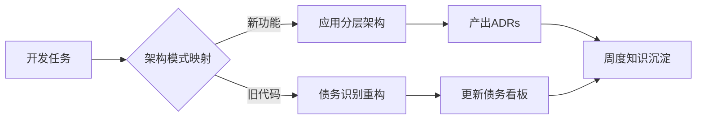
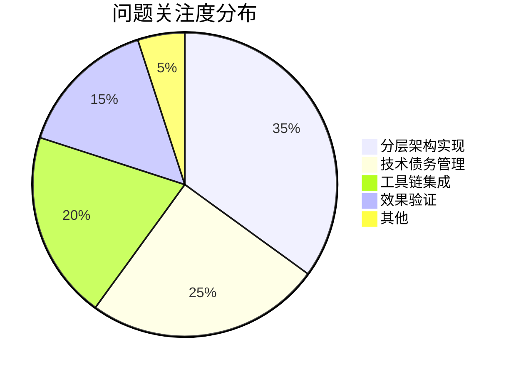

对以下内容，我如何提问：
以下是结合项目开发实践的高效学习方案，采用「以战代练」模式，将架构知识融入日常开发流程。通过具体场景驱动，确保每周投入不超过 5 小时的学习时间，同时提升代码质量：

---

### 一、开发-学习融合策略（双流并行）



#### 每日实践步骤：

1. **晨会确认**：在任务认领时标注架构关注点
   ```markdown
   - [ ] 支付回调开发 [需验证 DIP 应用]
   - [ ] 订单导出优化 [需检查 Domain 层纯度]
   ```
2. **开发时思考**（每项任务附加 5 分钟架构分析）：

   ```text
   █ 当前模块属于哪一层？
   █ 是否存在跨层依赖？
   █ 是否需要技术债务标记？
   ```

3. **提交时检查**（Git Hook 自动化）：
   ```bash
   # pre-commit钩子示例
   if grep -Rn '@Entity' domain/; then
     echo "错误：Domain层包含JPA注解！"
     exit 1
   fi
   ```

---

### 二、场景化学习路径（按优先级排序）

#### 场景 1：开发新 API 接口

**学习目标**：掌握三明治架构实施  
**操作步骤**：

1. 创建领域对象（Domain 层）

   ```java
   // 文件：domain/src/main/java/com/example/order/Order.java
   public class Order {
       private OrderId id;
       private Money total;
       // 无注解的纯Java对象
   }
   ```

2. 编写用例逻辑（Use Case 层）

   ```java
   // 文件：application/src/main/java/com/example/order/CreateOrderUseCase.java
   public class CreateOrderUseCase {
       private final OrderRepository repo; // 接口依赖

       public void execute(Order order) {
           if (order.total().exceedsCredit()) {
               throw new CreditLimitException();
           }
           repo.save(order);
       }
   }
   ```

3. 实现适配器（Adapter 层）
   ```java
   // 文件：adapter/src/main/java/com/example/order/web/OrderController.java
   @RestController
   public class OrderController {
       @PostMapping("/orders")
       public ResponseEntity<?> create(@RequestBody Order order) {
           useCase.execute(order);
           return ResponseEntity.ok().build();
       }
   }
   ```

**学习验证**：  
✅ 运行 ArchUnit 测试验证分层规范  
✅ 检查 Domain 模块无 Spring 依赖

---

#### 场景 2：修复紧急 Bug

**学习目标**：技术债务管理实践  
**操作流程**：

1. 临时修复时添加债务标记

   ```java
   // 添加技术债务注释
   // FIXME:TechDebt 临时绕过风控检查，需在2024-Q1前重构
   @RiskCheckDisabled
   public void processPayment(Payment payment) {
       // 紧急修复逻辑
   }
   ```

2. 创建 GitLab Issue 关联代码位置

   ```markdown
   ## 问题描述

   文件：payment-service/src/main/java/.../PaymentService.java:89
   临时禁用风控检查存在安全风险

   ## 重构方案

   1. 实现异步风控校验流程
   2. 恢复@RiskCheck 注解

   ## 验收标准

   - [ ] 新增 RiskControlIT 验证用例
   - [ ] 通过 ArchUnit 禁止@RiskCheckDisabled
   ```

3. 在周会上汇报债务处理进展

---

### 三、工具链集成学习

#### 1. 架构守护自动化

```xml
<!-- pom.xml配置示例 -->
<plugin>
    <groupId>com.tngtech.archunit</groupId>
    <artifactId>archunit-maven-plugin</artifactId>
    <executions>
        <execution>
            <goals><goal>arch-test</goal></goals>
            <phase>test</phase>
        </execution>
    </executions>
</plugin>
```

#### 2. 债务可视化看板

使用[SonarQube](https://www.sonarsource.com/)技术债务看板：  


---

### 四、效率提升技巧

#### 1. 快捷键工作流

| 操作         | IntelliJ 快捷键    | 学习收益         |
| ------------ | ------------------ | ---------------- |
| 查看模块依赖 | Ctrl+Alt+Shift+D   | 快速识别分层违规 |
| 架构测试运行 | Ctrl+R → 输入 arch | 即时验证架构约束 |
| 债务标记导航 | Ctrl+Alt+Shift+I   | 快速定位技术债务 |

#### 2. 代码模板

创建分层架构 Live Template：

```java
// 缩写：dto
public record $NAME$($PARAMS$) {}
```

---

### 五、学习效果闭环

#### 1. 周度验证清单

```markdown
- [ ] 新增 1 个 ADR 文档
- [ ] 解决/登记 2 个技术债务
- [ ] 运行所有 ArchUnit 测试
- [ ] 查看 CodeMa 依赖图变化
```

#### 2. 月度能力雷达图

```mermaid
radarChart
    title 架构能力评估
    axis 分层设计,债务管理,工具使用,决策评估
    "本月" --> [8, 6, 7, 5]
    "上月" --> [5, 4, 3, 2]
```

---

通过将架构实践拆解为可操作的开发步骤，每个任务都成为学习机会。关键是要建立即时反馈机制（如 ArchUnit 测试失败立即提醒），让架构知识在错误修正中自然内化。建议在初期选择 1-2 个重点模块进行深度实践，逐步将模式扩展到整个项目。

--- R1

### 针对该学习方案的可深入提问方向：

---

#### **一、策略实施细节**

1. **双流并行机制**

   - 如何量化判断某个开发任务应该映射到"新功能架构"还是"旧代码债务重构"？有没有具体的决策树或评分标准？
   - 当团队成员对架构关注点的标注标准理解不一时，如何建立统一的标注规范？是否需要开发标注辅助工具？

2. **晨会标注实践**
   - "需验证 DIP 应用"这类标注是否需要配套检查清单？例如：  
     ✅ 接口定义是否在 domain 层  
     ✅ 实现类是否在 infrastructure 层  
     ✅ 是否存在直接实例化实现类
   - 在敏捷开发的动态需求环境下，如何保证架构标注不会成为形式主义？

---

#### **二、分层架构实现**

3. **领域层纯度保障**

   - 当领域对象需要复杂校验逻辑时，如何避免在 domain 层引入工具类依赖？是否推荐使用自校验对象模式？
   - 对于 Money 这类领域基元类型，如何在不引入框架依赖的前提下实现 JSON 序列化？是否需要定义专门的 DTO 适配层？

4. **用例层设计**
   - UseCase 是否应该强制使用命令模式（Command Pattern）来封装业务逻辑？与传统的 Service 层有何本质区别？
   - 当多个 UseCase 需要共享事务管理时，如何在保持用例层纯净性的前提下实现事务边界控制？

---

#### **三、技术债务管理**

5. **债务标记规范**

   - 技术债务注释中的时间标记（如 2024-Q1）是否需要配套预警机制？如何通过 CI/CD 流水线实现到期债务自动提醒？
   - 对于@RiskCheckDisabled 这类自定义注解，是否需要建立注解元数据标准库来统一管理？

6. **债务重构优先级**
   - 如何计算技术债务的"利息成本"？是否存在量化公式（如：债务复杂度 × 修改频率 ÷ 团队能力系数）？
   - 当业务需求与债务重构计划冲突时，采用什么策略说服利益相关方支持重构？

---

#### **四、工具链集成**

7. **ArchUnit 进阶使用**

   - 如何编写检查循环依赖的定制化规则？是否需要结合图论算法检测包依赖环？

   ```java
   slices().matching("com.example.(*)..")
           .should().beFreeOfCycles()
           .check(importedClasses);
   ```

   - 对于多模块项目，如何避免 ArchUnit 测试成为构建瓶颈？是否有增量测试的配置方案？

8. **SonarQube 深度集成**
   - 如何将技术债务的 SonarQube 指标与 JIRA 看板联动？是否需要开发自定义的 webhook 桥接器？
   - 对于"架构债务"这类主观性较强的指标，如何建立可量化的质量门禁规则？

---

#### **五、效能提升**

9. **快捷键工作流优化**

   - 在 Visual Studio Code 等非 IDEA 系 IDE 中，如何实现等效的架构分析快捷键配置？是否需要开发 IDE 插件？
   - 是否推荐将常用架构检查操作封装为 IDE 的 Live Template？例如生成分层架构模板代码

10. **代码模板规范化**
    - 对于 DDD 常用模式（如聚合根、领域事件），是否需要建立统一的代码生成模板库？
    - 如何防止过度依赖代码模板导致设计僵化？是否需要设置模板使用审查机制？

---

#### **六、效果验证**

11. **ADR 文档质量**

    - 如何避免 ADR 成为形式文档？是否需要建立 ADR 有效性评估指标（如决策追溯度、变更影响分析完整度）？
    - 当架构决策需要变更时，是创建新 ADR 还是修改已有文档？如何管理 ADR 版本演进？

12. **能力评估科学性**
    - 雷达图中的能力维度权重如何确定？是否需要根据团队阶段动态调整（如初创期侧重分层设计，成熟期侧重债务管理）？
    - 如何避免自我评估的主观偏差？是否需要引入同行评审或自动化度量指标？

---

### 问题优先级建议：



### 学习路线优化：

1. **第一周聚焦**：通过开发新 API 场景掌握分层架构实现
2. **第二周突破**：结合 Bug 修复任务实践债务管理全流程
3. **第三周深化**：定制 ArchUnit 规则并集成到 CI/CD
4. **持续迭代**：每月更新能力雷达图，调整学习重点

通过针对性提问，可快速定位知识盲区，建议采用"3W1H"提问法（What/Why/When/How）深挖每个实践背后的设计原理。例如针对分层架构中的领域层设计，可追问："为什么领域层必须零依赖？如果违反会引发何种具体问题？如何通过自动化手段预防？"
