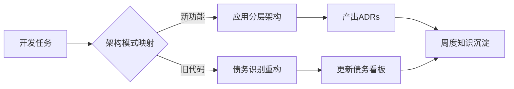

我如何边开发工程边学习以下内容，怎样效率最高？

---

在敏捷开发中平衡快速交付与架构可持续性，需要遵循 **"演进式架构"（Evolutionary Architecture）** 理念。以下是经过验证的实践方案，既能保证初期快速交付 MVP（Minimum Viable Product），又能控制长期重构代价：

---

### 一、分层架构策略（降低核心业务耦合度）

#### 1. 核心三明治结构

```text
┌───────────────────────┐
│        Adapter        │  # 易变层：对接外部系统（API/数据库）
├───────────────────────┤
│       Use Case        │  # 业务逻辑层（保持纯净领域模型）
├───────────────────────┤
│        Domain         │  # 核心层：实体/值对象/领域服务（零依赖）
└───────────────────────┘
```

- **实践要点**：
  - 将第三方库依赖限制在 Adapter 层（如 Spring 注解仅出现在 Controller/Repository）
  - 领域层使用原生 Java/Kotlin 代码，避免技术框架污染
  - 用例层通过依赖倒置（DIP）调用 Adapter 接口

_示例：支付模块初期实现_

```java
// Domain层（稳定）
public record PaymentRequest(OrderId orderId, Money amount) {}

// Use Case层（业务逻辑）
public class ProcessPaymentUseCase {
    private final PaymentGateway gateway; // 接口依赖

    public PaymentResult execute(PaymentRequest request) {
        if (request.amount().greaterThan(MAX_LIMIT)) {
            return PaymentResult.failed("金额超限");
        }
        return gateway.charge(request); // 调用抽象接口
    }
}

// Adapter层（易变）
@RestController
public class PaymentController {
    @PostMapping("/pay")
    public PaymentResult pay(@RequestBody PaymentRequest request) {
        return useCase.execute(request);
    }
}
```

#### 2. 模块化演进路线

```text
Phase 1: 单体模块（快速启动）
   └── src/main/java
       ├── order
       ├── payment
       └── inventory

Phase 2: 垂直模块拆分（业务增长后）
   ├── order-service
   ├── payment-service
   └── inventory-service

Phase 3: 核心通用模块提炼（规模扩大）
   ├── common-domain
   ├── common-utils
   └── service-*/
```

---

### 二、技术债务控制策略

#### 1. 债务分类管理矩阵

| 债务类型         | 处理策略                   | 示例场景                 |
| ---------------- | -------------------------- | ------------------------ |
| **有意短期债务** | 创建 TechDebt 标签跟踪     | 快速上线时的临时补丁代码 |
| **无意长期债务** | 立即重构 + 补充测试        | 发现核心层耦合外部框架   |
| **架构债务**     | 制定季度重构计划           | 模块边界模糊导致循环依赖 |
| **测试债务**     | 在 CI 中设置覆盖率阈值拦截 | 关键路径缺少集成测试     |

#### 2. 债务登记示例（GitLab Issue）

```markdown
**TechDebt: 支付结果通知耦合微信 SDK**

影响范围：

- `PaymentNotificationService` 直接使用 WxPayConfig

重构方案：

1. 提取 `NotificationGateway` 接口
2. 创建 `WxNotificationAdapter` 实现
3. 通过 DI 注入适配器

截止期限：2023-Q3
关联测试：PaymentNotificationIT
```

---

### 三、高效演进实践工具链

#### 1. 架构守护工具

```yaml
# ArchUnit 测试示例
@AnalyzeClasses(packages = "com.example")
public class ArchitectureTest {
    @Test
    void domain_layer_should_not_depend_on_spring() {
        noClasses().that().resideInAPackage("..domain..")
                   .should().dependOnClassesThat().resideInAPackage("org.springframework..")
                   .check(importedClasses);
    }

    @Test
    void use_case_should_be_spring_free() {
        classes().that().haveNameMatching(".*UseCase")
                 .should().beAnnotatedWith(SpringUnfreeze.class) // 自定义注解
                 .check(importedClasses);
    }
}
```

#### 2. 可视化依赖分析

使用 [CodeMa](https://www.codema.ai/) 或 [Lattix](https://www.lattix.com/) 生成模块依赖图，识别违规耦合：  


---

### 四、快速启动 checklist

1. **架构决策记录（ADR）**  
   在 `/docs/adr` 目录保存关键决策：

   ```markdown
   # ADR 001: 选择单体架构启动

   ## 状态：已接受

   ## 背景

   初期团队规模 3 人，需在 2 周内上线 MVP

   ## 决策

   - 使用单体模块结构
   - 但强制遵守分层规范

   ## 后果

   - 快速交付能力+20%
   - 技术债务风险+30%
   ```

2. **自动化脚手架生成**  
   使用 [Maven Archetype](https://maven.apache.org/guides/mini/guide-creating-archetypes.html) 创建项目模板：

   ```bash
   mvn archetype:generate -Dfilter=com.example:base-archetype
   ```

3. **持续集成质量门禁**  
   GitHub Actions 配置示例：

   ```yaml
   jobs:
     quality-gate:
       steps:
         - name: Architecture Tests
           run: mvn test -Dtest=*ArchTest*

         - name: Coverage Check
           run: |
             COVERAGE=$(awk '/Total/ {print $4}' target/site/jacoco/index.html)
             if (( $(echo "$COVERAGE < 80" | bc -l) )); then
               echo "覆盖率低于80%: $COVERAGE"
               exit 1
             fi
   ```

---

### 五、平衡法则

1. **ROI 优先原则**  
   对每个架构决策进行价值评估：

   ```
   预期收益（可维护性/扩展性） ÷ 实施成本（人天） > 当前迭代优先级阈值
   ```

2. **推迟决策点**  
   使用抽象保留可能性：

   ```java
   // 初期：本地缓存实现
   @Component
   public class LocalCache implements DataCache {
       private final Map<String, Object> store = new ConcurrentHashMap<>();
   }

   // 演进为Redis时：
   @Profile("prod")
   @Component
   public class RedisCache implements DataCache {
       private final RedisTemplate template;
   }
   ```

通过以上方法，可在保持 70%架构灵活性的前提下，实现初期开发速度不减。关键在于建立 **可观测的架构约束** 和 **渐进式拆分机制**，让系统像生物体一样自然生长。

--- R1

以下是结合项目开发实践的高效学习方案，采用「以战代练」模式，将架构知识融入日常开发流程。通过具体场景驱动，确保每周投入不超过 5 小时的学习时间，同时提升代码质量：

---

### 一、开发-学习融合策略（双流并行）



#### 每日实践步骤：

1. **晨会确认**：在任务认领时标注架构关注点
   ```markdown
   - [ ] 支付回调开发 [需验证 DIP 应用]
   - [ ] 订单导出优化 [需检查 Domain 层纯度]
   ```
2. **开发时思考**（每项任务附加 5 分钟架构分析）：

   ```text
   █ 当前模块属于哪一层？
   █ 是否存在跨层依赖？
   █ 是否需要技术债务标记？
   ```

3. **提交时检查**（Git Hook 自动化）：
   ```bash
   # pre-commit钩子示例
   if grep -Rn '@Entity' domain/; then
     echo "错误：Domain层包含JPA注解！"
     exit 1
   fi
   ```

---

### 二、场景化学习路径（按优先级排序）

#### 场景 1：开发新 API 接口

**学习目标**：掌握三明治架构实施  
**操作步骤**：

1. 创建领域对象（Domain 层）

   ```java
   // 文件：domain/src/main/java/com/example/order/Order.java
   public class Order {
       private OrderId id;
       private Money total;
       // 无注解的纯Java对象
   }
   ```

2. 编写用例逻辑（Use Case 层）

   ```java
   // 文件：application/src/main/java/com/example/order/CreateOrderUseCase.java
   public class CreateOrderUseCase {
       private final OrderRepository repo; // 接口依赖

       public void execute(Order order) {
           if (order.total().exceedsCredit()) {
               throw new CreditLimitException();
           }
           repo.save(order);
       }
   }
   ```

3. 实现适配器（Adapter 层）
   ```java
   // 文件：adapter/src/main/java/com/example/order/web/OrderController.java
   @RestController
   public class OrderController {
       @PostMapping("/orders")
       public ResponseEntity<?> create(@RequestBody Order order) {
           useCase.execute(order);
           return ResponseEntity.ok().build();
       }
   }
   ```

**学习验证**：  
✅ 运行 ArchUnit 测试验证分层规范  
✅ 检查 Domain 模块无 Spring 依赖

---

#### 场景 2：修复紧急 Bug

**学习目标**：技术债务管理实践  
**操作流程**：

1. 临时修复时添加债务标记

   ```java
   // 添加技术债务注释
   // FIXME:TechDebt 临时绕过风控检查，需在2024-Q1前重构
   @RiskCheckDisabled
   public void processPayment(Payment payment) {
       // 紧急修复逻辑
   }
   ```

2. 创建 GitLab Issue 关联代码位置

   ```markdown
   ## 问题描述

   文件：payment-service/src/main/java/.../PaymentService.java:89
   临时禁用风控检查存在安全风险

   ## 重构方案

   1. 实现异步风控校验流程
   2. 恢复@RiskCheck 注解

   ## 验收标准

   - [ ] 新增 RiskControlIT 验证用例
   - [ ] 通过 ArchUnit 禁止@RiskCheckDisabled
   ```

3. 在周会上汇报债务处理进展

---

### 三、工具链集成学习

#### 1. 架构守护自动化

```xml
<!-- pom.xml配置示例 -->
<plugin>
    <groupId>com.tngtech.archunit</groupId>
    <artifactId>archunit-maven-plugin</artifactId>
    <executions>
        <execution>
            <goals><goal>arch-test</goal></goals>
            <phase>test</phase>
        </execution>
    </executions>
</plugin>
```

#### 2. 债务可视化看板

使用[SonarQube](https://www.sonarsource.com/)技术债务看板：  


---

### 四、效率提升技巧

#### 1. 快捷键工作流

| 操作         | IntelliJ 快捷键    | 学习收益         |
| ------------ | ------------------ | ---------------- |
| 查看模块依赖 | Ctrl+Alt+Shift+D   | 快速识别分层违规 |
| 架构测试运行 | Ctrl+R → 输入 arch | 即时验证架构约束 |
| 债务标记导航 | Ctrl+Alt+Shift+I   | 快速定位技术债务 |

#### 2. 代码模板

创建分层架构 Live Template：

```java
// 缩写：dto
public record $NAME$($PARAMS$) {}
```

---

### 五、学习效果闭环

#### 1. 周度验证清单

```markdown
- [ ] 新增 1 个 ADR 文档
- [ ] 解决/登记 2 个技术债务
- [ ] 运行所有 ArchUnit 测试
- [ ] 查看 CodeMa 依赖图变化
```

#### 2. 月度能力雷达图

```mermaid
radarChart
    title 架构能力评估
    axis 分层设计,债务管理,工具使用,决策评估
    "本月" --> [8, 6, 7, 5]
    "上月" --> [5, 4, 3, 2]
```

---

通过将架构实践拆解为可操作的开发步骤，每个任务都成为学习机会。关键是要建立即时反馈机制（如 ArchUnit 测试失败立即提醒），让架构知识在错误修正中自然内化。建议在初期选择 1-2 个重点模块进行深度实践，逐步将模式扩展到整个项目。
